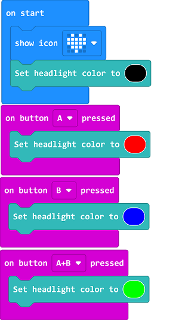
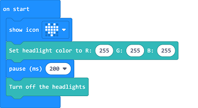

# Case 02: Light Control

## Purpose
---
- Programme to control the colour of the LED lights.  

## Material
---

- 1 x [TPBot](https://shop.elecfreaks.com/products/elecfreaks-micro-bit-tpbot-car-kit-without-micro-bit-board?_pos=1&_sid=f32828112&_ss=r)

## Software
---
[MicroSoftmakecode](https://makecode.microbit.org/#)

## Programming
---

- Click "Advanced" to see more choices in the MakeCode drawer. 

- We need to add a package for programming. Click "Extensions" in the bottom of the drawer and search with "tpbot" in the dialogue box to download it.  

### Sample A
- The LED headlights are in black while on start, and the micro:bit shows an icon.
- Press button A to make the LED headlights show red. 
- Press button B to make the LED headlights show blue. 
- Press button A+B to make the LED headlights show green. 

### Link
- Link: [https://makecode.microbit.org/_0RM5AJgos7C5](https://makecode.microbit.org/_0RM5AJgos7C5)

- You may also download it directly below:

<iframe style="position:absolute;top:0;left:0;width:100%;height:100%;" src="https://makecode.microbit.org/#pub:_0RM5AJgos7C5" frameborder="0" sandbox="allow-popups allow-forms allow-scripts allow-same-origin"></iframe>
  

### Conclusion

- Control the colour of the headlights with the buttons. 
- Press button A to make the LED headlights show red. 
- Press button B to make the LED headlights show blue. 
- Press button A+B to make the LED headlights show green. 

### Sample B 
- While on start, set the micro:bit showing an icon and the LED headlights in red for 2 seconds and then turning off. 

### Link
- Link: [https://makecode.microbit.org/_P5cJ7oV1664J](https://makecode.microbit.org/_P5cJ7oV1664J)

- You may also download it directly below:

<iframe style="position:absolute;top:0;left:0;width:100%;height:100%;" src="https://makecode.microbit.org/#pub:_P5cJ7oV1664J" frameborder="0" sandbox="allow-popups allow-forms allow-scripts allow-same-origin"></iframe>
  

### Conclusion

- The micro:bit displays an icon while on start and the LED headlights of the TPBot show white for 2 seconds and then turn off. 

## Exploration
---

## FAQ
---

## Relevant File
---

