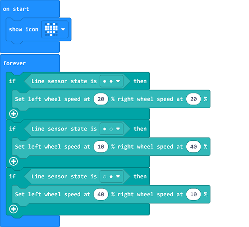

# Case 03: Line Tracking 

## Purpose
---
- Programme to set the TPBot driving along with the black line. 

## Material
---

- 1 x [TPBot](https://item.taobao.com/item.htm?spm=a1z10.5-c-s.w4002-18602834185.41.68d15ccfBFHNPy&id=618758535761)

## Software
---
[MicroSoftmakecode](https://makecode.microbit.org/#)

## Programming
---

- Click "Advanced" to see more choices in the MakeCode drawer. 

- We need to add a package for programming. Click "Extensions" in the bottom of the drawer and search with "tpbot" in the dialogue box to download it.  

##Sample
- Judge the status of the line-tracking sensors: if the black was detected on the left, set the speed of the left wheel in 0 and the right in 40; if the black was detected on the right, set the speed of the left wheel in 40 and the right in 0. 

### Link
- Link: [https://makecode.microbit.org/_4WML7wLL5DDJ](https://makecode.microbit.org/_4WML7wLL5DDJ)

- You may also download it directly below:

<iframe style="position:absolute;top:0;left:0;width:100%;height:100%;" src="https://makecode.microbit.org/#pub:_4WML7wLL5DDJ" frameborder="0" sandbox="allow-popups allow-forms allow-scripts allow-same-origin"></iframe>
  
---

## Conclusion
---

- TPBot drives along with the balck line. 

## Exploration
---

## FAQ
---
Q: The car does not work with the code in the wiki.     
A: It should be the batteries that are lack of power, please try to fix it by adding the value of the speed in the code. 

## Relevant File
---

