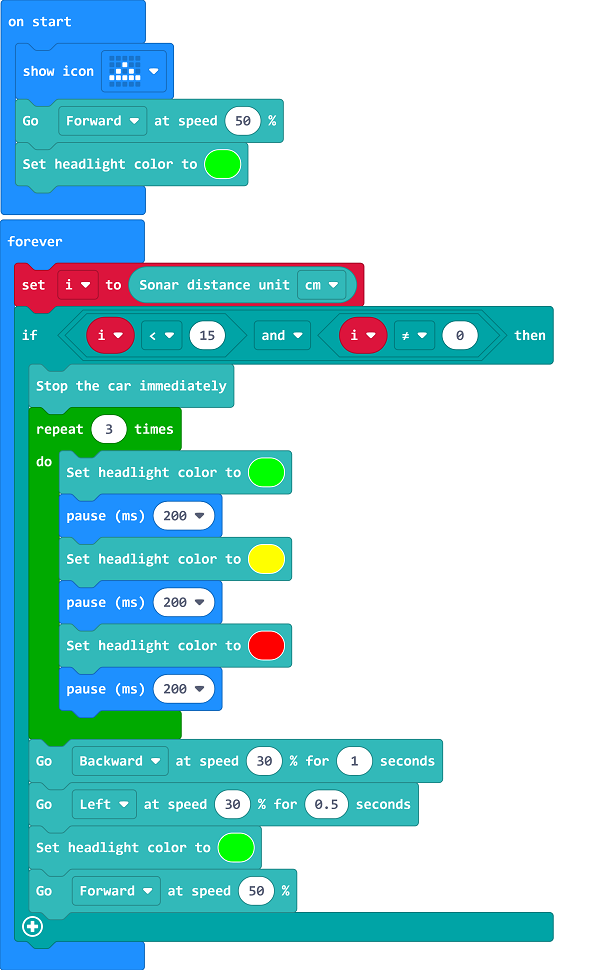

# Case 04: Obstacle-avoidance Driving 

## Purpose 
---
- Programme to set the TPBot avoiding an obstacle automatically. 

## Material 
---

- 1 x [TPBot](https://item.taobao.com/item.htm?spm=a1z10.5-c-s.w4002-18602834185.41.68d15ccfBFHNPy&id=618758535761)

## Software
---
[MicroSoftmakecode](https://makecode.microbit.org/#)

## Programming
---

- Click "Advanced" to see more choices in the MakeCode drawer. 

- We need to add a package for programming. Click "Extensions" in the bottom of the drawer and seach with "tpbot" in the dialogue box to download it.  

##Sample
- Set a triangle in the micro:bit and the TPBot moving forward at the speed of 50%; Set the LED headlights in green. 
- Save the variable of the distance from the TPBot to the obstacle in the forever brick, judge if the items of `i<15` and `i≠0` are both true, if yes, set TPBot stopping immediately and the headlights flashing three times; set it reversing for 1 second at the speed of 30% and then turning left for 0.5 second at the speed of 30%; finally set the headlights showing green and the TPBot moving forward at the speed of 50%. 

### Link
- Link: [https://makecode.microbit.org/_9A0XzETTzA54](https://makecode.microbit.org/_9A0XzETTzA54)

- You may also download it directly below:

<iframe style="position:absolute;top:0;left:0;width:100%;height:100%;" src="https://makecode.microbit.org/#pub:_9A0XzETTzA54" frameborder="0" sandbox="allow-popups allow-forms allow-scripts allow-same-origin"></iframe>
  
---

## Conclusion
---

- Power up the TPBot to move forward and it stops immediately with the headlights flashing three times if an obstacle was detected, then it reverses and turns left to keep moving forward with the headlights in green. 

## Exploration

---

## FAQ

---
Q: The car does not work with the code in the wiki.     
A: It should be the batteries that are lack of power, please try to fix it by adding the value of the speed in the code. 

## Relevant File

---

