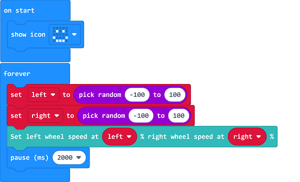

# Case 06: Drive at Random

## Purpose
---
- Programme to set the TPBot driving at random. 

## Material
---

- 1 x [TPBot](https://item.taobao.com/item.htm?spm=a1z10.5-c-s.w4002-18602834185.41.68d15ccfBFHNPy&id=618758535761)

## Software
---
[MicroSoftmakecode](https://makecode.microbit.org/#)

## Programming
---

- Click "Advanced" to see more choices in the MakeCode drawer. 

- We need to add a package for programming. Click "Extensions" in the bottom of the drawer and search with "tpbot" in the dialogue box to download it.  

##Sample
- Set a smile face on the micro:bit. 
- Set the speed of the left and the right wheel at a random value between -100~100 and pause 2 seconds.

### Link
- Link: [https://makecode.microbit.org/_PHzL9LUCL4cv](https://makecode.microbit.org/_PHzL9LUCL4cv)

- You may also download it directly below:

<iframe style="position:absolute;top:0;left:0;width:100%;height:100%;" src="https://makecode.microbit.org/#pub:_PHzL9LUCL4cv" frameborder="0" sandbox="allow-popups allow-forms allow-scripts allow-same-origin"></iframe>
  
---

## Conclusion
---

- The micro:bit shows a smile face and the speed of both wheels changes every two seconds at random.

## Exploration

---

## FAQ

---

## Relevant File

---

