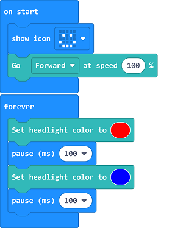

# Case 07: Here Comes the Police

## Purpose
---
- Programme to let the TPBot be a "police car".

## Material
---

- 1 x [TPBot](https://www.elecfreaks.com/tpbot.html)

## Software
---
[MicroSoftmakecode](https://makecode.microbit.org/#)

## Programming 
---

- Click "Advanced" to see more choices in the MakeCode drawer. 

- We need to add a package for programming. Click "Extensions" in the bottom of the drawer and search with "tpbot" in the dialogue box to download it.  

### Sample
- Set a smile face on the micro:bit and set it moving forward at the speed of 100%.
- Set the headlights in red and pause for 100ms in the forever brick; then set them in blue and pause for 100ms. 

### Link
- Link: [https://makecode.microbit.org/_6AT0J1Yx99rm](https://makecode.microbit.org/_6AT0J1Yx99rm)

- You may also download it directly below: 

<iframe style="position:absolute;top:0;left:0;width:100%;height:100%;" src="https://makecode.microbit.org/#pub:_6AT0J1Yx99rm" frameborder="0" sandbox="allow-popups allow-forms allow-scripts allow-same-origin"></iframe>
  

### Conclusion

- Power up to set the TPBot driving forward with the headlights alternating showing red and bule. 

## Exploration
---

## FAQ
---

## Relevant File
---

