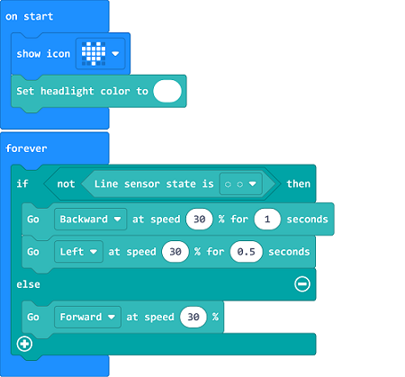

# Case 10: Fall-arrest TPBot

## Purpose
---
- Stick a black gummed paper to the edges of the table, programme to set the TPBot reversing if the black was detected and then it keeps moving forward.  

## Material
---

- 1 x [TPBot](https://shop.elecfreaks.com/products/elecfreaks-micro-bit-tpbot-car-kit-without-micro-bit-board?_pos=1&_sid=f32828112&_ss=r)

## Software
---
[MicroSoftmakecode](https://makecode.microbit.org/#)

## Programming
---

- Click "Advanced" to see more choices in the MakeCode drawer. 

- We need to add a package for programming. Click "Extensions" in the bottom of the drawer and search with "tpbot" in the dialogue box to download it.  

### Sample
- Set an icon on the micro:bit display and the headlights in white. 
- Judge if the black line was detected in the forever brick, if yes, set the TPBot reversing for one second at the speed of 30% and then turning left for 0.5 second at the same speed; or it moves forward at the speed of 30%. 

### Link
- Link: [https://makecode.microbit.org/_dtPhXL3XxTJC](https://makecode.microbit.org/_dtPhXL3XxTJC)

- You may also download it directly below: 

<iframe style="position:absolute;top:0;left:0;width:100%;height:100%;" src="https://makecode.microbit.org/#pub:_dtPhXL3XxTJC" frameborder="0" sandbox="allow-popups allow-forms allow-scripts allow-same-origin"></iframe>
  

### Conclusion

- Power up to show an icon on the micro:bit display and set the TPBot moving forward with headlights in white.  If the black line was detected, it reverses and then turns left to keep moving. 

## Exploration
---

## FAQ
---
Q: The car does not work with the code in the wiki.     
A: It should be the batteries that are lack of power, please try to fix it by adding the value of the speed in the code. 

## Relevant File
---

