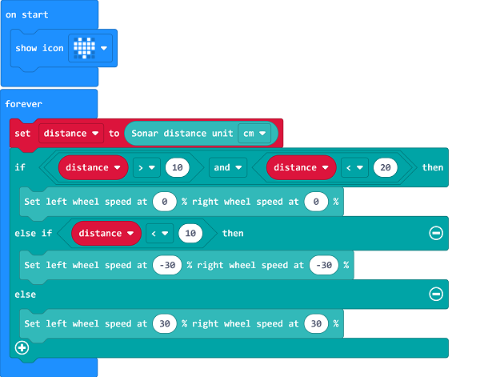

# Case 11: Following with A Fixed Distance

## Purpose 
---
- Programme to set the TPBot following another car with a fixed distance.

## Material
---

- 1 x [TPBot](https://item.taobao.com/item.htm?spm=a1z10.5-c-s.w4002-18602834185.41.68d15ccfBFHNPy&id=618758535761)

## Software
---
[MicroSoftmakecode](https://makecode.microbit.org/#)

## Programming
---

- Click "Advanced" to see more choices in the MakeCode drawer. 

- We need to add a package for programming. Click "Extensions" in the bottom of the drawer and search with "tpbot" in the dialogue box to download it.  

### Sample
- Set an icon on the micro:bit display. 
- Save the variable as the distance detected from the TPBot to its front car in the forever brick, judge if the the distance is between 10 and 20(exl. 10&20), if yes, set the speed of both wheels in 0; if the distance is below 10, set the speed of both wheels in -30%; or set the speed both in 30%. 

### Link
- Link: [https://makecode.microbit.org/_9ugK1pVyPE8M](https://makecode.microbit.org/_9ugK1pVyPE8M)

- You may also download it directly below: 

<iframe style="position:absolute;top:0;left:0;width:100%;height:100%;" src="https://makecode.microbit.org/#pub:_9ugK1pVyPE8M" frameborder="0" sandbox="allow-popups allow-forms allow-scripts allow-same-origin"></iframe>
  

### Conclusion

Power up to show an icon on the micro:bit display and the TPBot keeps a distance to its front car.  It goes slower if the distance detected was close or it goes forward if the distance detected was far; and it stops if the distance detected was between the set interval value. 

## Exploration
---

## FAQ
---

Q: The car does not work with the code in the wiki.     
A: It should be the batteries that are lack of power, please try to fix it by adding the value of the speed in the code. 

## Relevant File
---

