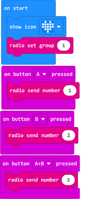
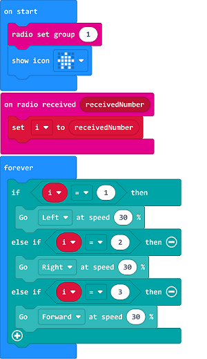

# Case 12: micro:bit Remote Control

## Purpose
---
- Programme to use the mciro:bit to control the TPBot. 

## Material
---

- 1 x [TPBot](https://www.elecfreaks.com/tpbot.html)

## Software
---
[MicroSoftmakecode](https://makecode.microbit.org/#)

## Programming
---

- Click "Advanced" to see more choices in the MakeCode drawer. 

- We need to add a package for programming. Click "Extensions" in the bottom of the drawer and search with "tpbot" in the dialogue box to download it.  

### Sample

### Remote Control Part
- Set the micro:bit showing a set icon and the radio group as 1. 
- After pressing button A, radio send number 1; after pressing button B, radio send number 2; after pressing button A+B, radio send number 3.

### Link
- Link: [https://makecode.microbit.org/_DYDT9ibh9V1E](https://makecode.microbit.org/_DYDT9ibh9V1E)

- You may also download it directly below: 

<iframe style="position:absolute;top:0;left:0;width:100%;height:100%;" src="https://makecode.microbit.org/#pub:_DYDT9ibh9V1E" frameborder="0" sandbox="allow-popups allow-forms allow-scripts allow-same-origin"></iframe>
  

### Receiving Part

- Set the micro:bit showing a set icon and the radio group as 1. 
- Save the received number as the variable. 
- Judge if the variable is 1, if yes, set the TPBot turning left at the speed of 30%; if the variable is 2, set the TPBot turning right at the speed of 30%; if the variable is 3, set the TPBot moving forward at the speed of 30%.

### Link
- Link: [https://makecode.microbit.org/_CAMF0t8rYT0j](https://makecode.microbit.org/_CAMF0t8rYT0j)

- You may also download it directly below: 

<iframe style="position:absolute;top:0;left:0;width:100%;height:100%;" src="https://makecode.microbit.org/#pub:_CAMF0t8rYT0j" frameborder="0" sandbox="allow-popups allow-forms allow-scripts allow-same-origin"></iframe>
  

### Conclusion

- Power up to show a set icon on the micro:bit, after pressing button A, it turns left; after pressing button B, it turns right; after pressing button A+B, it moves forward. 

## Exploration
---

## FAQ
---
Q: The car does not work with the code in the wiki.     
A: It should be the batteries that are lack of power, please try to fix it by adding the value of the speed in the code. 

## Relevant File
---

 
