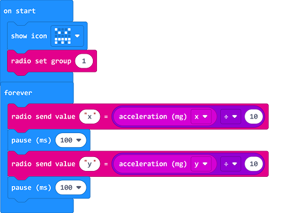
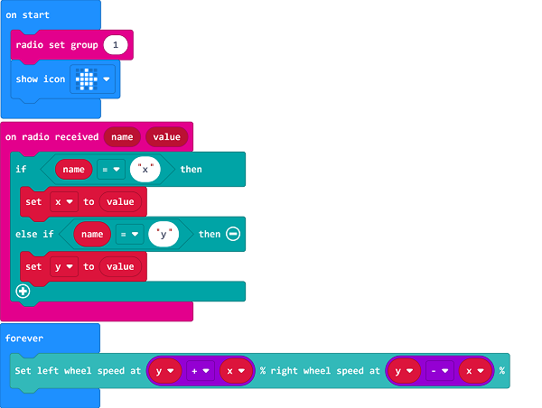

# Case 13: Remote Control with micro:bit Accelerometer

## Purpose
---
- Programme to control the TPBot with the accelerometer.

## Material
---

- 1 x [TPBot](https://item.taobao.com/item.htm?spm=a1z10.5-c-s.w4002-18602834185.41.68d15ccfBFHNPy&id=618758535761)

## Software
---
[MicroSoftmakecode](https://makecode.microbit.org/#)

## Programming
---

- Click "Advanced" to see more choices in the MakeCode drawer. 

- We need to add a package for programming. Click "Extensions" in the bottom of the drawer and seach with "tpbot" in the dialogue box to download it.  

##Sample
### Remote Control Part
- Set the micro:bit showing a set icon and the radio group as 1. 
- Radio send x which is given by its acceleration dividing 10 in the forever brick. 
- Radio send y which is given by its acceleration dividing 10  in the forever brick. 
- 

### Link
- Link: [https://makecode.microbit.org/_11kPTbbxM9Mf](https://makecode.microbit.org/_11kPTbbxM9Mf)

- You may also download it directly below:

<iframe style="position:absolute;top:0;left:0;width:100%;height:100%;" src="https://makecode.microbit.org/#pub:_11kPTbbxM9Mf" frameborder="0" sandbox="allow-popups allow-forms allow-scripts allow-same-origin"></iframe>
  
---
### Receiving Part
- Set the micro:bit showing a set icon and the radio group as 1. 
- Drag two" if...else..." sentences to the "on radio received..." block, judge if the received name is x or y. 
- If it's x, save it as the variable as the accelaration from the x.
- If it's y, save it as the variable as the accelaration from the y.
- Set the speed of the left wheel being y+x and the right wheel being y-x.

### Link
- Link: [https://makecode.microbit.org/_a6LLFsMfDT7K](https://makecode.microbit.org/_a6LLFsMfDT7K)

- You may also download it directly below:

<iframe style="position:absolute;top:0;left:0;width:100%;height:100%;" src="https://makecode.microbit.org/#pub:_a6LLFsMfDT7K" frameborder="0" sandbox="allow-popups allow-forms allow-scripts allow-same-origin"></iframe>
  
---
## Conclusion
---

- Power up to show the set icon on the micro:bit display, and the movement of TPBot is controlled by the changing angel from the micro:bit.  

## Exploration

---

## FAQ

---

## Relevant File

---

