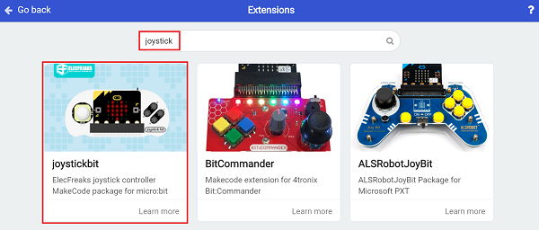
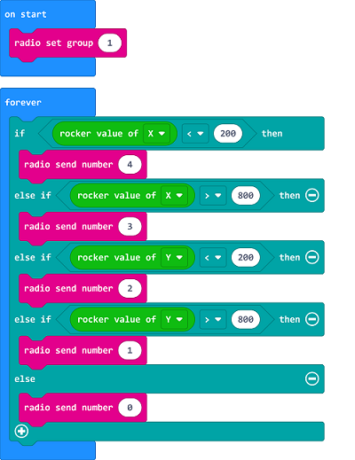
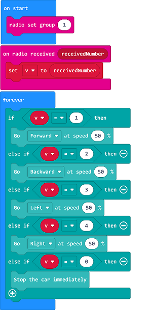

# Case 14: Remote Control with Joystick:bit

## Purpose
---
- Programme to control the TPBot with the Joystick:bit.

## Material
---

- 1 x [TPBot](https://item.taobao.com/item.htm?spm=a1z10.5-c-s.w4002-18602834185.41.68d15ccfBFHNPy&id=618758535761)

## Software
---
[MicroSoftmakecode](https://makecode.microbit.org/#)

## Programming
---

- Click "Advanced" to see more choices in the MakeCode drawer. 

- We need to add a package for programming. Click "Extensions" in the bottom of the drawer and seach with "tpbot" in the dialogue box to download it.  

- We need to add a package for programming the Joystick also. Click "Extensions" in the bottom of the drawer and seach with "joystick" in the dialogue box to download it.  

##Sample
### Remote Control Part
- Set the radio group as 1. 
- Judge the value of x&y of the Joystick in the forever brick, if the value of the x is below 200, radio send number 4;  if the value of the x is over 800, radio send number 3; if the value of the y is below 200, radio send number 2; if the value of the y over 800, radio send number 1; or radio send number 0. 

### Link
- Link: [https://makecode.microbit.org/_7rzb5TEfrbu7](https://makecode.microbit.org/_7rzb5TEfrbu7)

- You may also download it directly below:

<iframe style="position:absolute;top:0;left:0;width:100%;height:100%;" src="https://makecode.microbit.org/#pub:_7rzb5TEfrbu7" frameborder="0" sandbox="allow-popups allow-forms allow-scripts allow-same-origin"></iframe>
  
---
### Receiving Part
- Set the radio group as 1. 
- Save the received number as the variable in "on radio received..."block.
- Judge if the value is 1, if yes, set the TPBot moving forward at the speed of 100%; if it's 2, set the TPBot reversing at the speed of 50%; if it's 3, set the TPBot turning left at the speed of 50%;  if it's 4, set the TPBot turning right at the speed of 50%; If it's 0, set the TPBot to stop. 

### Link
- Link: [https://makecode.microbit.org/_HPVCEx29zTPx](https://makecode.microbit.org/_HPVCEx29zTPx)

- You may also download it dorectly below:

<iframe style="position:absolute;top:0;left:0;width:100%;height:100%;" src="https://makecode.microbit.org/#pub:_HPVCEx29zTPx" frameborder="0" sandbox="allow-popups allow-forms allow-scripts allow-same-origin"></iframe>
  
---
## Conclusion
---

- The movement of the TPBot is controlled via the Joystick:bit.

## Exploration

---

## FAQ

---

## Relevant File

---

