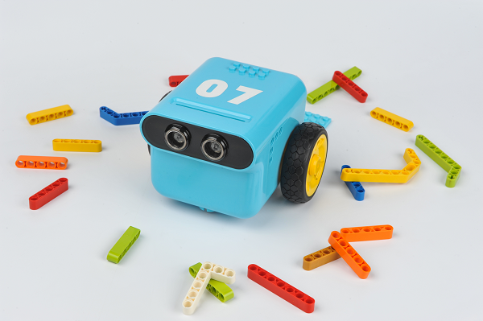
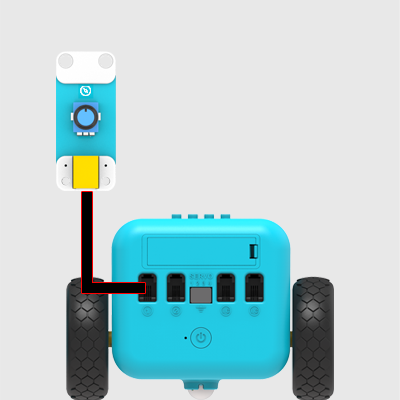
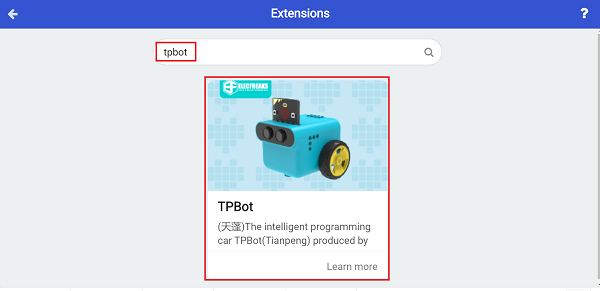
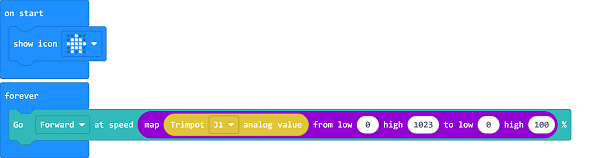

# Case15: Speed Adjustable TPBot

## Purpose
---
- Adjust the speed of the TPBot with the potentiometer. 

## Material
---

- 1 x [TPBot](https://item.taobao.com/item.htm?spm=a1z10.5-c-s.w4002-18602834185.41.68d15ccfBFHNPy&id=618758535761)

## Hardware connection

Connect potentiometer to port 1 on TPBot. 

## Software

---

[MicroSoftmakecode](https://makecode.microbit.org/#)

## Programming

---

Click "Advanced" to see more choices in the MakeCode drawer. 

- We need to add a package for programming. Click "Extensions" in the bottom of the drawer and search with "tpbot" in the dialogue box to download it.  

- We need to add a package for programming. Click "Extensions" in the bottom of the drawer and seach with "PlanetX" in the dialogue box to download it.  

##Sample
- Drag the show icon brick into on start. 
- In forever brick, map the returned value of the potentiometer from 0~1023 to 0~100, and set the mapping value as the speed for the car to move forward. 

### Link
- Link：[https://makecode.microbit.org/_ArRM71PD6de0](https://makecode.microbit.org/_ArRM71PD6de0)

- You may also download it directly below:

<iframe style="position:absolute;top:0;left:0;width:100%;height:100%;" src="https://makecode.microbit.org/#pub:_ArRM71PD6de0" frameborder="0" sandbox="allow-popups allow-forms allow-scripts allow-same-origin"></iframe>
  
---

---
## Conclusion
---

- After powering on, the speed of the TPBot could be adjusted by the potentioneter. 

## Exploration
---

## FAQ
---

Q: While operating this case, why the car might not work properly?

A: It might be the low power of the batteries, please try adding the value of TPBot's speed and test again. 

## Relevant File
---

