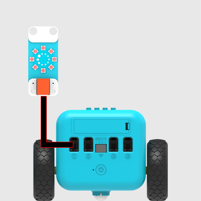
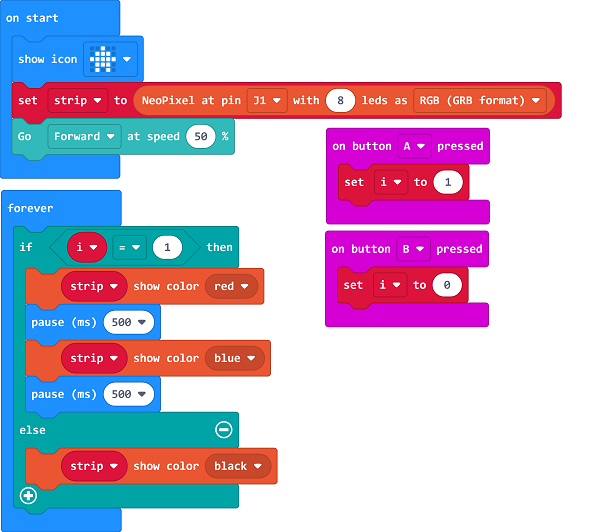

# Case16: Here Comes the Police

## Purpose
---
- Simulate the lights of the police car. 

## Material

1 x [TPBot](https://item.taobao.com/item.htm?spm=a1z10.5-c-s.w4002-18602834185.41.68d15ccfBFHNPy&id=618758535761)

## Hardware connection

Connect rainbow led to port 1 on TPBot. 

- ## Software

  ---

  [MicroSoftmakecode](https://makecode.microbit.org/#)

  ## Programming

  ---

  Click "Advanced" to see more choices in the MakeCode drawer. 

- We need to add a package for programming. Click "Extensions" in the bottom of the drawer and seach with "tpbot" in the dialogue box to download it.  

- We need to add a package for programming. Click "Extensions" in the bottom of the drawer and seach with "PlanetX" in the dialogue box to download it.  

##Sample

- In on start brick, initialize the led strip and has it connected to J1 port, set TPBot move forward at the speed of 50%. 
-  Save the variable "i" as 1 while pressing button A and set it as 0 while pressing button B. 
- In forever brick, judge if the variable "i" is 1, if yes, set the led in red and pasue for 500ms, after in blue and pause another 500ms; or set it in black. 

### Link
- Link：[https://makecode.microbit.org/_TvrRaMJLKPWr](https://makecode.microbit.org/_TvrRaMJLKPWr)

- You may also download it directly below:

<iframe style="position:absolute;top:0;left:0;width:100%;height:100%;" src="https://makecode.microbit.org/#pub:_TvrRaMJLKPWr" frameborder="0" sandbox="allow-popups allow-forms allow-scripts allow-same-origin"></iframe>
  

---
## Conclusion 
---

- The TPBot moves forward after powering on, press button A on the micro:bit to turn on the LED cycling with red and blue, press button B to turn it off. 

## Exploration

---

## FAQ

---

Q: While operating this case, why the car might not work properly?
A: It might be the low power of the batteries, please try adding the value of TPBot's speed and test again. 

## Relevant File

---

