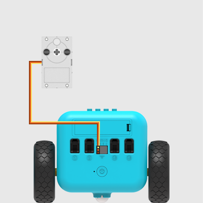
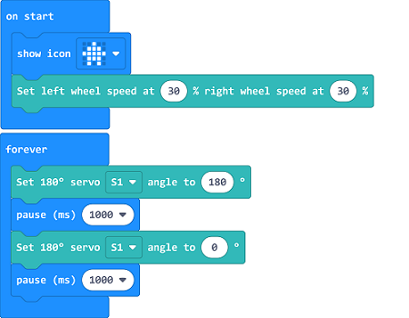

# Case 19: Sweeper

## Purpose
---
- Build a TPBot sweeper. 

## Material
---

- 1 x [TPBot Smart Car](https://item.taobao.com/item.htm?spm=a1z10.5-c-s.w4002-18602834185.41.68d15ccfBFHNPy&id=618758535761)

## Hardware Connection
---
Connect the 360 degrees servo to servo 1 port on TPBot. (Servos are not included in our TPBot kit)

## Software 
---
[MicroSoft makecode](https://makecode.microbit.org/#)

## Programming
---

- Click "Advanced" in the MakeCode drawer to see more choices. 

- We need to add a package for programming. Click "Extensions" in the bottom of the drawer and search with "tpbot" to download it. 

### Sample

- Drag the show icon brick in the on start and set the car to move forward at the speed of 30%; in forever brick, set the servo connecting to S1 rotate to 180 degrees and pause for 1000ms, and set it rotate to 0 degree and pause for 1000ms. 

### Link
- Link：[https://makecode.microbit.org/_664VpuAVMcCa](https://makecode.microbit.org/_664VpuAVMcCa)

- You may also download it directly below:

<iframe style="position:absolute;top:0;left:0;width:100%;height:100%;" src="https://makecode.microbit.org/#pub:_664VpuAVMcCa" frameborder="0" sandbox="allow-popups allow-forms allow-scripts allow-same-origin"></iframe>
  

## Conclusion
---

The car move forward with the servo rotating. 

## Exploration
---

## FAQ
---
Q: The car cannot move with the code in this case? 
A: It might be a lack power of the battery, please add the value of the parameter for the speed of the car and test it. 

##  Revelant File 
---

