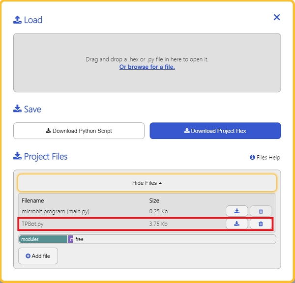

# TPBot Samples for Python

---


### Add Python File
Download to unzip it: [EF_Produce_MicroPython-master](https://github.com/lionyhw/EF_Produce_MicroPython/archive/master.zip)
Go to  [Python editor](https://python.microbit.org/v/2.0)


We need to add TPBot.py for programming. Click "Load/Save" and then click "Show Files (1)" to see more choices, click "Add file" to add TPBot.py from the unzipped package of EF_Produce_MicroPython-master. 




### Samples

### Sample 1: Drive the car at a full speed. 

```
from microbit import *
from TPBot import *

tp = TPBOT()
tp.set_motors_speed(100,100)

```
- ### Result

  The speed of the left and right wheels is at 100, the car moves forward at the full speed. 


### Sample 2: Turn the headlights on in random colors
```
from microbit import *
from TPBot import *
import random

tp = TPBOT()

while True:
    R = random.randint(0,255);
    G = random.randint(0,255);
    B = random.randint(0,255);
    tp.set_car_light(R,G,B)
    sleep(500)
```
### Result

  The headlights light up in different colours at random. 

### Sample 3: Obstacles avoidance 
```
from microbit import *
from TPBot import *

tp = TPBOT()
while True:
    i = tp.get_distance(0)
    if i>3 and i<30:
        tp.set_motors_speed(-50, 50)
        sleep(500)
    else:
        tp.set_motors_speed(50, 50)
```
### Result

  The TPBot turns its direction once it detects any obstacle ahead of it. 

### Sample 4: Link-tracking 
```
from microbit import *
from TPBot import *

tp = TPBOT()
while True:
    
    i = tp.get_tracking()
    if i == 10:
        tp.set_motors_speed(10, 50)
    if i == 1:
        tp.set_motors_speed(50, 10)   
    if i == 11:
        tp.set_motors_speed(25, 25)  
```
### Result

The TPBot drives along with the black line. 

### Sample 5:  Control the servo  

```
from microbit import *
from TPBot import *

tp = TPBOT()
while True:
    tp.set_servo(1,180)
    sleep(1000)
    tp.set_servo(1,0)
    sleep(1000)
```
### Result

- The servo connecting to S1 continues driving back and forth. 

## Relevant Case

---

## Technique File

---
