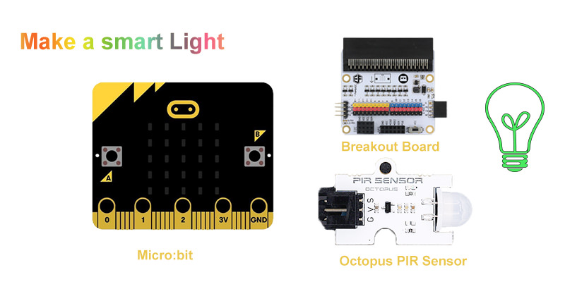
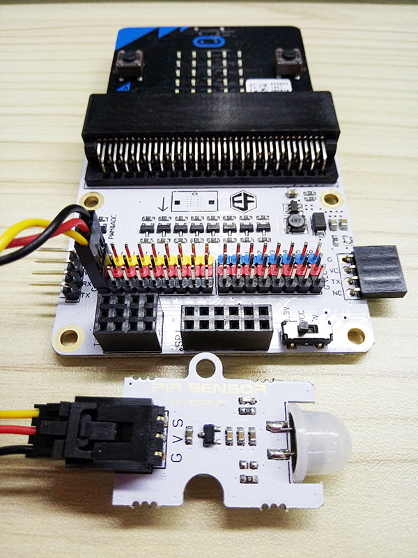
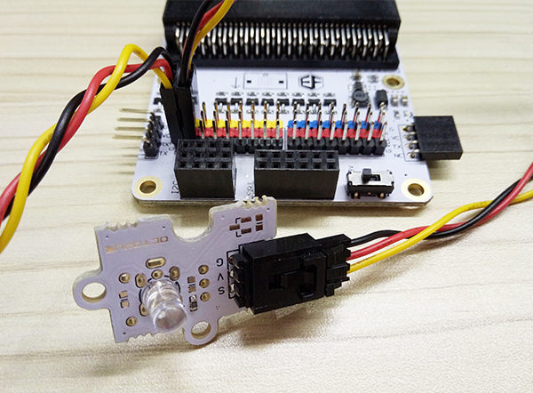
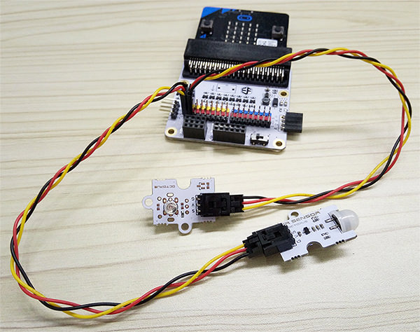
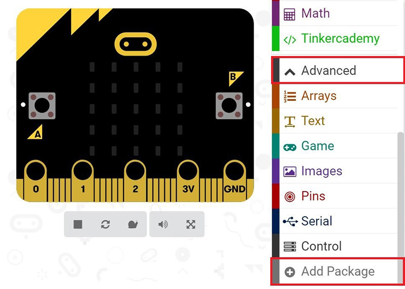
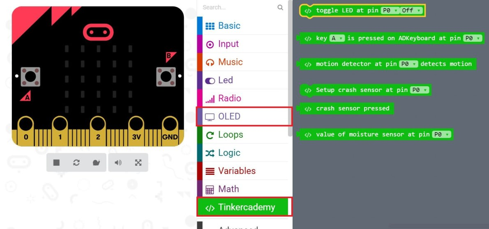
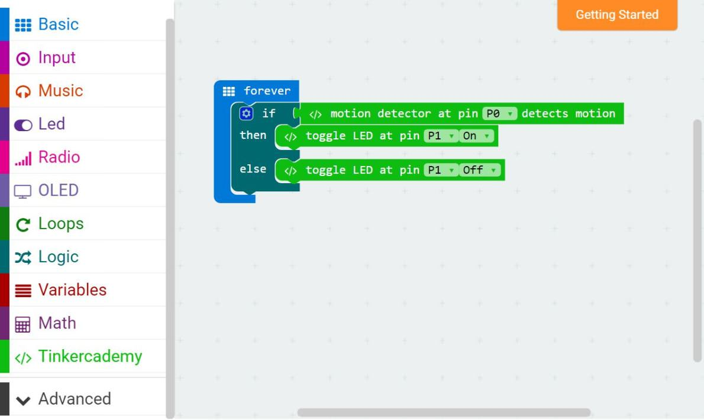

# case 02 Smart Light 

  

In this project, we are going to create a smart light with ElecFreaks Micro:bit Tinker Kit. It will use Octopus PIR Sensor and LED light. When there is someone in the room and detected, the LED will light up. 

## Goals
---

- Make something with Octopus PIR sensor.
- Make something which is easily to be used in real life.

## Materials:    
---
- 1 x BBC micro:bit
- 1 x Micro USB cable
- 1 x Breakout board
- 1 X Octopus PIR sensor Brick
- 1 x Octopus 5mm LED Brick OBLED - Red

## How to Make
---

### Step 1: Components

Insert the micro:bit into the breakout board and plug Octopus PIR sensor into Pin 0.

Plug LED to Pin 1. Make sure the wire colors matches pin colors.

### Step 2: Pre-coding

We will add a package of code to enable us to use our kit components. Click on “Advanced” in the Code Drawer to see more code section and look at the bottom of the Code Drawer for “Add Package”.

This will open a dialog box. Search for "tinker kit", and then click it to download this package.

Note: If you get a warning telling you some packages will be removed because of incompatibility issues. You have to either follow the prompts or create a new project in the projects file menu.

### Step 3: Coding

Click on Tinkercademy inside the Code Drawer to find blocks for the components in your kit.

For this project, no initialization is required, and there isn’t much code anyway.
If you don't want to type these code, you can download it directly from the link below:

[https://makecode.microbit.org/_aFUP7wcy94sv](https://makecode.microbit.org/_aFUP7wcy94sv)

Or, you can download from the page below:

<iframe style="position:absolute;top:0;left:0;width:100%;height:100%;" src="https://makecode.microbit.org/#pub:_aFUP7wcy94sv" frameborder="0" sandbox="allow-popups allow-forms allow-scripts allow-same-origin"></iframe>

If any motion is detected by the PIR sensor, the light is triggered. Or else, the light is turned off. Quite simple enough.

### Step 4: Success

Success! You have created a simple smart light! Let’s light it up !
