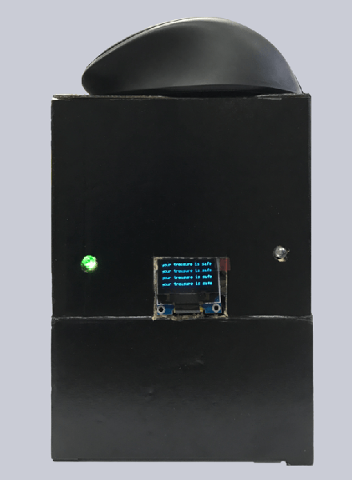
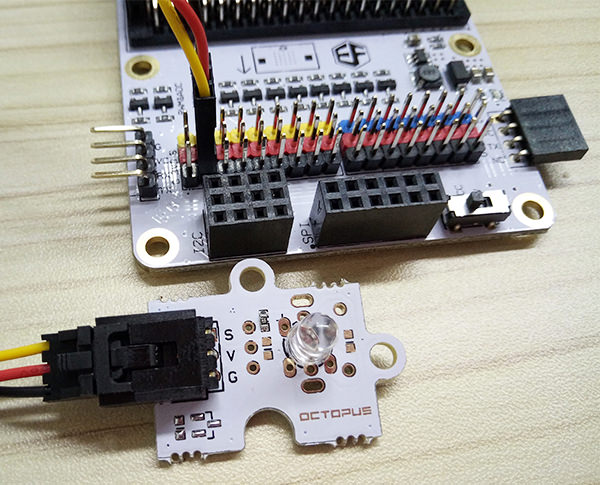
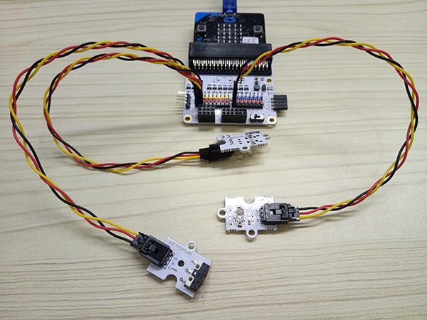
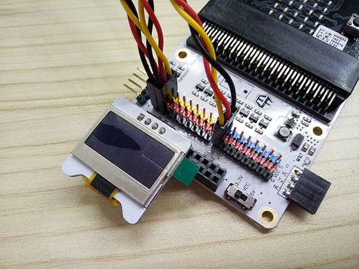
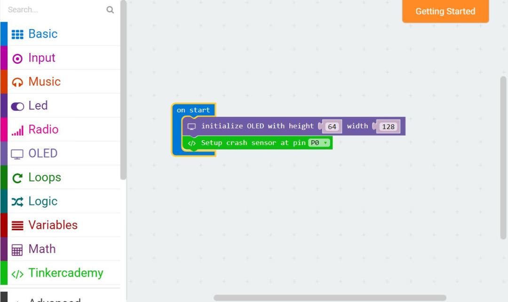
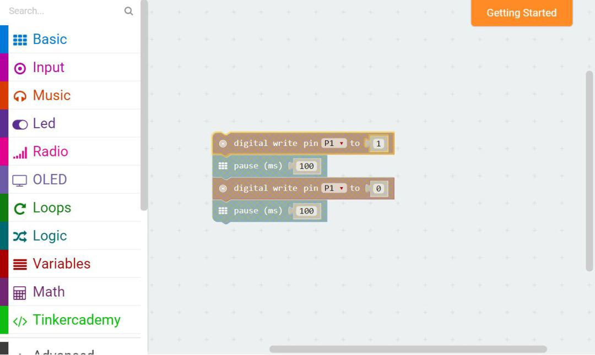
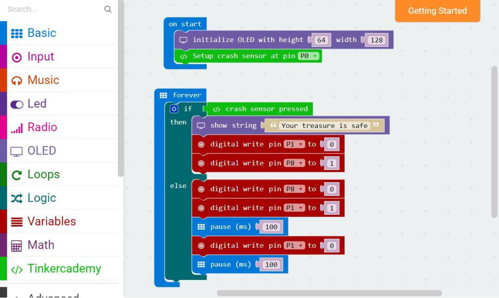
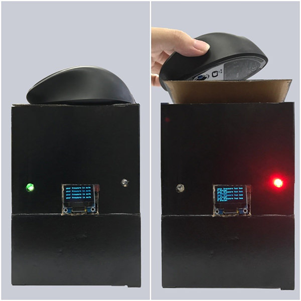

# case 04 Simple Alarm Box 

## Step 0: Pre-build Overview  
---

In this project, we are going to create a simple alarm device which will alert the owner if someone has stolen his or her property. The red LED will blink when the crash sensor detects that the object has been taken away. Otherwise, the green LED will light up continuously. The OLED will display the status of the device.

## Products Link

[Tinker Kit](https://shop.elecfreaks.com/products/elecfreaks-micro-bit-tinker-kit-without-micro-bit-board?_pos=1&_sid=a3579b340&_ss=r)

## Materials:    
---  
  
- 1 x BBC micro:bit  
- 1 x Micro USB cable
- 1 x Breakout board
- 1 x Octopus LED
- 1 x Crash Sensor
- 1 x OLED
- 1 x LED
- 2 x Female-Female jumper wires

## Goals:  
---
- Get to know the Octopus LED, normal LED, Crash sensor and OLED. 
- Make something with different types of LED
- Make something with Crash sensor and OLED

## How to Make  
---

### Step 1 – Components  

Connect LED module to pin 1.

Connect the USB cable to the micro:bit and then to the breakout board as shown in the picture above. Making sure that the colour of the wire follows the colour of the pins on the break out board, plug in the crash sensor to Pin 0 and the Octopus LED to Pin 8. 
Lastly, plug in the OLED as shown in the picture above. You should be able to plug it into any of the three rows.

### Step 2 – Pre-coding  
  
We’ll need to add a package of code to be able to use our kit components. Click on Advanced in the Code drawer to see more code sections and look at the bottom of the Code Drawer for Add Package.

This will open up a dialog box. Search for "tinker kit" and then click it to download this package.

Note: If you get a warning telling you some packages will be removed because of incompatibility issues, either follow the prompts or create a new project in the Projects file menu.

### Step 3 – Coding  

After that, use blocks under the Tinkercademy section to initialize the OLED and Crash Sensor as shown in the picture

This part of the code allows the red LED to blink continuously. You can adjust the speed of blinking by changing the pause period.

Since there are only two conditions, we need only one ‘else-if’ statement. When the Crash Sensor is pressed, the green Octopus LED will light up. Or else, if no force is applied to the Crash Sensor, the red LED will blink continuously.

If you don't want to type these code by yourself, you can directly download the whole program from the link below:

[https://makecode.microbit.org/_LvC6e0UfWH7c](https://makecode.microbit.org/_LvC6e0UfWH7c)

Or, you can download from the page below:

<iframe style="position:absolute;top:0;left:0;width:100%;height:100%;" src="https://makecode.microbit.org/#pub:_LvC6e0UfWH7c" frameborder="0" sandbox="allow-popups allow-forms allow-scripts allow-same-origin"></iframe>

### Step 4 – Succeed!    

Let’s download code into it and run it. Let’s find a book or something else and place it on the top of device, then see what will happen. We can see the green light illuminates as showed in the picture below. When we take away the book or something else you placed, you can see the red light starts to flash while the green light turned off.

