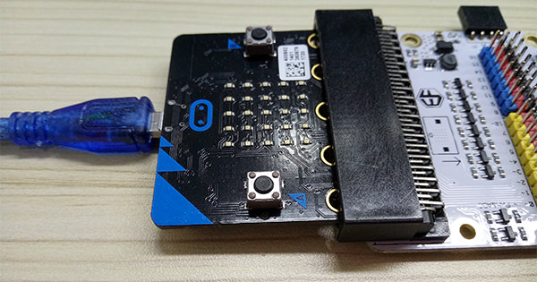
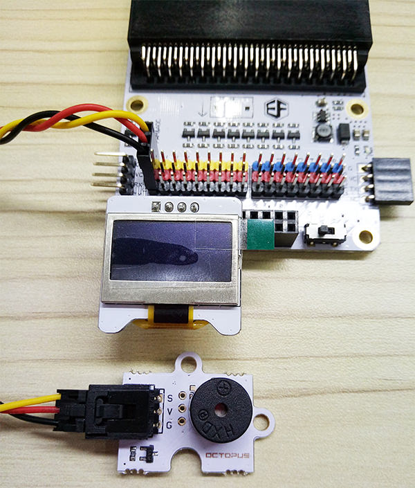
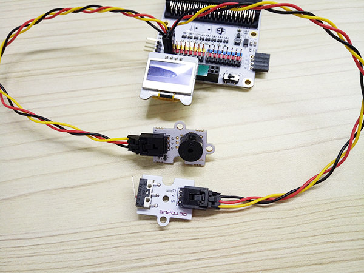
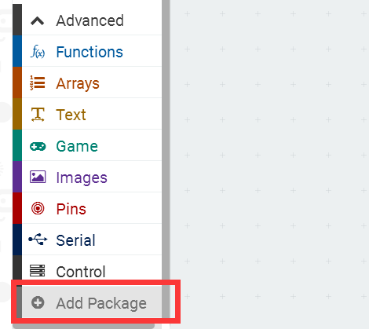
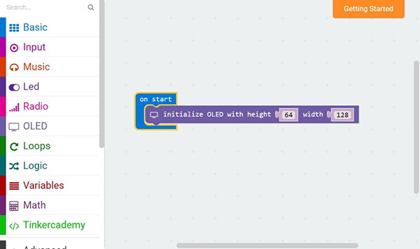
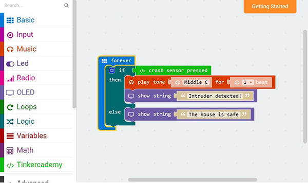

# case 06 Intruder Detection 

Swiper no swiping!
Stop burglars with this simple intruder detection system.

## Products Link

[Tinker Kit](https://shop.elecfreaks.com/products/elecfreaks-micro-bit-tinker-kit-without-micro-bit-board?_pos=1&_sid=a3579b340&_ss=r)

## Step 0 – Pre-build Overview  
---

In this project, we are going to create an intruder detection system which will sound when someone opens the door. The status of the house will be displayed on the OLED.  

## Materials:  
---

- 1 x BBC micro:bit
- 1 x Micro USB cable
- 1 x Breakout board
- 1 x Crash Sensor
- 1 x OLED
- 1 x Buzzer
- 2 x Female-Female jumper wires

## Goals:  
---

- Get to know the Crash Sensor, OLED and Buzzer
- Make something with a OLED
- Make something with a Crash Sensor

## How to Make    
---  

### Step 1 – Components    

Insert the micro:bit into the Breakout Board and plug in the micro USB cable.  

  

Then connect the buzzer to Pin 0 using the jumper cables. Plug in the OLED as shown in the picture below. You should be able to plug it into any of the three rows.  

  

Plug in the crash sensor to Pin 1. Make sure the colour of the wire follows the coloured pins on the breakout board.  

  

### Step 2 – Pre-coding    

  

We will add a package of code to enable us to use our kit components. Click on Advanced in the Code Drawer to see more code section and look at the bottom of the Code Drawer for Add Package.  

  

This will open up a dialog box. Search for "tinker kit" and then click it for downloading this package.   

  

Note: If you get a warning telling you some packages will be removed because of incompatibility issues, either follow the prompts or create a new project in the Projects file menu.  

### Step 3 – Coding    

  

Click on Tinkercademy inside the Code Drawer to find our custom blocks for the various components in your kit.  

   

You should always initialize the OLED at the beginning. 64 and 128 represent the height and width of the OLED respectively.  

  

Since there are only two conditions, we need only one “else-if”statement.  
When crash sensor is triggered, the buzzer will sound and the OLED will display the message “Intruder Detected”. Or else, if there is no force is applied to the crash sensor, the buzzer will not sound and the OLED will display the message “The house is safe”.

If you don't want to type these code by yourself, you can download the whole program directly from the link below.   [https://makecode.microbit.org/_A0zFxqMPMXbo](https://makecode.microbit.org/_A0zFxqMPMXbo)  

Or you can download from the page below.  

<iframe style="position:absolute;top:0;left:0;width:100%;height:100%;" src="https://makecode.microbit.org/#pub:_A0zFxqMPMXbo" frameborder="0" sandbox="allow-popups allow-forms allow-scripts allow-same-origin"></iframe>
  

### Step 4 – Success!    

Success! You have created a intruder detector!
