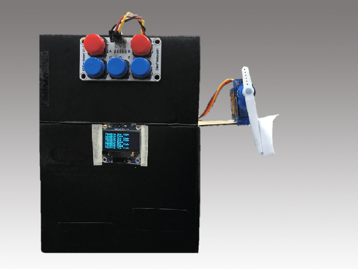
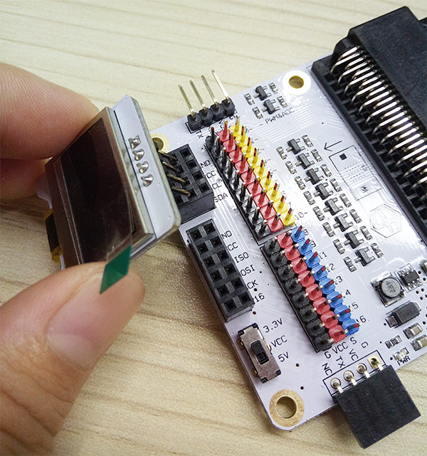
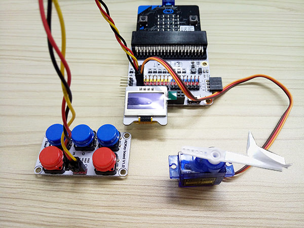
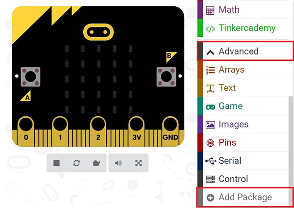
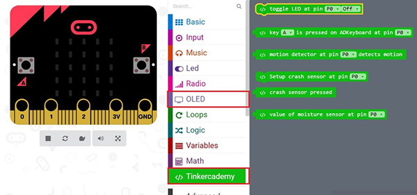
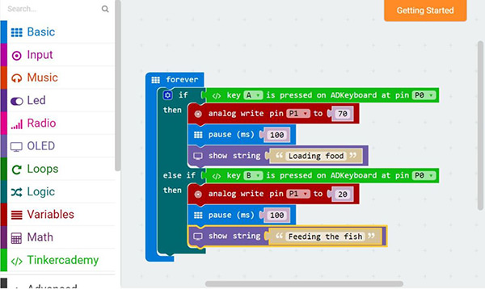

# case 07 Fish Feeder 

Tired of feeding your fish by hand? Here’s the micro:bit project for you!             
In this course, we will use a ADKeypad to control the motion of a servo to feed fish.         

## Step 0 – Pre-build Overview       
---   

     

In this project, we are going to create a fish feeding machine. The movement of the servo will be controlled by the two red buttons on the ADKeypad and the OLED will display a message showing the status of the servo.      

## Materials:     
---     

- 1 x BBC micro:bit    
- 1 x Micro USB cable     
- 1 x Breakout board     
- 1 x ADKeypad  
- 1 x OLED 
- 1 x Servo     
- Wires     

## Goals:     
---     

- Get to know the ADKeypad, OLED and servo
- Make something with a servo
- Make something with a OLED 

## How to Make     
---   

### Step 1 – Components     

  
  

Insert the micro:bit into the Breakout Board and plug in the micro USB cable, then plug in the OLED as shown in the picture above. You should be able to plug it into any of the three rows

Connect the ADKeypad to Pin 0 and the servo to Pin 1. Make sure the colour of the wire matches the colour of the pins on the Breakout Board.

### Step 2 – Pre-coding  

We will add a package of code to enable us to use our kit components. Click on Advanced in the Code Drawer to see more code section and look at the bottom of the Code Drawer for Add Package.   

   

This will open up a dialog box. Search for "tinker kit" and then click it to downloading this package.   

   

Note: If you get a warning telling you some packages will be removed because of incompatibility issues, either follow the prompts or create a new project in the Projects file menu.   

### Step 3 – Coding     

   

Click on Tinkercademy inside the Code Drawer to find our custom blocks for the various components in your kit.   

  

You should always initialize the OLED at the beginning. 64 and 128 represent the height and width of the OLED respectively.   

Since there are only two conditions, we need only one ‘else-if’ statement. 
If the button A of the ADKeypad is pressed, the servo will turn to angle 70 and the OLED will display "Loading food". 
Or else,if button B of the ADKeypad is pressed, the servo will turn to angle 20 and the OLED will display "Feeding the fish".
You can adjust the servo angle to suit your requirement.

If you don't want to type these code by yourself, you can download the whole program from the link below.  

[https://makecode.microbit.org/_3HJDazbma3H4](https://makecode.microbit.org/_3HJDazbma3H4)

Or you can download from the page below.   

<iframe style="position:absolute;top:0;left:0;width:100%;height:100%;" src="https://makecode.microbit.org/#pub:_3HJDazbma3H4" frameborder="0" sandbox="allow-popups allow-forms allow-scripts allow-same-origin"></iframe>
  

### Step 4 – Success!    

Voilà! You have created a fish feeding machine!     
