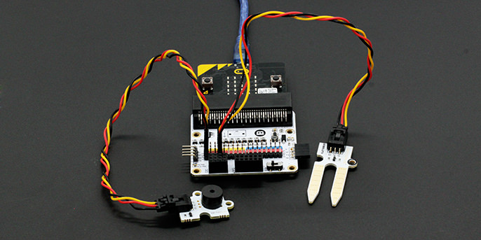
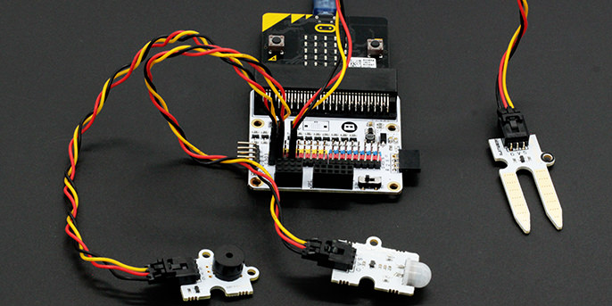
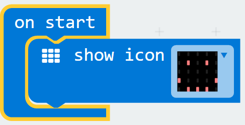
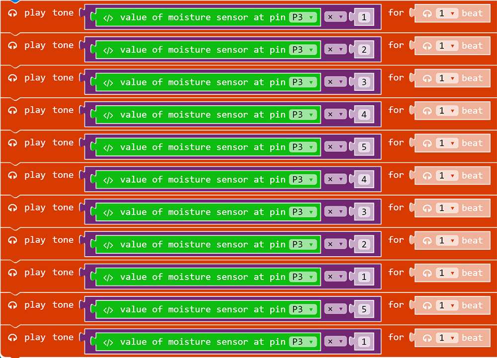
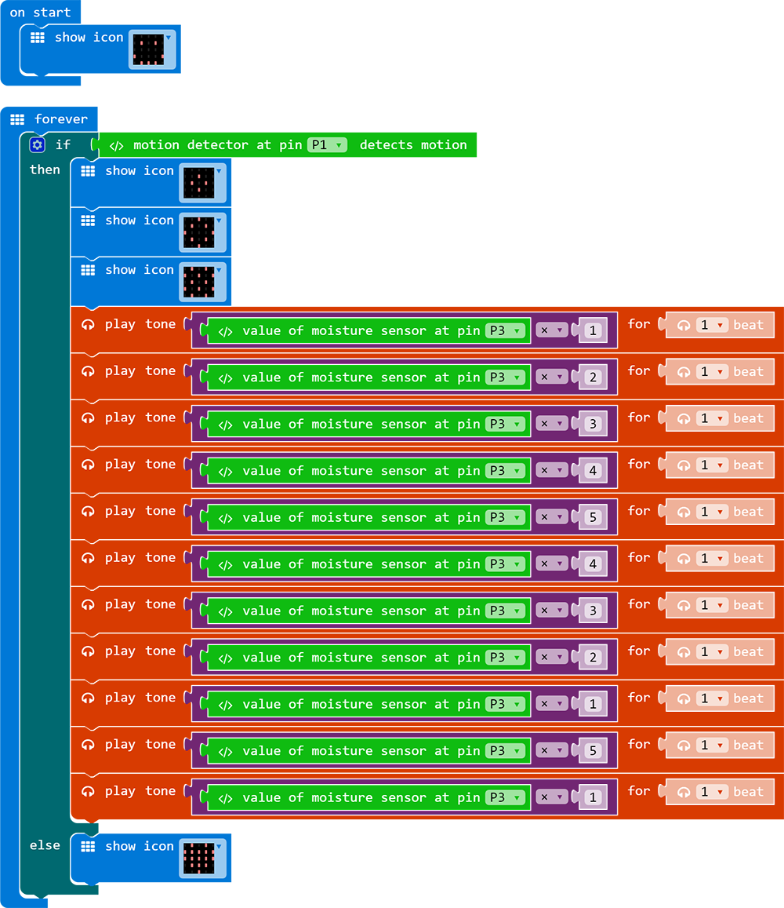

# case 08 Motion Detector 

Don’t like people sneaking up on you? Here’s just the right micro:bit project for you! In this course, we learn how to make use of the motion sensor, the moisture sensor as well as how they can be coded for.

## Goals:  
---  

- Get to know the PIR Sensor Brick and moisture sensor.  
- Make something with a PIR Sensor Brick.  
- Make something with a Moisture Sensor.  

## Materials:    
---  
  
- 1 x BBC micro:bit  
- 1 x Micro USB cable  
- 1 x Breakout board  
- 1 X Mini buzzer  
- 1 X Octopus PIR sensor Brick
- 1 X Moisture sensor  
- 2 X Female-Female jumper wires  

## How to Make  
---  

### Step 1:
  
After connecting one end of the USB cable to your computer, connect the other end to the micro:bit as shown in the picture.Connect the side of the micro:bit where the pins are located to the breakout board.  

   

### Step 2:  

Plug in the buzzer to Pin 0 (the pins beside the number ‘0’ on the breakout board) . Plug in the moisture sensor to Pin 3. Plug in the motion sensor to Pin 1.Make sure the colour of the wire of the buzzer and the ADKeyboard follows the colour of the pins on the breakout board.  

  
  
  

### Step 3:  

Click on “Advanced” in the code drawer to see more code sections.  
To code for our extra kit components (the ADKeyboard and the buzzer), we will need to add a package of code.  

  

Look at the bottom of the code drawer for “Add Package” and click it to open up a dialogue box. Search for "tinker kit" and then click on it to download this package.  

  

Note: If you get a warning telling you some packages will be removed because of incompatibility issues, either follow the prompts or create a new project in the Projects file menu.  

  

Click on Tinkercademy inside the Code Drawer to find our custom blocks for the various components in your kit.  

  

For this project, we are going to use the blocks read value from moisture sensor and motion sensor.  

### Step 4  

In this step, we will code the Micro:bit with Block Editor. We begin by coding a starting screen, by placing the “Show Icon” block under the “On Start” block as shown in the picture on the right.  
This causes the icon to appear on the screen whenever the micro:bit is powered on.  

  

### Step 5  

Next, let’s create some music using the moisture sensor values.   
Select the “Play Tone” block under the “Music” code section and place the value of Moisture Sensor code block in it
The pitch can be adjusted by multiplying the sensor values by different numbers, as shown in the image on the left.  

  

### Step 6  

Finally, make the buzzer sound when the motion sensor detects movements. The micro:bit will only show an icon on the screen if there is no movement.  
This can be done by using a conditional (if-then-else) statement and inserting the relevant blocks in the appropriate spots, as shown in the picture on the right.  

  

If you don't want to type these code by yourself, you can download the whole code directly from the link below.  

[https://makecode.microbit.org/_8xYPibiLdeYR](https://makecode.microbit.org/_8xYPibiLdeYR)  

Or you can download from the page below.  

<iframe style="position:absolute;top:0;left:0;width:100%;height:100%;" src="https://makecode.microbit.org/#pub:_8xYPibiLdeYR" frameborder="0" sandbox="allow-popups allow-forms allow-scripts allow-same-origin"></iframe>
  

Now save these code into your micro:bit and have a try!    
Succeed! You now have your very own Micro:bit motion detector!    

