# case 09 Lie Detector 

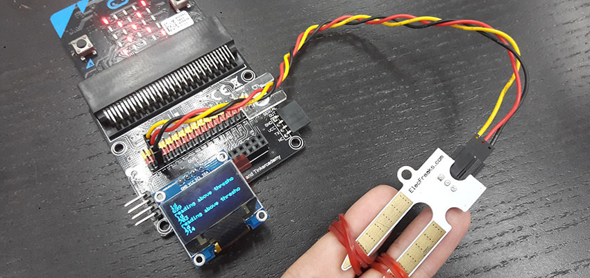  

With this machine, the truth will never escape you! As long as you can make your subject hold a moisture sensor for a while.       

## Products Link

[Tinker Kit](https://www.elecfreaks.com/micro-bit-tinker-kit.html)

## Step 0 – Pre Build Overview    
---  

In this project, we will create a simple lie detector machine, which works by measuring the electrical conductivity of our skin. Upon feeling nervous, our skin’s electrical conductivity will increase, and the moisture sensor can pick up on that. This allows us to determine if a person is telling the truth or not.   

## Material Needed     
---   

- 1 x BBC micro:bit  
- 1 x Micro USB cable  
- 1 x Breakout board
- 1 x Octopus OLED  
- 1 x Moisture Sensor 

**Tips: If you want all components above, you may need ElecFreaks Micro:bit Tinker Kit**  

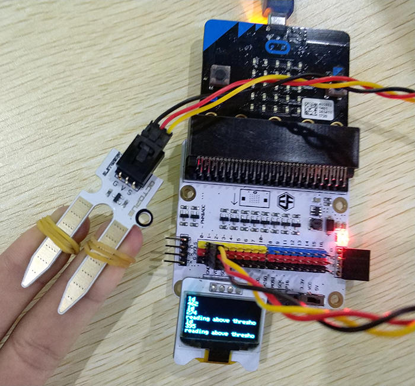  

## Goals    
---  

- Get to know the Octopus LED and Soil Moisture Sensor   
- Learn basic statistics   
- Make something using the moisture sensor   

### Step 1 Components  

First of all, plug in the soil moisture sensor. Match the colors and note down what pin you plug for it will influence later procedures. 

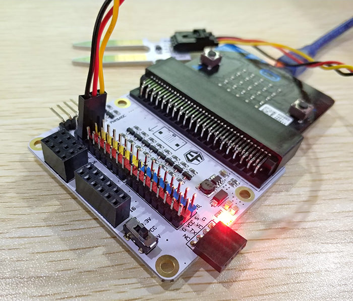  

Next, plug in the Octopus LED. Any of the three slots should do.   

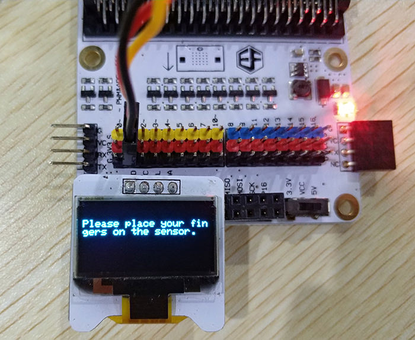  

### Step 2 Pre-Coding  

We’ll need to add a package of code to be able to use our kit components. Click on “Advanced” in the Code drawer to see more code sections and look at the bottom of the Code Drawer for “Add Package”.  

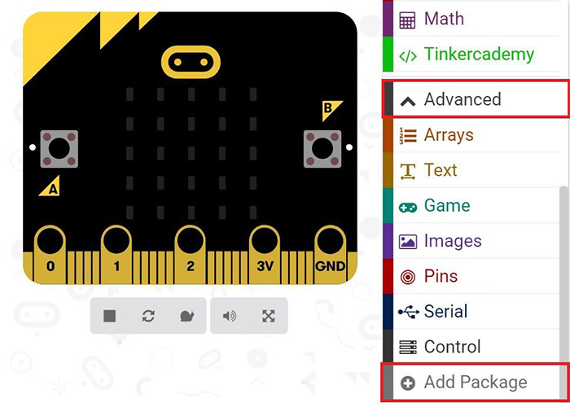  

This will open a dialog box. In “Add Package” text field search tinker kit.   

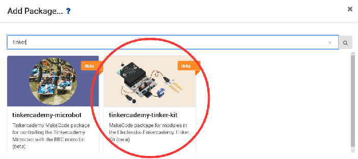  

Note: If you get a warning telling you some packages will be removed because of incompatibility issues, either follow the prompts or create a new project in the Projects file menu.  

### Step 3 Coding  

First of all, initialize the OLED using blocks in the OLED section as shown in the picture.  

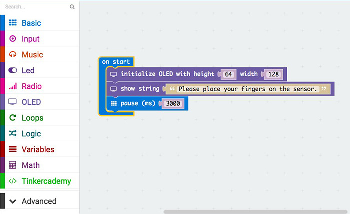  

This part of the code allows the soil moisture sensor to measure and record down the electrical conductivity between the two fingers every few seconds for about 45 seconds. Then, it calculates the average. This is the “calm” value when the user has not told any lies.  

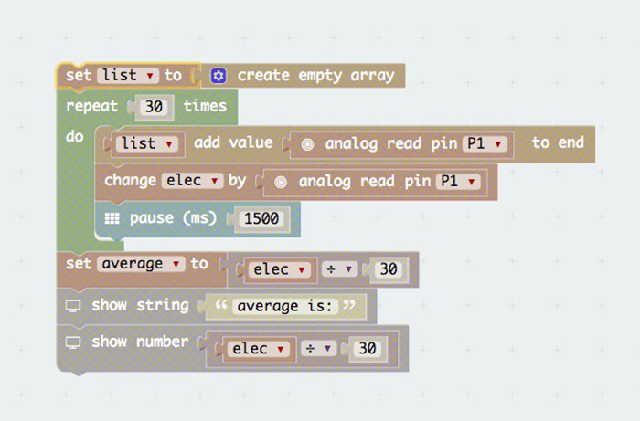  

This part of the code calculates the standard deviation of the readings obtained in that 45 seconds. The standard deviation indicates how different the readings were. A larger standard deviation means more variance in the readings. The “Math.sqrt” block square roots the given value and was added in Javascript.  

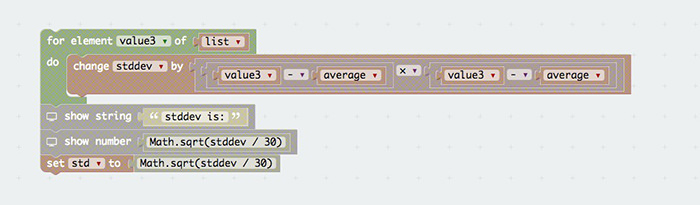  

After the initial readings have been made and recorded, the moisture sensor now measures the average electrical conductivity over 2.5 seconds. If it is higher than the average added to the standard deviation, we can conclude that the user has an abnormally high electrical conductivity and is thus lying. Then, the LED screen would show an “X”shape.  

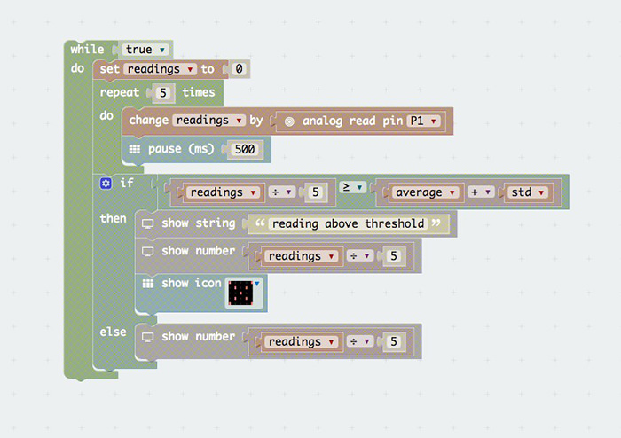  

To relieve your tired fingers, you can download the code below.  

[https://makecode.microbit.org/_fadAyyh27Eo3](https://makecode.microbit.org/_fadAyyh27Eo3)  

Or you can download from the page below.  

<iframe style="position:absolute;top:0;left:0;width:100%;height:100%;" src="https://makecode.microbit.org/#pub:_fadAyyh27Eo3" frameborder="0" sandbox="allow-popups allow-forms allow-scripts allow-same-origin"></iframe>
  

### Step 4 Using It  

First of all, you will have to attach each prong of the soil moisture sensor to one of your fingers. Personally, I found that using rubber bands was a simple and effective way to do so. You can experiment with different methods, such as using crocodile clips or tape. 

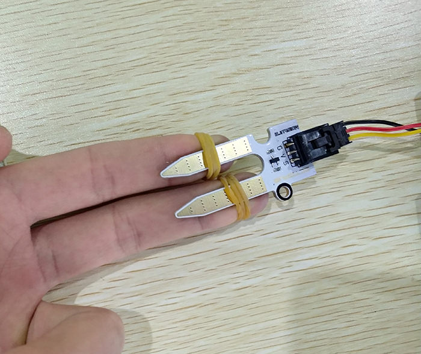  

Now, turn on the device. The device will record the electrical conductivity of your skin under calm circumstances. Then, it will give the average value and its standard deviation.   

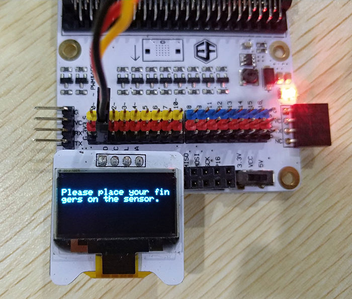  

After the initial readings have been made, ask again! If the person has lied, he will become nervous and the device can pick up on that, resulting in a cross being displayed.   

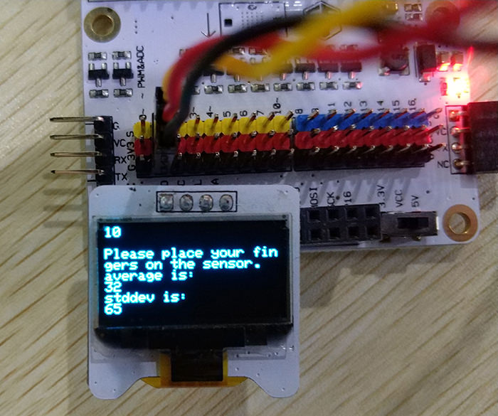  

### Step 5 Success!  

Voila! Now you can test lies with this machine easily.  
