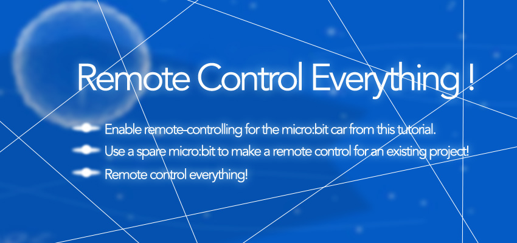
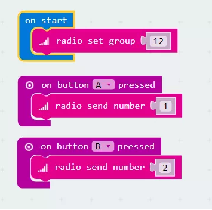
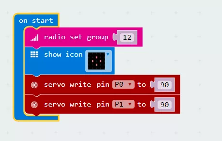
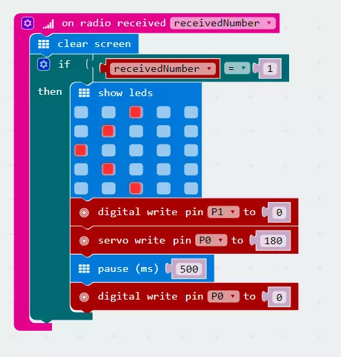
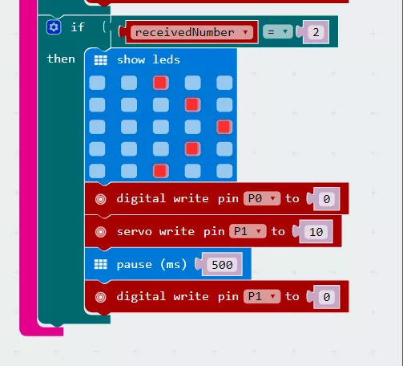

# case 12 Remote Control Everything 

Do you already have a micro:bit project you’d like to control from afar?
Partner up with a friend, or grab a spare micro:bit, to make a remote controlled project with 2 micro:bits. (Don’t grab a friend’s micro:bit. Be nice.)

## Products Link

[Tinker Kit](https://shop.elecfreaks.com/products/elecfreaks-micro-bit-tinker-kit-without-micro-bit-board?_pos=1&_sid=a3579b340&_ss=r)

## Goals  
---
  
- Enable remote-controlling for the micro:bit car from this tutorial.
- Use a spare micro:bit to make a remote control for an existing project!
- Remote control everything!

## Materials  
---  
 
- 1 x BBC micro:bit  
- 1 x Micro USB cable  
- 1 x Battery box  
- 2 x AA batteries  
- 1 x micro:bit car
OR
- 1 x a project you’d like to remote control  

## How to Make  
---

### Step 1  

Set your radio group in makecode. This ensures your transmitter and receiver are in the same channel.
Think about the usage of each button on your remote controller.
Radio send a different number with each button press event block by using the blocks shown.
You can find these blocks under the Radio drawer.
Download this into the micro:bit you’ll use as your remote controller.
Now each button on your micro:bit remote controller will send a different command!

  

### Step 2  

In your micro:bit car project (or the particular project you’re trying to remote control), add the same radio group block to your On Start block.  
 
This ensures the project you’re trying to remote control will listen to the right commands!  

  

### Step 3  

Remember the numbers sent from our remote controller every time we pressed a button? We’re going to use that to trigger an action.
Find the radio received block as shown in the Radio drawer.
Use an if-then block to check if the number you received is the number you sent when pressing button A.
Take the code that turns your micro:bit car left, and place it within this if-then block.
We have also added an led indication pointing left just to show what was supposed to happen.
Turn off the left servo afterward by digitally writing the pin to 0.

  

### Step 4  

Do the same to the code that turns your micro:bit car to the right!
Make sure you turn the right wheel off afterward.
You can always choose to leave the wheels on without stop after receiving each command. But you’ll face with a situation that the car keeps spinning in circles.
Download this program into your micro:bit car.

  

If you don't want to type these code by yourself, you can download the whole program from the link below.

**Remote Control:** [https://makecode.microbit.org/_gH73AW4Dy1rP](https://makecode.microbit.org/_gH73AW4Dy1rP)
**Receiver:** [https://makecode.microbit.org/_4am87cCWb0e9](https://makecode.microbit.org/_4am87cCWb0e9)

Or you can download from the page below.  

**Remote Control:**  

<iframe style="position:absolute;top:0;left:0;width:100%;height:100%;" src="https://makecode.microbit.org/#pub:_TKE3rA7CqL2w" frameborder="0" sandbox="allow-popups allow-forms allow-scripts allow-same-origin"></iframe>
  

**Receiver:**  

<iframe style="position:absolute;top:0;left:0;width:100%;height:100%;" src="https://makecode.microbit.org/#pub:_4am87cCWb0e9" frameborder="0" sandbox="allow-popups allow-forms allow-scripts allow-same-origin"></iframe>
  

### Awesome!  
  
Now that all your code is snugly tucked into your micro:bits, attach your battery packs and get going! Play around and see what other commands you can send with the A+B button, or try different kinds of inputs instead of buttons. Then remote control all your other micro:bit projects. Woo-hoo! World domination without leaving your seat! 

