# case 13 micro:bit Car 

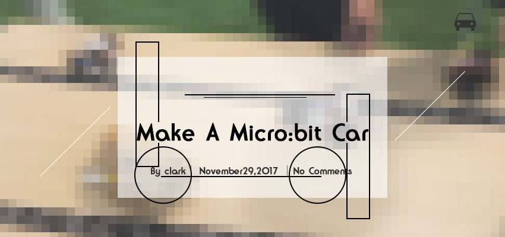

Make your very own self-driving micro:bit car!
(Disclaimer: It’s only “self-driving” inasmuch as a ball rolling down a hill is “self-rolling”.)

## Goals
---

- In this project, we’re going to use the Micro:bit, Breakout Board, and Servos to make a self-driving car!
- Get to know the Servo and how to use it with the Micro:bit, Breakout Board and MakeCode. 
- Marvel at how ridiculous this thing is!

Note: 
This activity uses extra parts not found in the Tinker Kit.
(Stay tuned to our Online Store for our Car Kit !)

## Materials
---

- 1 x BBC micro:bit
- 1 x Micro USB Cable
- 1 x Battery Box
- 2 x AA Batteries
- 1 x Breakout Board
- 2 x Servo
- 1 x Acrylic Car Body
- 2 x Wheels
- 1 x Felt Pad
- Sticky Tape

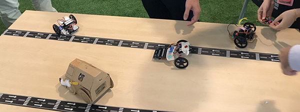
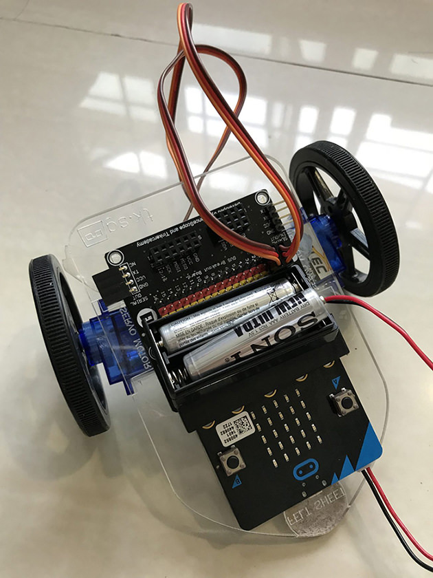

## How to Make  
---  

### Step 1  

Connect your car parts as shown in the following pictures.
If you’re using our car kit, follow the labels on the car body to insert the components correctly with the sticky tape.  
Connect the servo connectors to Pin 0 and Pin 1 on the Breakout Board.  
Note that the colours of common servo cables don’t match the yellow, red, and black colour scheme of the breakout board exactly. Match the orange servo cable to the yellow pin, and the brown servo cable to the black pin.  

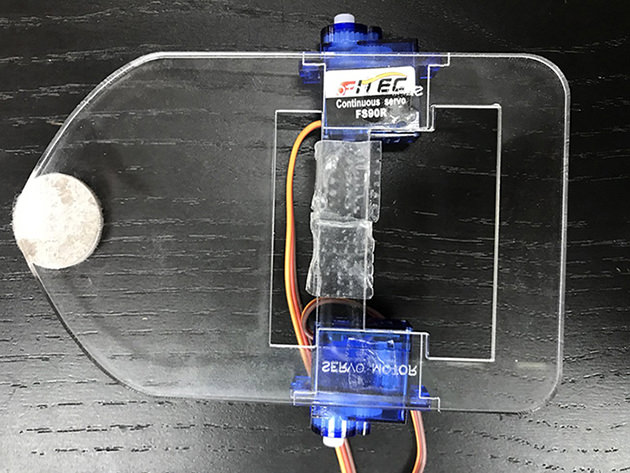
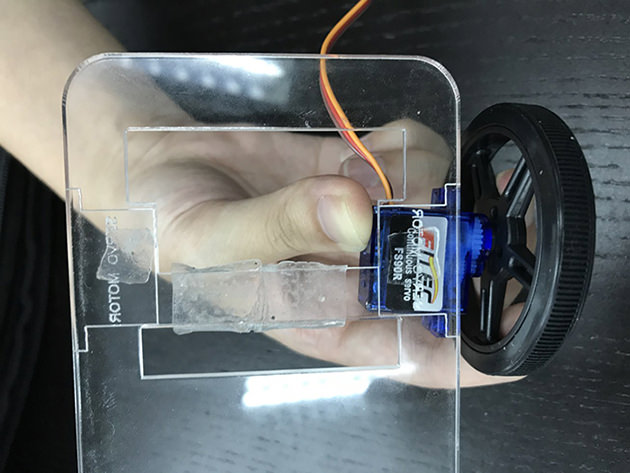
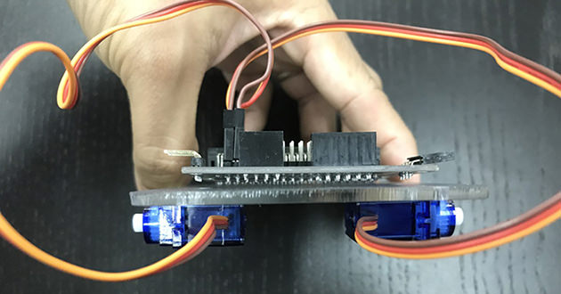
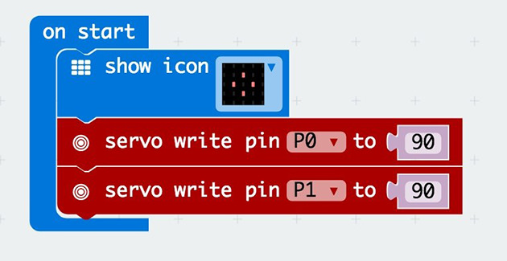

### Step 2

Add the blocks shown to your On Start block.
What this does? Reset the servos to fixed positions whenever we start!
The Servo block (coloured red) in MakeCode takes values from 0 to 180. You can find it under Advanced, then Pins.
For the continuous servos we’re using, a value of 90 is right in the middle. In other words, we’re telling the servo to “stay still”.
We display an image to make a visual indication that we’ve downloaded our code into the Micro:bit.

### Step 3

Let’s make the wheels move! Add the code shown on the right to your Forever block.
The Digital Write Pin to 0 block is also found under Advanced, Pins.
What’s happening here? We’re turning one servo clockwise (180), while turning off the other servo. Then, after a short pause, we’re turning off the former servo, and turning the latter servo anti-clockwise (0). Remember, 90 is straight ahead!
Why do we need to turn off one servo at a time? That’s because of battery power requirements—your micro:bit has trouble in powering both servos at once. If you’re interested, you can explore by using a DC motor with an external power source. Or you can email us to find out more!
Make sure to check that your motors are facing the right directions—you can change the travel directions of the motors by swapping the 0 and 180 values.

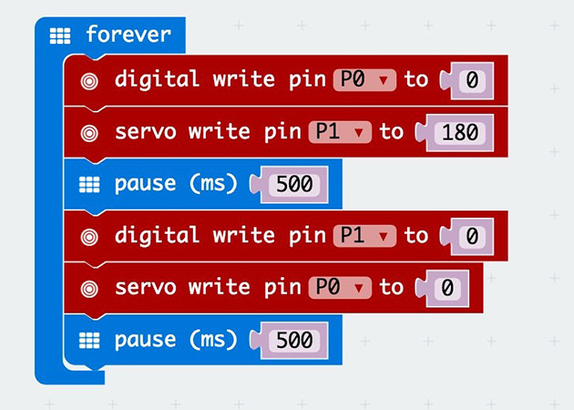

If you don't want to type these code by yourself, you can directly download from the link below.

[https://makecode.microbit.org/_Ef87EJAepcve](https://makecode.microbit.org/_Ef87EJAepcve)

Or you can download from the page below.

<iframe style="position:absolute;top:0;left:0;width:100%;height:100%;" src="https://makecode.microbit.org/#pub:_Ef87EJAepcve" frameborder="0" sandbox="allow-popups allow-forms allow-scripts allow-same-origin"></iframe>

### Succeed!

When you’re ready to run your car, attach your battery pack to your micro:bit, and your car runs ! Besides, you can personalise your car with some craft material to improve its aerodynamic properties! For further extension, you can also hook up an ADKeyboard to control the motors manually, instead of having the car move autonomously.

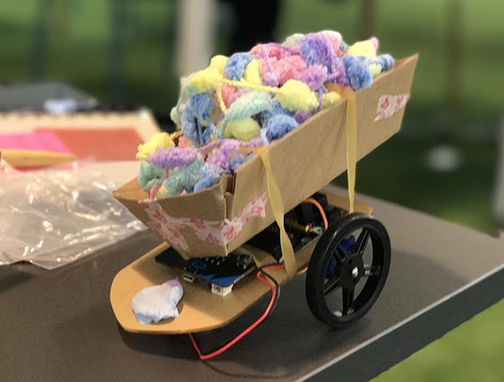
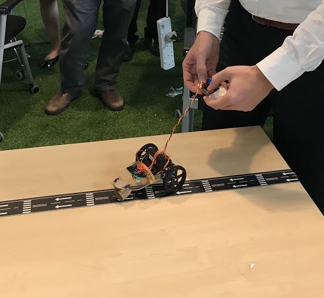
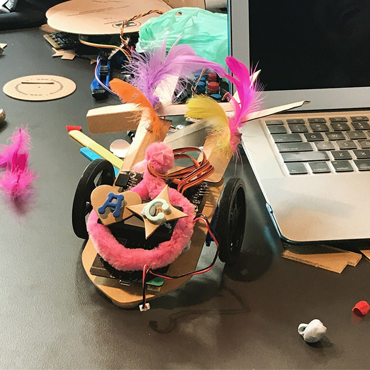
