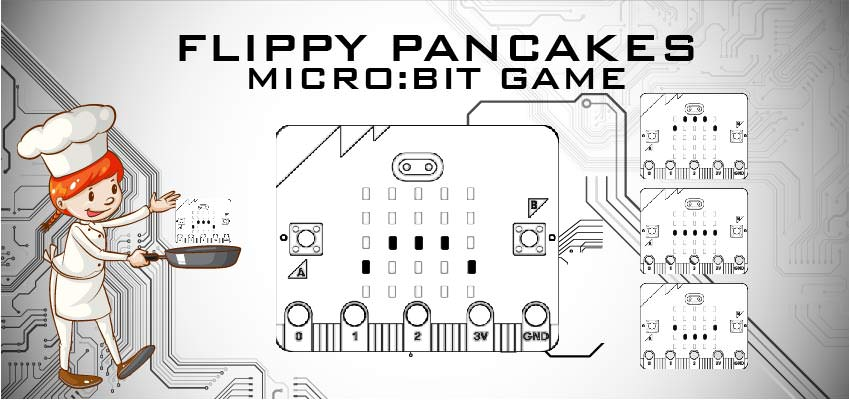
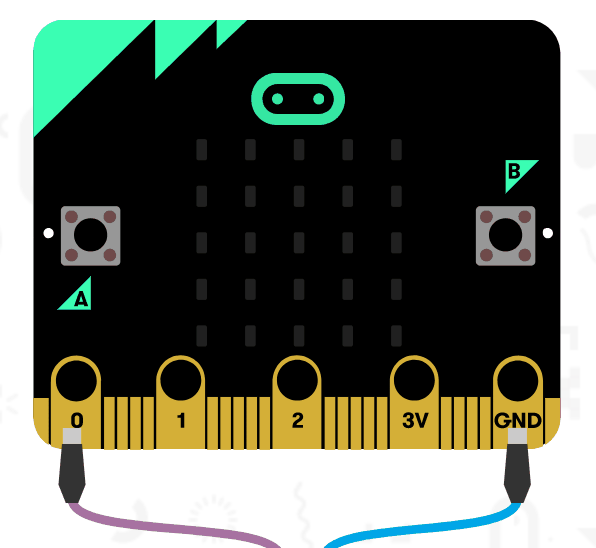
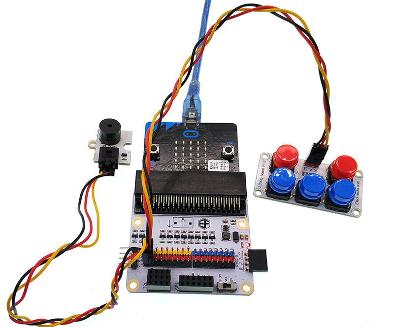
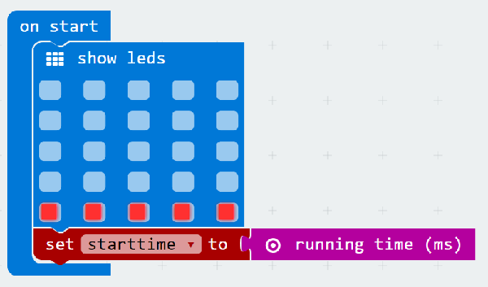
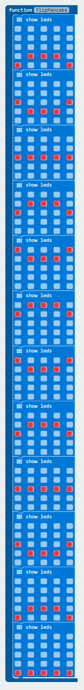
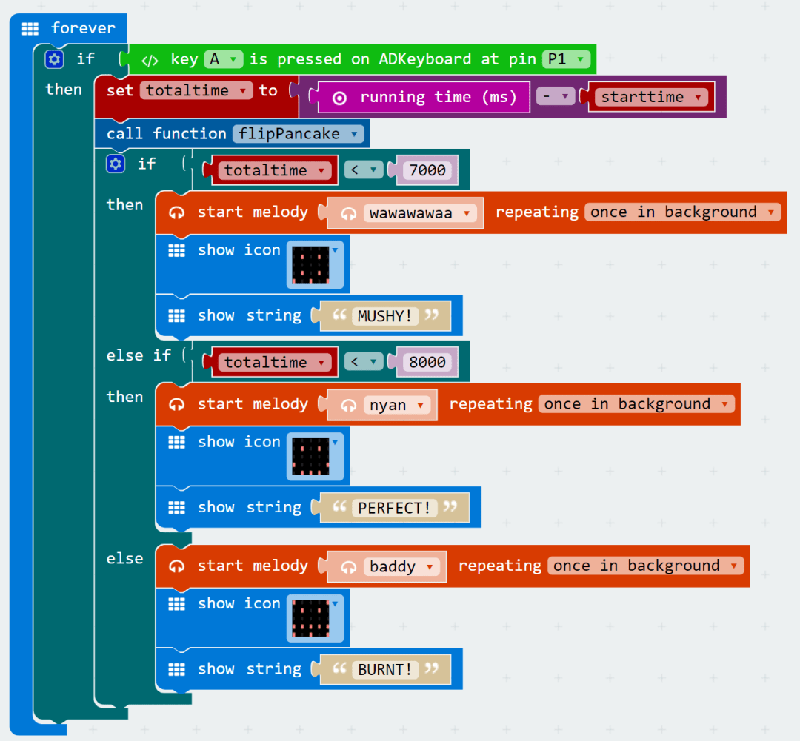
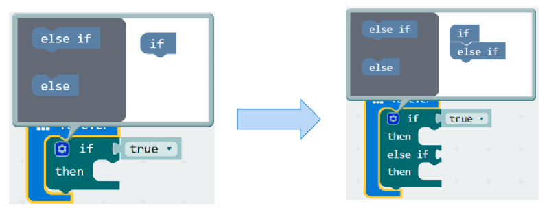
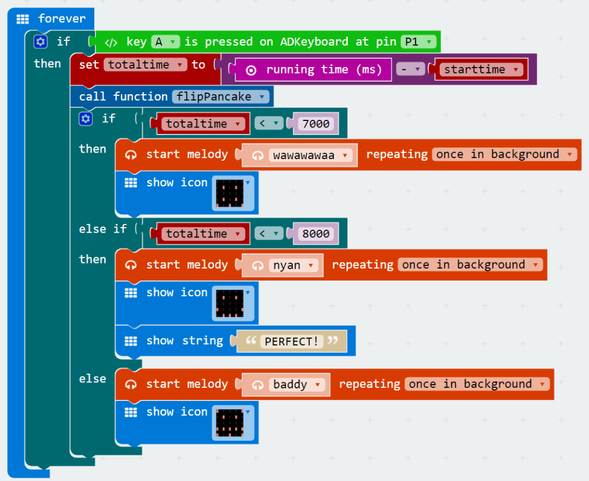
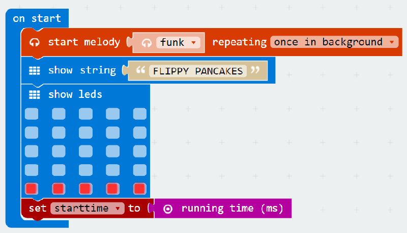

# case 14 Flipping Pancakes 

  

Do you have what it takes to flip the perfect pancake?  

## Goals  
---  

We’re going to create a flippy pancake game where you must flip the pancake at the perfect time. Too fast, your pancake will be mushy; too slow, it will be burnt! You’ll learn how to…   

- Use a Buzzer and ADKeypad with the micro:bit.  
- Use if-else statements to evaluate conditions.  
- Create your own function on MakeCode.  
- Customise your game!  

## Materials  
---  

- 1 x BBC micro:bit  
- 1 x Micro USB cable  
- 1 x Buzzer  
- 2 x F-F Jumper Wires  
- 1 x ADKeypad  

## How to Make  
---    

### Step 1    

Plug in your Buzzer to Pin0. Make sure the positive lead is connected to the yellow signal pin and the negative lead is connected to the black ground pin on the breakout board.  

Plug in the ADKeypad to Pin1. Match the colours of the wires to the ones on the breakout board!

### Step 2  

In Makecode, we’ll track the length of time using two variables. Variables are like buckets that can hold changing values.

Every time we turn on micro:bit, a hidden timer keeps track of how long it has been on. We’re going to use this hidden timer to calculate the start time, end time, and total length of the game.

Create a new variable called startTime (or anything you like, really) in the Variable drawer.

When we start the game, we want to set our variable startTime to the running time of the micro:bit.

We also want to display a flat pancake on the screen with the LEDs.

### Step 3

We want to set up the game so that when you press the A button on the ADKeypad, a pancake-flipping animation will be played on the micro:bit.

To do this, we need to create a function. A function is a piece of code that performs a specific task every single time it’s called. In this case, our task is to display the pancake-flipping animation.

To create your own function, click on the Functions category and choose the ‘Make a Function’ button. I named my function ‘flipPancake’.

When you do this, a new block will be added to your screen called ‘function flipPancake.’ This is where we define our function, i.e. what will happen whenever we run the function block!

In this case, we’re going to add multiple LED blocks inside our flipPancake function so it appears as if our pancake is being tossed into the air and is wobbling as it falls back down.

Once you have your function defined, you can run it anytime by using the new ‘call function flipPancake’ block inside the Functions category.

Feel free to customise your own pancake-flipping animation. This is just one example!

### Step 4

Now we’re going to sense button press on the ADKeypad. To do so, we need to import a special package into MakeCode.

Expand the ‘Advanced’ section, scroll to the bottom and click on ‘Add Packages’.

In the search box, type in ‘tinker kit’. Then click on the box labelled ‘tinker kit’.

Now you’ll see something new in MakeCode – a bright green Tinkercademy category has been added!

Inside this category, you’ll find blocks to sense button press on the ADKeypad. This package importation only happens in current project. So if you start a new project, you’ll need to re-import it.

### Step 5

Now that we can sense button press, let’s create the main code for the game! We need to calculate the time whenever a player presses button A and figure out if the pancake is mushy, perfectly cooked, or burnt.

We start off with a forever loop. Inside the forever loop, we put an if-else statement to test if button A is pressed. If-else statement judges if a condition is true. If it is true, then implement the program; if it is false, then skip it. Because this if-else statement is inside a forever loop, it will forever test to see if button A is pressed.

To do this, we’re going to check the current running time of the micro:bit and subtract the value of our startTime variable. This gives us the total time the current game has been running. We store this in another variable called totalTime (you can create this in the Variables category).

After calculating the totalTime, we call our flipPancake function! This will animate the pancake!

Next, we need to to test the totalTime to judge if the pancake is mushy, perfect, or burnt. We use if-else statement again for this. But in this case, we’re going to link the if-else statements together to test multiple conditions back-to-back. When if-else statements are linked together, only one can be run. As soon as the micro:bit finds one that is true, it skips testing all others that are linked. We can add linked if-else statements by clicking on the gear icon on the if-else block and dragging in more if-else blocks.

In this case, we start by testing if totalTime is less than 7000 (keep in mind this is milliseconds! So 7000 milliseconds = 7 seconds). If totalTime is less than 7000, we determine that the pancake is mushy and display a frowny face and a MUSHY message. If this first condition is true, the micro:bit will skip testing all the following conditions!

If totalTime is not less than 7000, we test if totalTime is less than 8000 milliseconds. We know at this point that totalTime is greater than 7000. So if it is also less than 8000, we determine that the pancake is perfect and display a happy face and a PERFECT message.

Finally, if neither of the previous two conditions are true, then we know that totalTime must be greater than 8000. So we determine that the pancake is overcooked and display an angry face and a BURNT message.

### Step 6

Now that we have the game running. Let’s make it so that players can play more than once without resetting the micro:bit.

To do this, we’ll reset the game when button B is pressed on the ADKeypad. Once again, we use a forever loop and place an if-else statement inside to test if button B is pressed (don’t forget to specify the correct Pin number again!).

What else do we need to do when we restart the game? In this case, all we need to do is to display a new pancake, and reset the starting time.

### Step 7

Now our game is working (hopefully)! Let’s add some more fun to the game! We have a buzzer attached to the micro:bit but haven’t used it yet! Note: Add this onto your existing code. It’s not a brand new section!

Micro:bit has lots of pre-programmed music melodies available for us to use. Let’s add music to our game! Here we add a different melody to each outcome of the game. For mushy or burnt pancakes, we add sad melodies. But for perfect pancakes, we play the nyan-cat melody!

We need to set these melodies to play ‘once in the background’, otherwise it could pause the entire game until the melody is finished playing.

### Step 8

Finally, let’s add some starting music and a starting message when we first start up the micro:bit. Note: Add this onto your existing code. It’s not a brand new section!

We can use the buzzer once again to play a melody (once again we want it to play ‘once in background’). We can also display the name of the game as well!

If you don't want to type these code by yourself, you can download directly from the link below.

[https://makecode.microbit.org/_aepYrcgwLFEy](https://makecode.microbit.org/_aepYrcgwLFEy)

Or you can download from the page below.

<iframe style="position:absolute;top:0;left:0;width:100%;height:100%;" src="https://makecode.microbit.org/#pub:_aepYrcgwLFEy" frameborder="0" sandbox="allow-popups allow-forms allow-scripts allow-same-origin"></iframe>

### Cool Stuff!

Now you’ve learned how to use the ADKeypad, you can use it to control LEDs, servos, and other components! You have also learned about if-else statements and creating your own functions, which can be useful in many micro:bit projects! Try customising your pancake game as well!

