# case 16 QUICK MATHS 

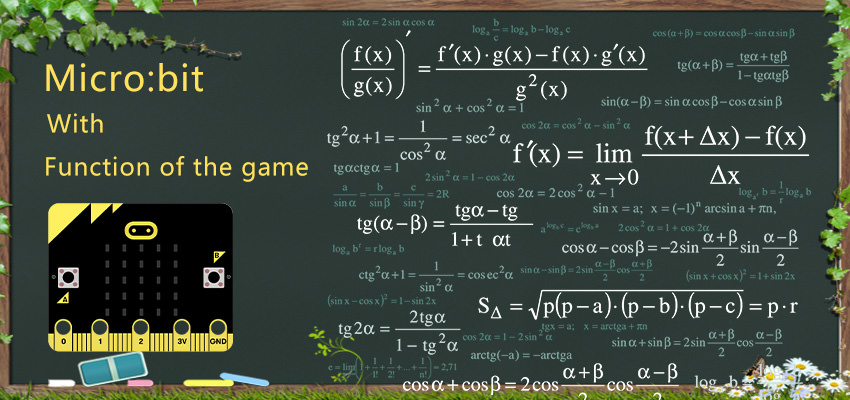

QUICK MATHS is a game where its all about testing your mental calculation. Too slow, you lose; too fast, you may make mistakes.

## Step 0 – Pre Build Overview  
---  

- Use a Buzzer and OLED with the micro:bit.
- Use if-else statements to evaluate conditions.
- Create your own function on MakeCode.

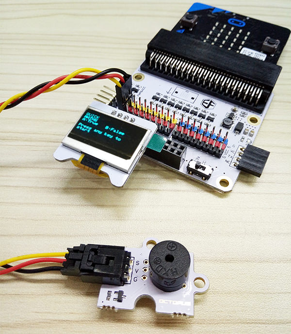

## Materials required  
---  

- 1 x BBC micro:bit  
- 1 x Micro USB cable  
- 1 x Buzzer  
- 1 x Octopus:bit
- 1 x OLED 

## How to Make    
---  

### Step 1 – Components  

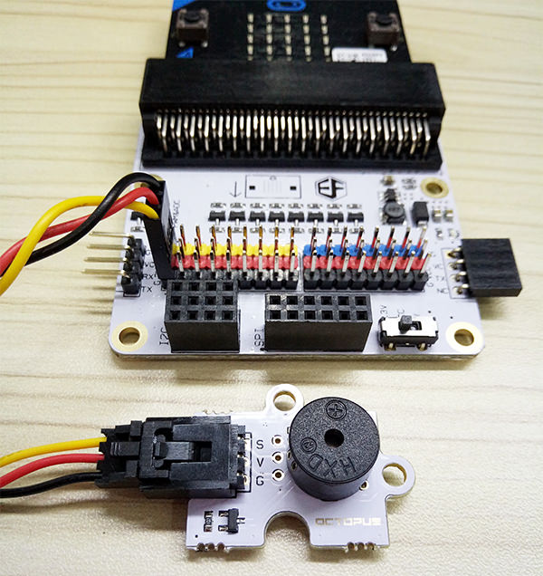
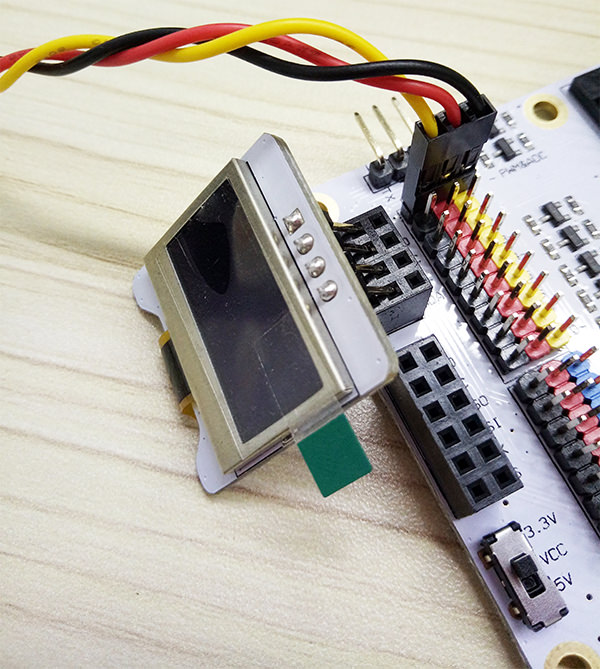

Connect the buzzer to P0.

Plug in the OLED as shown in the picture above. You can plug it into any of the three rows.

### Step 2 – Pre-coding  

We’ll need to add a package of code to be able to use our kit components. Click on Advanced in the Code drawer to see more code sections and look at the bottom of the Code Drawer for Add Package.

This will open up a dialog box. Search for OLED. Click on the search icon or press enter, then select the oled-ssd1306.

### Step 3 – Coding Initial Screen  

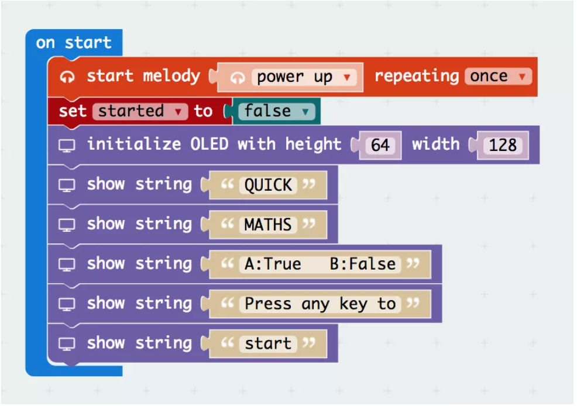

From the music section start the power up melody, this is the game’s introduction music.
After that, create a variable named started and set it to false, as the game has not started.
Finally, use the blocks under the **Tinkercademy** section to initialise the OLED and display the messages as shown in the picture above.

### Step 4: Coding Randomiser Function  

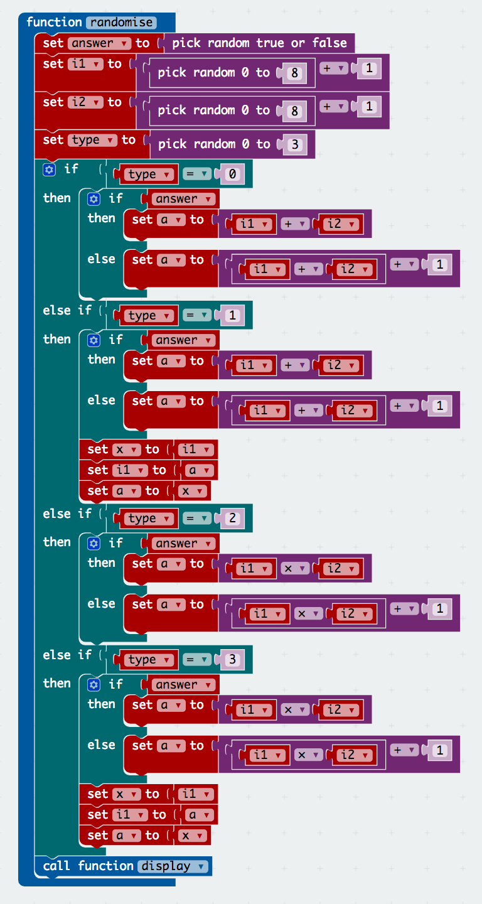

In this step, we will randomise the questions that will be displayed.
Firstly, create a variable named answer. In this, we will store whether the answer should be true or false. We determine this by using the randomiser block under Math.

Next, we create 3 more variables – i1, i2 and a.
i1 + i2 = a this is an example of what these variables would be used for.
We then assign a random value from 1 to 9 to i1 and i2. The value of a would be set later.

After this, we create a variable name type, which will be used to store what type of question this is. 
(0: Addition, 1: Subtraction, 2: Multiplication, 3: Division)
type would then be given a random number from 0 to 3 using the block under math.

From here, there is an if-else statement that checks what type of question it is in order to generate an answer.

For Addition (0), if the answer for this is supposed to be true, we set a to the sum of i1 and i2. However, if this is supposed to be false, we add 1 to correct answer.
For Subtraction (1), if the answer for this is supposed to be true, we set a to the sum of i1 and i2, afterwards we swap the values of a and i1. However, if this is supposed be false, we add 1 to i1.
For Multiplication (2), if the answer for this is supposed to be true, we set a to the product of i1 and i2. 

However, if this is supposed to be false, we add 1 to correct answer.
For Division (3), if the answer for this is supposed to be true, we set a to the product of i1 and i2, afterwards we swap the values of a and i1. However, if this is supposed be false, we add 1 to i1.

### Step 5: Coding Display Function  

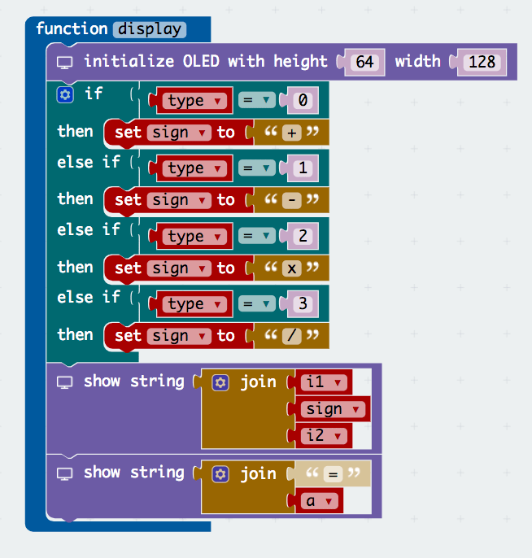

In this step, we will create a function that displays the question on the screen.
First, initialise the OLED as shown in the picture.
Next, we want to determine what sign to use, so we create a variable named sign.
Afterwards set the value of sign by using an if-else statement that checks what type of question it is.
(0: +, 1: -, 2: x, 3: /)
Now we have what we need to display the equation.
Under the OLED section, select the show string block and add the variables i1, sign, i2.
Now that the display function is done, call the function at the end of the randomise function, as you would want the question to be displayed after the values have been randomised.

### Step 6: Coding the Start Action  

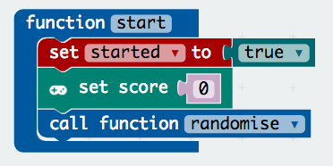

Now that we can randomise the questions, it is time we start the game.
Firstly, create a start function. In this function, set the start value to be true and call the randomise function. Afterwards, from the game section in **advanced**, add the **set score** block and set the value to 0.
Now that the function is complete, add the 2 button pressed blocks under the input section for both buttons A and B. In both blocks, create an if-else statement to check if the game has started. If it hasn’t, call function start.

### Step 7: Coding Check Function  

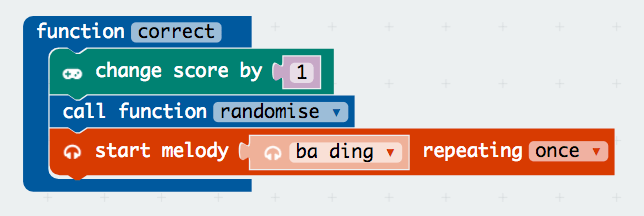

Continuing from step 6, now we will be working on the part if the game has started.
Firstly, create 2 functions – correct and wrong. In the correct function, select the change score block from under the game section and change the score by 1. Next call the randomise function to get the next question and lastly start melody ba ding that repeats once for additional sound effects.
Moving on to the wrong function, start melody wawawawaa repeating once and show icon X to indicate that the player has chosen the wrong answer. Afterwards, initialise OLED as shown in image.
Lastly, we want to check the high score. Start off by creating a high score variable. Next create an if-else statement as shown above, in this logic gate we are checking if the score is higher than the player’s high score. If it is, then the high score value will be set to the current score.
Don't forget to set the start variable to be false when the game has ended.
Now that we have completed the correct and wrong functions, we need to call them as shown in the image.

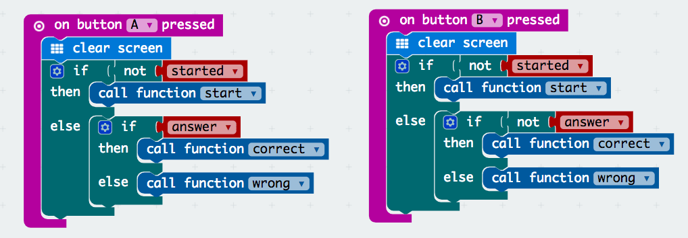

### Bonus step 8: Coding Timer  

Now you have a functioning game. But to make things more exciting, we should add a timer. Before we dive into that, there are a few things we have to do first.  
Firstly, create an end function. Set up in the function accordingly. This may seem familiar as this is the last part of the wrong function. You can replace that portion by calling this function. This function would be called again to prevent reprogramming.  

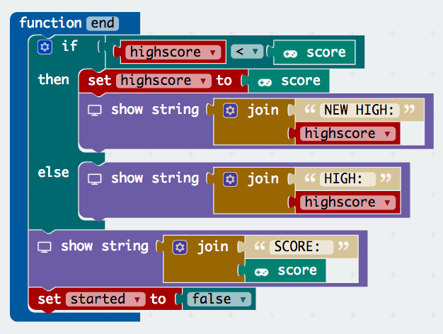  

Next, create a slow function. This would be called if the player does not answer in time. Create the blocks as shown in the image.  

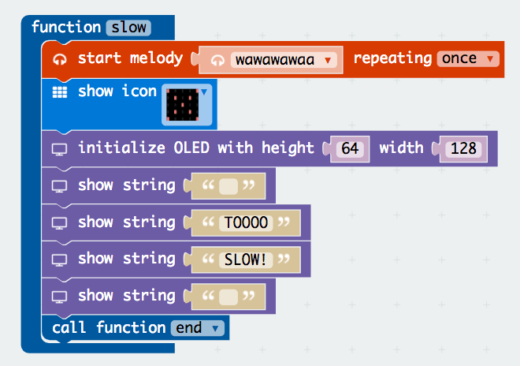  

Following that, we have to create a new variable called time. Time stores when the player started a specific question. Afterwards, set its value to the running time (ms) block which can be found under the more tab of the input section.  

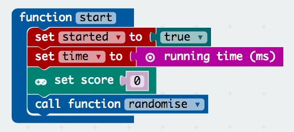  

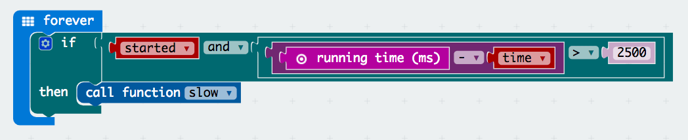  

Micro:bit does not have a built-in timer, thus we have to design one by using what they offer. Now we know the starting time is when the player started the question, and running time is how long the program has been running. From this, if we subtract them we get how long the player has spent on that question. For this game, we only allow the player to have 2.5s (2500ms) for each question. Hence, they will lose if they are too slow.  

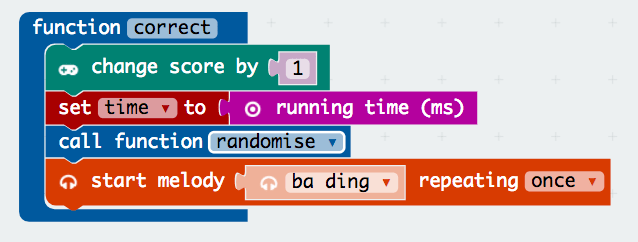  

Lastly, in the correct function add a block that sets the value of time to current running time. This is to refresh the starting time for a new question.  

That’s it! You’ve officially completed this tutorial.   

If you don't want to type these code by yourself, you can directly download the whole program from the link below.  

[https://makecode.microbit.org/_ThdfipEwFbWs](https://makecode.microbit.org/_ThdfipEwFbWs)  

Or you can download from the page below.  

<iframe style="position:absolute;top:0;left:0;width:100%;height:100%;" src="https://makecode.microbit.org/---codeembed#pub:_HXEKc46PeDRm" allowfullscreen="allowfullscreen" frameborder="0" sandbox="allow-scripts allow-same-origin"></iframe>

