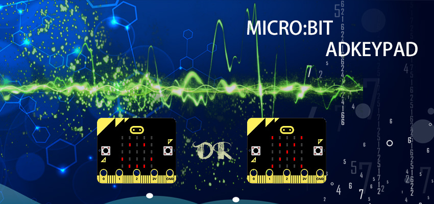
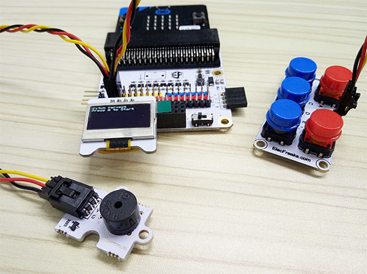
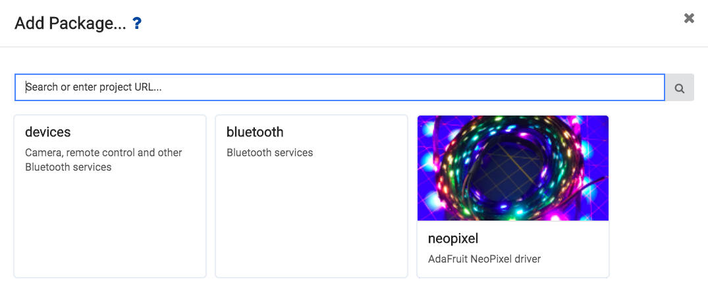
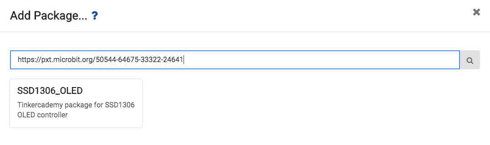
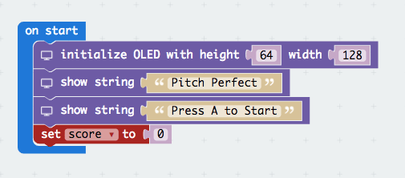
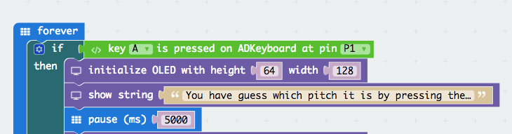
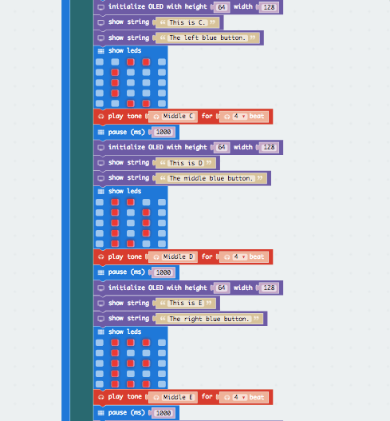
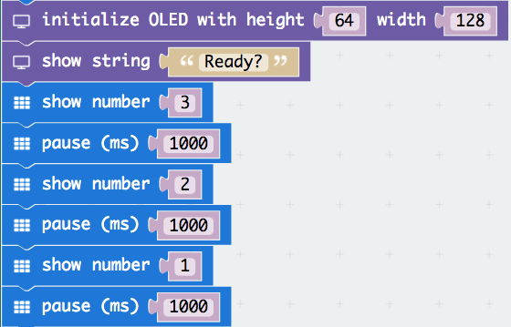
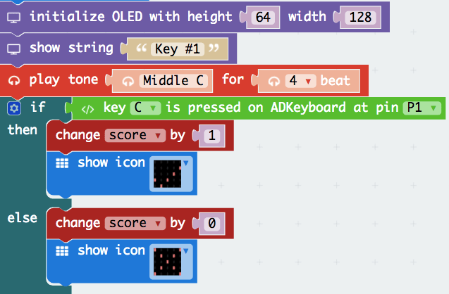
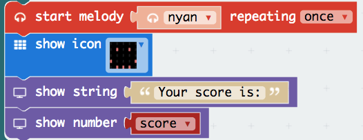

# case 17 Pitch Perfect 

Do you think your ears are pitch perfect, then try my game. Or even better, create one!

## Products Link

[Tinker Kit](https://www.elecfreaks.com/micro-bit-tinker-kit.html)

## Goals  
---

- Learn how to use a ADKeypad, the OLED screen and the buzzer.
- Make something with a ADKeypad, OLED screen and the buzzer.
- Learn the if-else statement functionality.

## Materials Needed
---

- 1 x BBC micro:bit
- 1 x Micro USB cable
- 1 x Buzzer
- 2 x F-F Jumper Wires
- 1 x OLED
- 1 x ADKeypad
- 1 x Breakout Board

## How to Make
---

### Step 1:

Firstly, plug in your buzzer to Pin 0, making sure the positive side (usually the longer end) is connected to the yellow signal pin and the negative end is connected to the black ground  pin on the breakout board.

Plug in the ADKeypad to Pin 1, making sure that the colour of the wire and breakout board matches. Then, attach the OLED screen at the bottom left socket of the breakout board.

### Step 2:

We will need to add a package to the code editor to use the kit components. Click on the advanced in the micro bit text editor and you will see a section that says Add Package.

This will open up a dialog box. Search for OLED. Click on the search icon or press enter, then select the oled-ssd1306.

Note: If you get a warning telling you some packages will be removed because of incompatibility issues, either follow the prompts or create a new project in the  Projects file menu.

### Step 3:

First, you have to initialise the OLED screen to a height of 64 and width of 128 so to run the screen in the proper sizing.

Next, you have to set a variable starting score to 0 for the initial play. This means you have a score of 0 at the start of your game. Then you need the OLED display show a text of “Pitch Perfect”.

You need to write a simple instruction on how to start. Thus, a simple sentence “Press A to start ” will do.

### Step 4:

Since at step 3 we wrote that you need to press A to start, we need to write a condition for it. A condition basically means a requirement for a program to start loading its instructions. Thus, an if-else statement of the A button being pressed would suffice. Moreover, this will be nested on a forever bracket.

Next, you have to write another set of instructions on how to play the game. What I wrote was : “You have guess which pitch it is by pressing the correct key”. Then you have to have a timeout around 5000ms (5 seconds) to let the user read the instructions.

### Step 5:

You are gonna introduce the user to listen to the pitch of the sound being played. What I did was to play the pitch (for example: C) for 4 beat (4 seconds), flash the led on the MicroBit of the pitch C and OLED display on the screen itself.

After that, I will put in a timeout so the user can process the pitch to the correct alphabet and the ADKeyboard. Additionally, you can put in the OLED screen on what buttons are to be pressed for a certain pitch. Example, when Pitch C is being played, I wrote “Left blue button” to indicate that is the button.

If you are wondering, why the intialise OLED display and show string block is repeated, it is because it would simulate a refresh in web browser. If you do not initalise the display, the text would just be brought down instead of new text being created.

### Step 6:

Once the user have gone through the mini-briefing of how the pitch sounds, you can get them ready. You can have a countdown for them to get ready on the game itself.

Now, you can build your pitch tests. So, to do that, you need to play a pitch and you can customise by displaying by any image on the MicroBit and a message “Key #1” at the same time.

Then, if the user pressed the correct button on the ADKeypad, they would get a point. If not, no points. Thus you set the variable score to change by 1 if the get it correct and otherwise, a -1. Thus, an if-else statement on whether the user pressed the correct button will do.

To let the user know if they got the correct answer, you can display of an image tick for a correct answer and a cross for a wrong answer.

Repeat this step so you can have many tests to play with!

### Step 7:

Once you are contempted with your tests, you can end the game by showing the latest scores. You can display in the OLED screen “Your score is:” with the variable score shown. Put a smiley for fun sake.
And you are done! Enjoy the game.

If you don't want to type these code by yourself, you can directly download the whole program from the link below.

[https://makecode.microbit.org/_A26fCxRz1P1g](https://makecode.microbit.org/_A26fCxRz1P1g)

Or you can download from the page below.

<iframe style="position:absolute;top:0;left:0;width:100%;height:100%;" src="https://makecode.microbit.org/#pub:_A26fCxRz1P1g" frameborder="0" sandbox="allow-popups allow-forms allow-scripts allow-same-origin"></iframe>

