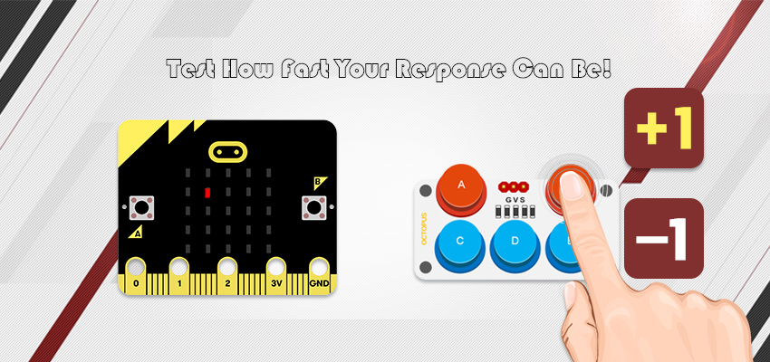
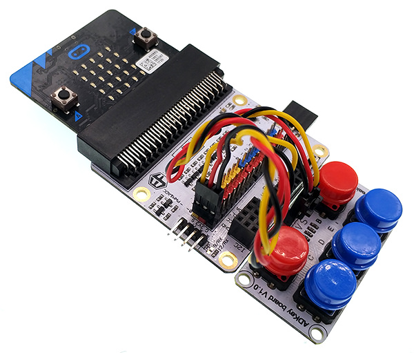
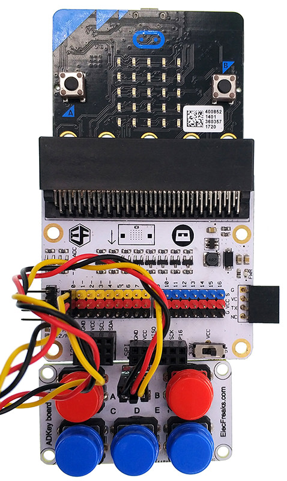
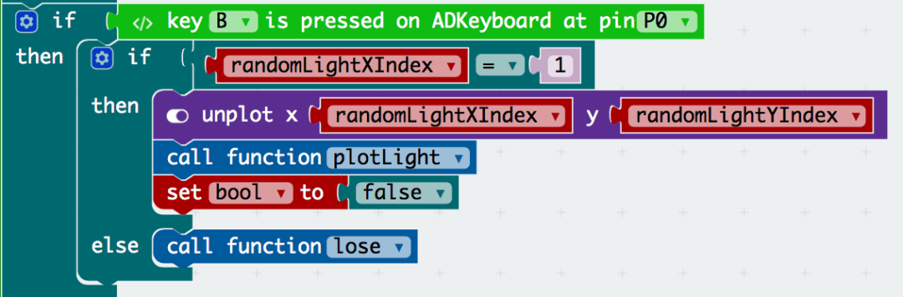
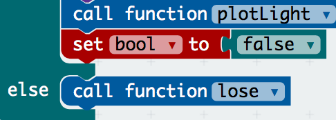
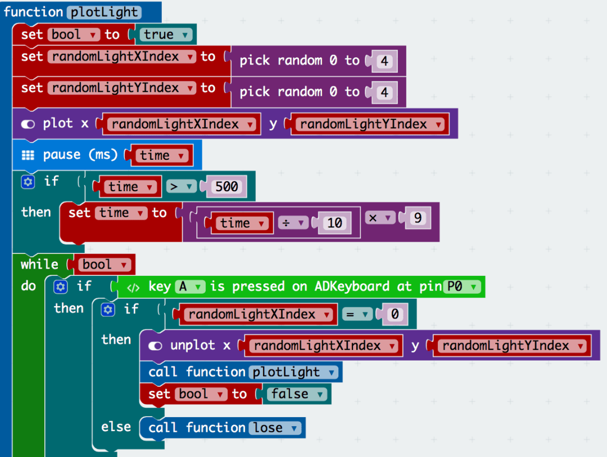
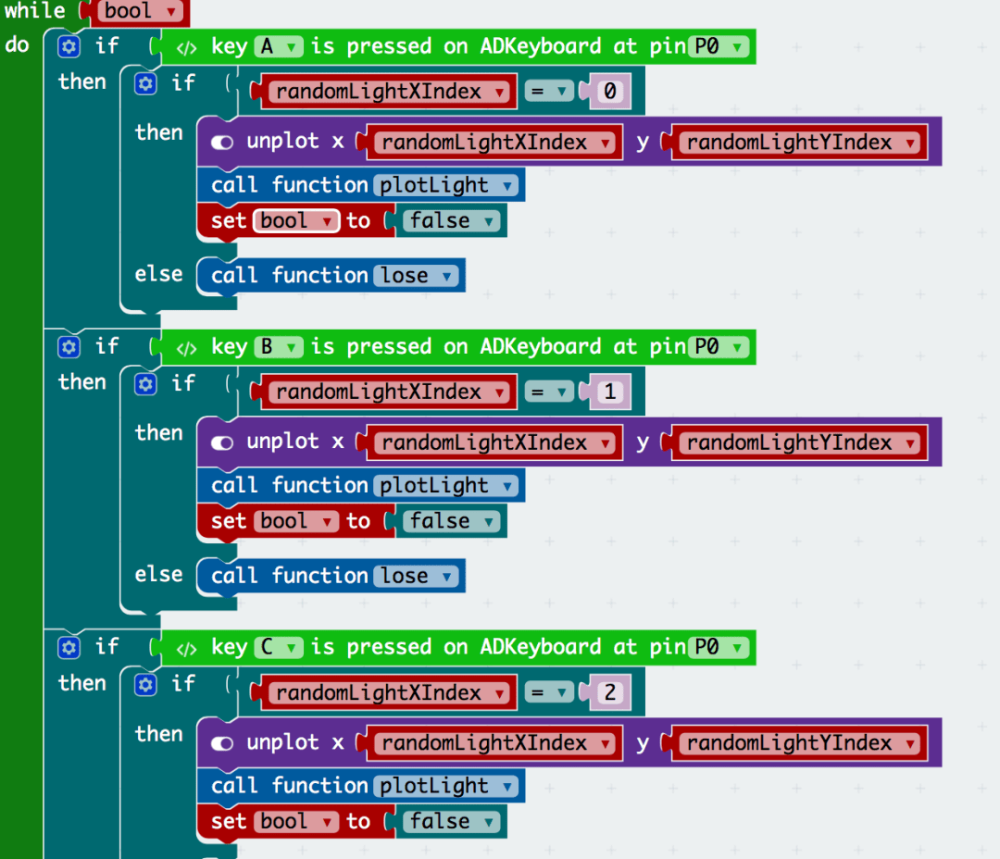
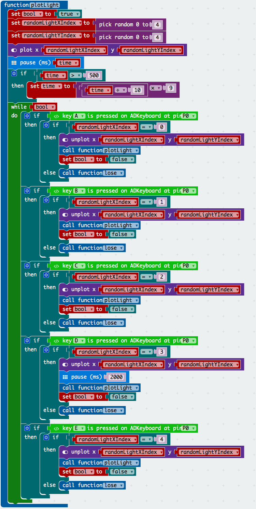
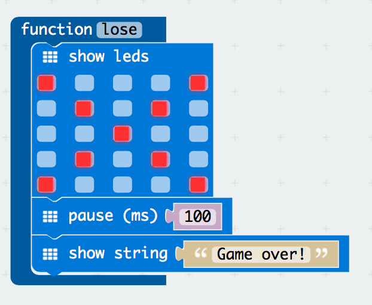
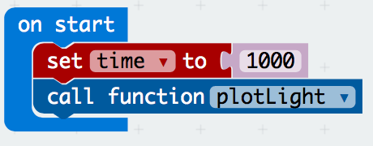

# case 18 Finger Dexterity 

Are your psychomotor skills as bad as mine?

## Products Link

[Tinker Kit](https://shop.elecfreaks.com/products/elecfreaks-micro-bit-tinker-kit-without-micro-bit-board?_pos=1&_sid=a3579b340&_ss=r)

## Goals
---

We are going to create a game where the player must click on a key (on the ADKeypad) that corresponds to the column on which a random LED lights up (A for the first column and E for the last). The pace at which the LED lights up gets quicker and quicker as the game goes on. You’ll learn how to：

- use an ADKeypad with the micro:bit.
- use functions recursively.
- use while loops.
- improve your finger dexterity!

## Materials and Pre-requisites
---

- 1 x BBC micro:bit
- 1 x Micro USB cable
- 1 x F-F Jumper Wires
- 1 x ADKeypad
Or 
ElecFreaks Micro:bit Tinker Kit (contains all components in the above.)

You also need some experience about if-else statements, variables etc.

## How to Make
---

### Step 1

Plug in your ADkeypad to Pin0, making sure the positive lead is connected to the yellow signal pin and the negative lead is connected to the black ground pin on the breakout board.

### Step 2

In order for the ease of randomisation of the LED that lights up, we will use a function recursively. A function used recursively will call itself (!) so as to acheive the end goal. I created the function plotLight for this reason. If you have not covered functions, go here.

Then i set two variables randomLightXIndex and randomLightYIndex to integers between 0 and 4. This will correspond to the specific LED that lights up. Doing this will ensure randomness (let us not get into the discussion as to where true randomness can really be generated) of the LED that lights up so the game will be different and unpredictable every time.

I also set the variable bool to true. While this may not be obvious now, it will come in handy later (in reality this was a later addition that I decided to add after the rest of the function was fleshed out. The reason for this will come to light later). This is a common technique in coding (especially with while loops).

In order to increase the difficulty, it was my judgement that a  time variable could be useful. We use this later to decrease the pause time betwen one LED lighting up and the next. We have set a lower limit for the pause time at half a second so as to not make the game impossible. When we call the function recursively, the if-statement modifying the pause time is what will decrease the pause time everytime the function is called.

I have created a bunch of if-else statements inside a loop. These statements periodically check if a button on the keyboard was pressed and if the button corresponds to the x-coordinate of the LED that lights up. We have to do this because the pressing of the keypad does not emit an event that our event listeners in micro:bit’s core modules can respond to (like how it does for shaking or button presses). Thus, we had to create our own event listener. This event listener only runs as long as bool (which we created earlier) is true.

### Step 3

Inside the if-else statement, we check to see which key was pressed and if it corresponds to the column of the LED (x-coordinate). If it was, we CALL THE FUNCTION AGAIN. This is how recursive programming works. By calling the function again, we basically start over with a new LED. Note that when we call the function again we decrease the value of the time variable and thus the pause duration will be shorter.

Note that I unplotted the point first LED. This is to ensure that we don’t have more than one LED in each round so as to not confuse the player. If you wanted to make the game more difficult, you could show multiple LEDs and play for only the most recent LED that lights up. Treat that as an extension!
Interestingly, I have set bool to false. Why?

### Step 4

The bool is set to false so as to terminate the above while loop. This is not strictly necessary and I initially disregarded this. However, it is important to note that terminating the while loop greatly improves the efficiency of your program and efficiency of our programs is something generally worth considering.

I have also created and called a function to handle the case where the player types the wrong key. This will be covered later.

### Step 5

That was quite a lot for one function! It can be quite a bit for a newbie at programming so let me go through that one more time.

We use random integers between 0 and 4 for the determination of the LED that lights up. (Note that we use an index that starts with 0 – this means that the top left corner is (0,0))

In anticipation of the function being called in some point in the future, we decrease the pause time so that when that happens the game is more difficult.

We run our own homemade event listener (the name betrays its function – it simply waits for an event to happen and acts with our preset code when it does). We use a while loop to listen for an event. If it does not find an event in one loop the if-else statements inside will not be activated and thus, it will go on to the next iteration. When the event does happen (in this case the pressing of the key), the if-else statement is activated from its slumber and thus, in this rather ingenious way, we have created an event listener. (Extension: Browsers listen for events like clicks or keypad presses in the same way).

### Step 6

Inside each if-else statement, we have decided to end the game if the wrong keypad was pressed and tell the player what we think of him/her.

If the right key was pressed, we immediately go on to the next LED light whilst ending the previous while loop or effeciency purposes (just to be clear, your code will still work but it’s best not to foster such bad habits).
Whilst going on to the next LED light, we make use of a concept called recursion. To fully understand the inner workings of recursions we must be familiar with concepts like execution contexts, which is beyond the scope of this tutorial. 

### Step 7

That was a lot of work!!

But in the end, we have created a wonderful function that can be called recursively. It is remarkable that such a game can be simplified so much so that its crux is in one block of code!

### Step 8

Now we just want to tie up some loose strings.
The lose function is one that we will call when the player presses the wrong key. It is mostly self-explanatory and if you could get past the previous parts, it should be obvious what the code does.

### Step 9  

Now to start the first LED.  
We call the function when the file loads. Due to the recursiveness of the function, the game will take care of itself thereafter with minimal effort from us. How is that for effeciency!  

If you don't want to type these code by yourself, you can download the whole program from the link below.  

https://makecode.microbit.org/_eeyAFJMcg8z5  

Or you can download from the page below.  

<iframe style="position: absolute; top: 0; left: 0; width: 100%; height: 100%;" src="https://makecode.microbit.org/#pub:_eeyAFJMcg8z5" width="300" height="150" frameborder="0" sandbox="allow-popups allow-forms allow-scripts allow-same-origin"></iframe>
  
&nbsp;

### Wonderful!  

  

You have completed this tutorial! If you wish to challenge yourself further, go ahead and add a counter that counts the number of points a player gets before he/she loses. Clue: Create a variable called counter and increment it as you see fit. Remember to display it as well!  

Congratulations!  

This tutorial was possibly a level higher than the rest and if you got here you are definitely rocking it. If you didn’t, take solace in the fact that it took me weeks to get my head around concepts like recursions too. Good luck!  
