# case 19 Electric Spirit Level 

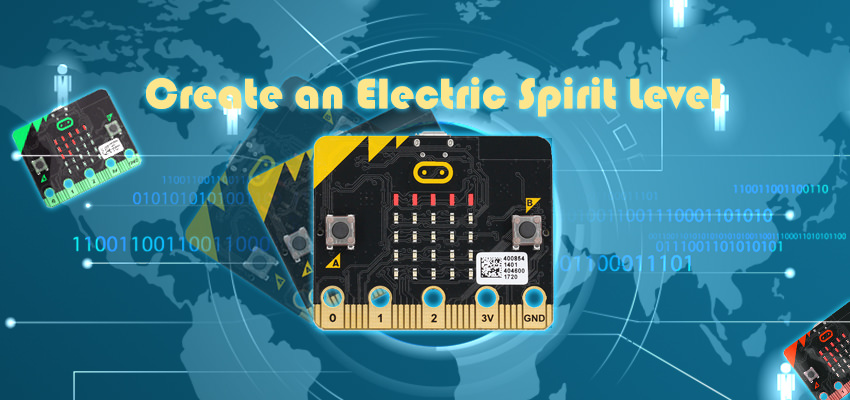

Use this spirit level to quickly and easily display the tilt of any object attached!
Created by Kaitlyn from Raffles Institution.

## Goals  
---

- Learn to read tilt with micro:bit’s built-in accelerometer.
- Learn to work with micro:bit’s 5x5 LED Display!

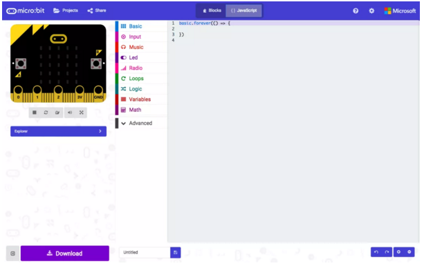

## Materials  
---

- 1 x BBC micro:bit
- 1 x Micro USB cable
- 2 x AA Batteries
- 1 x Double AA Battery Pack

## Pre Coding: Connect your Micro:Bit
---

- Connect the BBC micro:bit to your computer using a micro USB cable.
- Access the javascript editor for the micro:bit at makecode.microbit.org.  

### Step 0: Code Flow  

Before we begin writing the code, we need to decide what we want to achieve with the program and in what order should each component run.

For the electric spirit level, the steps that we will take in the code for each loop are:

Read tilt readings from accelerometer.
Convert tilt readings to tilt levels to be displayed on LED matrix.
Check for change in tilt level readings from previous loop.
Create array of LED coordinates for different tilt cases and directions.
Plot LED coordinates onto micro:bit LED matrix.

A few additional functions we need to include are:

Calibration for initial tilt position.
Returning to default tilt calibration.

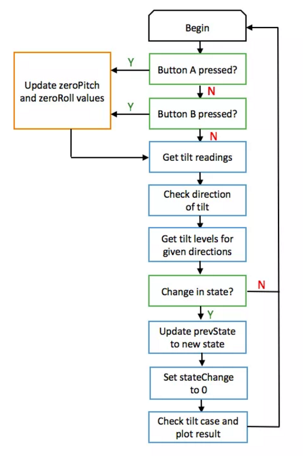

## How to Make  
---

### Step 1: Defining Variables

We start by defining variables needed as shown. A breakdown of a few  variables are:

tiltList: Array that stores extent of tilt from values 0-4 in the order [Left, Right, Forward, Backward]
tiltBoundary: Boundary of the first tilt level between 0 (no tilt) and 1 (slight tilt)
prevState: Array that stores the tilt values of the micro:bit from a previous loop in the same format as tiltList, used to check for a change in tilt between iterations
ledPlotList: Plot led coordinate arrays in the form (x, y). To define an array , we use the type number[][] to indicate a nested array of variables of type: number.

### Step 2: Convert tilt values to levels

As the 5x5 LED matrix can only display so much information, the actual tilt values will not be useful for display.

Instead, a function tiltExtent() takes the parameter num, which refers to the tilt value from the accelerometer, and converts these tilt values (num) to tilt levels from 0 to 4. 

0 indicates no tilt in the given direction and 4 indicates very large tilt, while  -1 is returned when there is an error.

Here, tiltBoundary and tiltSensitivity are used as the boundary values between tilt levels.

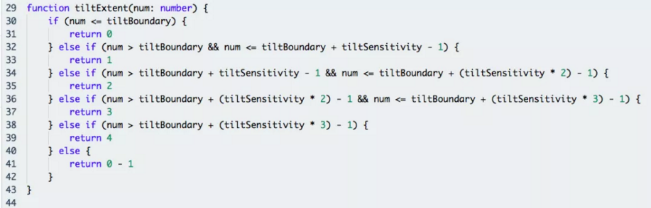

### Step 3: Compile tilt levels

The two functions checkRoll() and checkPitch() write the tilt levels obtained from tiltExtent() into tiltList for the roll (left-right) and the pitch (forward-backward) axes respectively.

Before using the tilt values, we calibrate them using a zeroed value for both pitch (zeroPitch) and roll (zeroRoll) obtained from a calibration function written later.

As the accelerometer readings are negative for both left and forward tilt, we need to use the Math.abs() function to obtain the modulus of the negative value to be given to the tiltExtent() function as a parameter for these two directions.

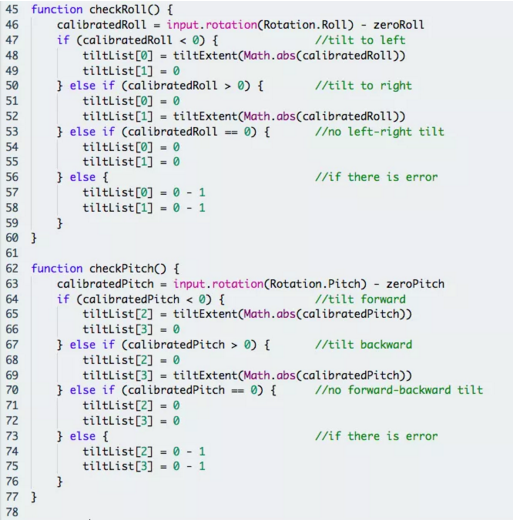

### Step 4: Write LEDPlotList Functions

Having obtained the tilt levels in tiltList we can now write the led plotting functions for the different cases that can arise, namely

plotSingle(): Tilt only in a single direction, taking extent of tilt in given direction as parameter.
plotDiagonal(): Tilt in two directions of the same magnitude, taking extent of tilt in either direction as parameter.
plotUnequal(): Tilt in two directions of different magnitudes, taking extent of tilt in each direction as parameter. Uses plotDiagonal() first and adds on to ledPlotList array afterwards.

These plotting functions write an array of led coordinates to ledPlotList to be plotted later on.

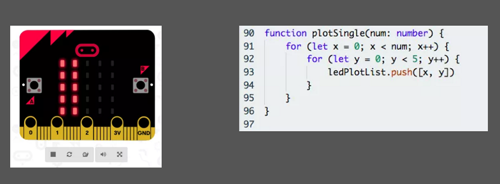
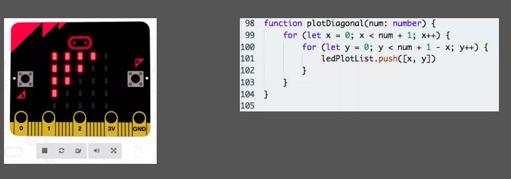
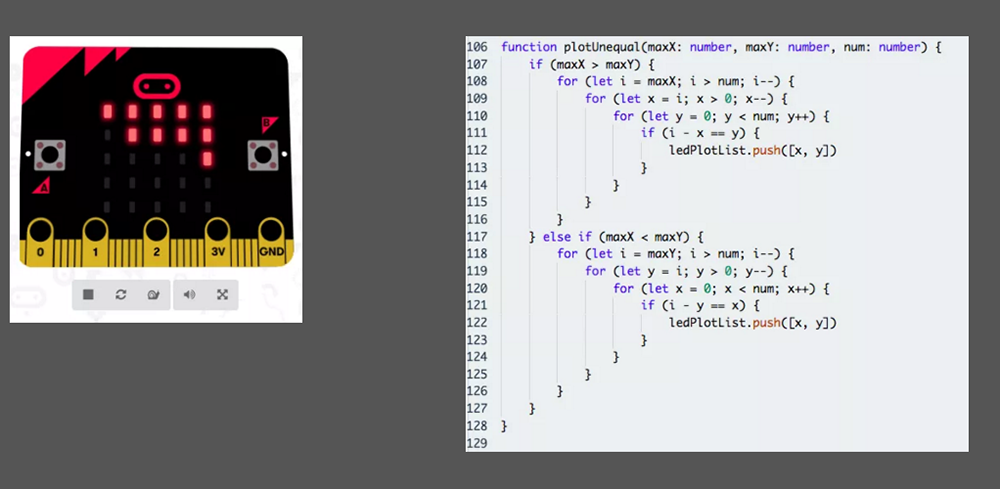

### Step 5: Plot LED Matrix for Each Case

Using the plotting functions from the three cases in step 4, we can now plot the actual LED matrix for the different possible combinations of tilt levels. As the three functions in step 4 do not discriminate with direction, we need to adjust the coordinate values passed to the LED matrix to plot the LEDs in the right directions.

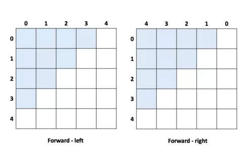
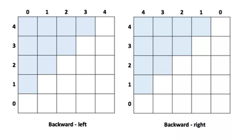

PlotResult() contains multiple if conditions that check the kind of tilt and plot the LED matrix accordingly using led.plot(x, y). The possible combinations of tilt are:

Single direction: Left Only or Right Only.

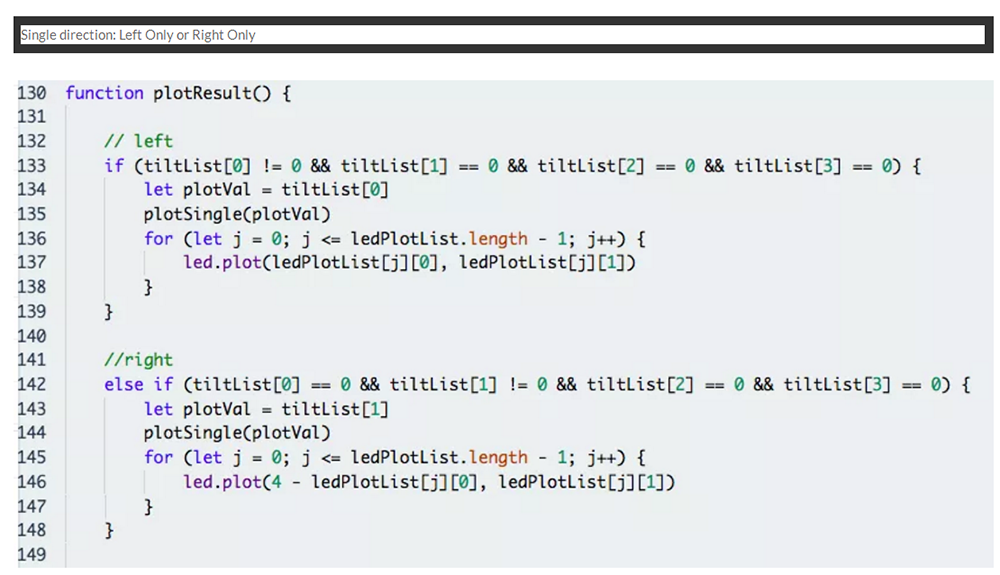

Single direction: Forward Only or Backward Only.

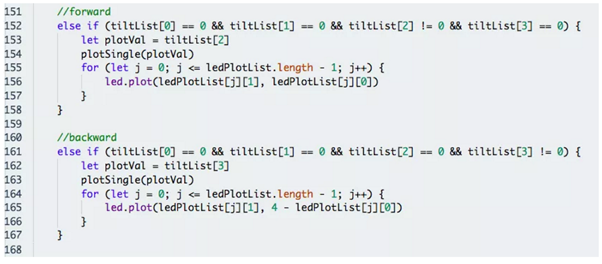

Two directions: Forward-left or Backward-left.

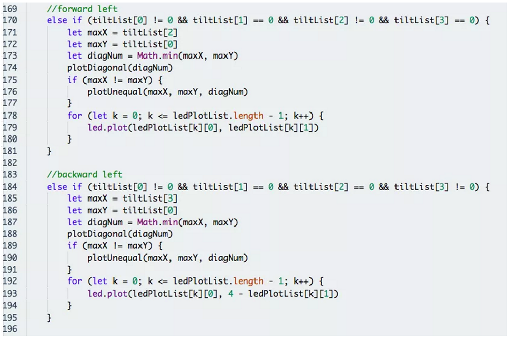

Two directions: Forward-right or Backward-right.

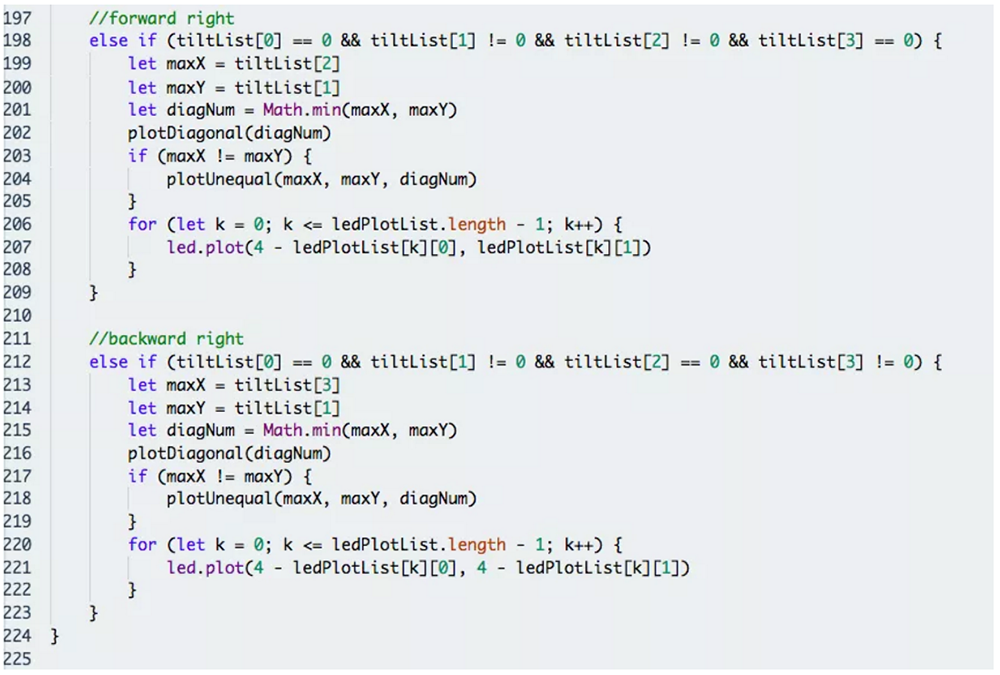

Note: For tilt in two directions, each combination can have the same or different magnitude (checked by comparing maxX and maxY), and hence plotted using plotDiagonal() or plotUnequal() respectively.

### Step 6: Write Calibration Functions

Having completed the bulk of the code, we now add in the calibTilt() and the resetTilt() functions.

calibTilt() allows users to tare the tilt to zero at the micro:bit’s current position
resetTilt() resets the calibration of the board to its original state.

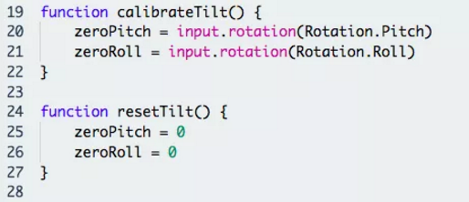

### Step 7: Write State Function

We add a simple function checkState() to check whether the tilt levels have changed from a previous iteration.

If there is no change in tilt levels from a previous iteration i.e. stateChange == 0, we can directly move on to the next iteration and skip the plotting of the LED matrix, reducing computation needed.

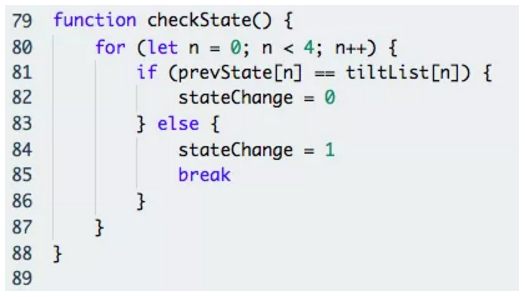

### Step 8: Putting It All Together Part 1!

Now we can finally place all the necessary functions into the micro:bit’s infinite loop to run it repeatedly.

Firstly, we set button A and B on the micro:bit to the calibTilt() and resetTilt() functions respectively using input.onButtonPressed(), and plot a tick on the LED matrix when calibration is completed.

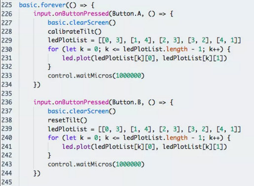

### Step 9: Putting it All Together Part 2!

Next run the necessary functions according to our code flow in Step 0 and check for a state change (meaning that there has a change in the tilt of micro:bit since the last iteration).

If there is a change in tilt levels i.e. stateChange == 1, the code will update prevState to the new tilt levels and set stateChange back to 0 for the next iteration, and plot the updated tilt levels on the LED matrix using PlotResult().  

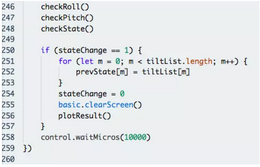  

If you don't want to type these code by yourself, you can directly download from the link below.  

[https://makecode.microbit.org/56811-31458-64502-76623](https://makecode.microbit.org/56811-31458-64502-76623)  

Or you can download from the page below.  

<iframe style="position:absolute;top:0;left:0;width:100%;height:100%;" src="https://makecode.microbit.org/#pub:56811-31458-64502-76623" frameborder="0" sandbox="allow-popups allow-forms allow-scripts allow-same-origin"></iframe>
  

### Step 10: Assembly  

Flash the completed code to your micro:bit.  
Attach your micro:bit and the battery pack securely to any object and it is ready for use!  

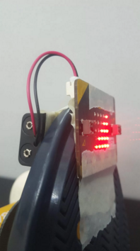  

### Awesome!  

Have fun with your electric spirit level! And while you’re at it, why not try to extend the capabilities of the tilt sensor or even turn it into a game?  
