# case 20 Space Shooter 

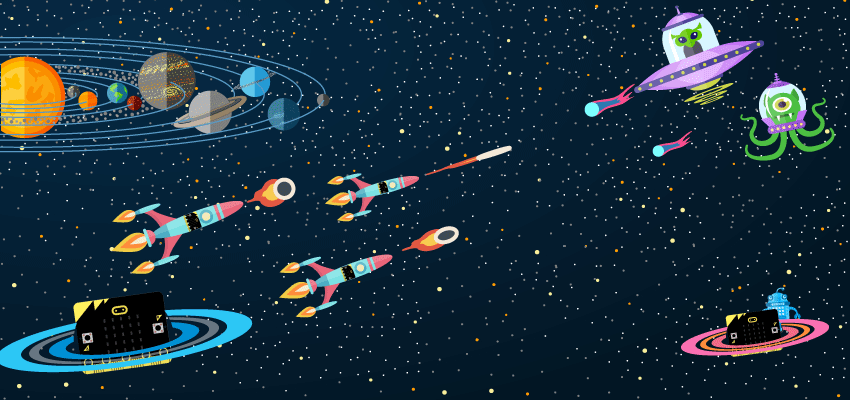

Are you tired of complicated flashy modern games? Prefer to play your games on a 5 x 5 resolution rather than a 4K resolution? Have some arcade fun on your micro:bit with Space Shooter! This tutorial is in JavaScript. Typing! Many typing!

## Products Link

[Tinker Kit](https://www.elecfreaks.com/micro-bit-tinker-kit.html)

## Step 0： Pre Build Overview    
---

In this project, we will create a simple space shooter game where you have to try to shoot and avoid falling projectiles. 

## Materials:    
---   

- 1 x BBC micro:bit 
- 1 x Micro USB cable  
- 1 x Breakout board   
- 1 x ADKeypad 

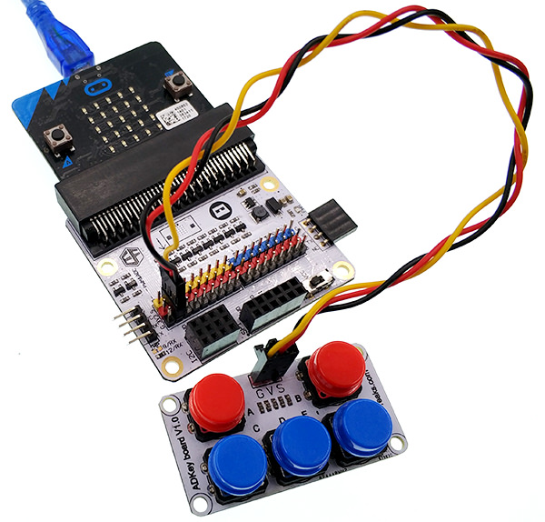  

## Goals    
---

- Learn to use the ADKeyboard.  
- Learn basic game programming.  
- Learn more about programming with Javascript.  

## How to Make    

### Step 1 – Components

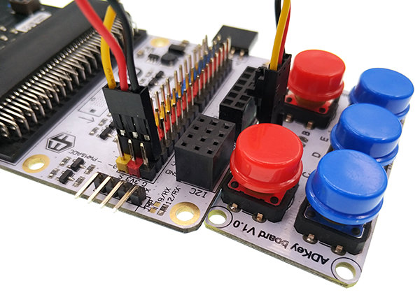

First of all, plug in the ADKeypad. Ensure the colours match and take note of what pin you plug them into as it will be relevant later.

### Step 2 – Coding

In this project, we will use Javascript to code, so first of all, switch to Javascript mode on the top of the page.

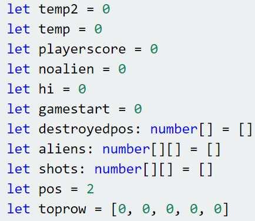

At the beginning of our code, we will need to initialise the variables we will use: playerscore for the current player’s score, noalien as a storage of whether or not there are aliens currently on the screen, hi for the current highscore, gamestart to keep track of what state the game is currently in, destroyedpos as an array to store where the player collided with an alien, shots to store the position of the shots that the player has shot, aliens to store the positions of the aliens, pos to keep track of the player’s current position, toprow to store if there is an alien currently in each position of the top row, as well as a few temporary variables. We will need to use all these variables later.

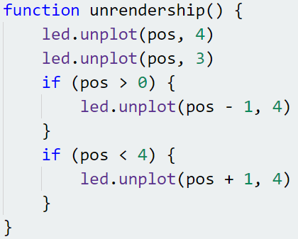

This function, unrendership, turns off the LEDs that represents our spaceship. We will use this to move the spaceship around.

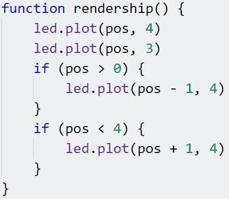

This function, rendership, turns on the LEDs that represents our spaceship. After using unrendership, we can update the player’s position then use rendership to change the spaceship’s position.

This function, unrendershots, turns off the LEDs that represents the player’s fired shots. Similarly, we will use this function to update the positions of the shots.

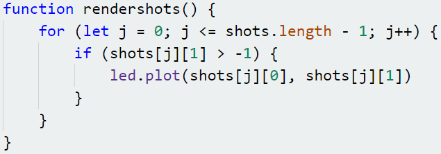

This function, rendershots, turns on the LEDs that represents the player’s fired shots. Similar to unrendership and rendership, after using unrendershots, we can update the shots’ positions then use rendershots to change all fired shots’ position.

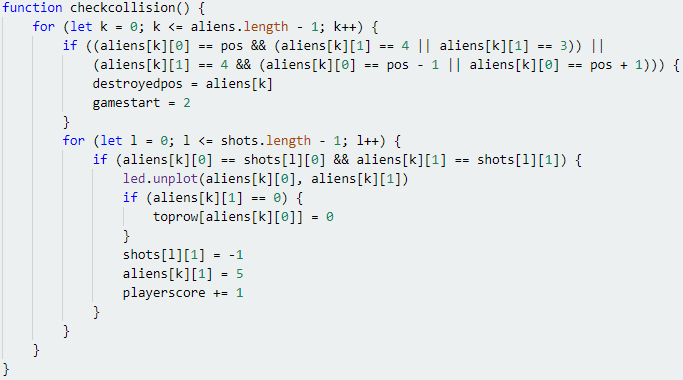

This function, checkcollision, checks for two types of collisions: between the player and an alien, and between an alien and a shot fired by the player.
Firstly, for the collision between the player and an alien, due to the shape of our ship, we have to check if there is an alien on the lowest or second lowest row and in the same column of the centre of the spaceship, as well as if there is an alien on the lowest row and to the left or right of the centre of the spaceship. Note that in Javascript, && represents “and” and || represents “or”. If there is indeed an alien in one of these positions, we will set destroyedpos to the position where this alien collided with the spaceship and change the value of gamestart to 2 to signify that the game is over.
Next, for collision between the player and a shot fired by the player, since each of these only occupy one LED, we just have to check if their positions are exactly the same. However, since there can be multiple shots and/or aliens, we have to loop through every shot for every alien and check if they are in the same position. If they are, we turn off the LED for that position. If the alien was in the toprow, we set the value of toprow for that column to 0 to signify that there is no longer an alien in the top row of that column. Then, we set the height of the shot to -1 and the height of the alien to 5, moving both of them out of the screen, where we will remove them later. Lastly, we increase the player’s score by 1 for shooting an alien.

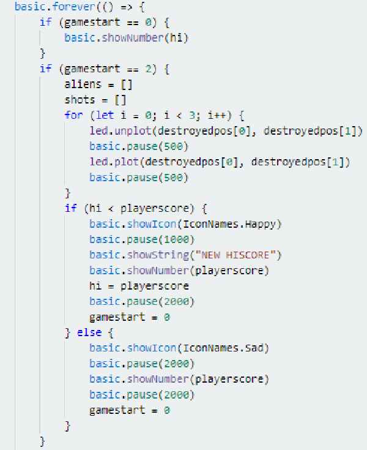

Now that we have written all the required functions, we can finally start linking them together! You may already be familiar with the forever function from coding in blocks mode. In Javascript, we use this by typing basic.forever(() => {Code to run forever here}. Firstly, if the value of gamestart is 0, we show the current highscore on the display.
Next, if the value of gamestart is 2, that means that the player’s game has just ended. We make the position where the player collided with an alien blink 3 times to let the player know where the collision happened, then display a happy face if the player set a new highscore, and a sad face if not. After that, we display the player’s score, and set the value of gamestart back to 0.

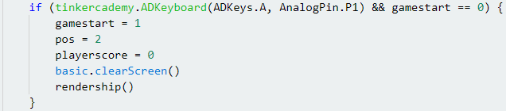

To start the game, we detect if the player pressed the “A” button on the ADKeypad and the value of gamestart is 0. If so, we set the value of gamestart to 1 to signify that the game has started, reset the player’s position to the centre, set the player’s score to 0, turn off all the LEDs on the screen then render the ship using the function we made earlier.

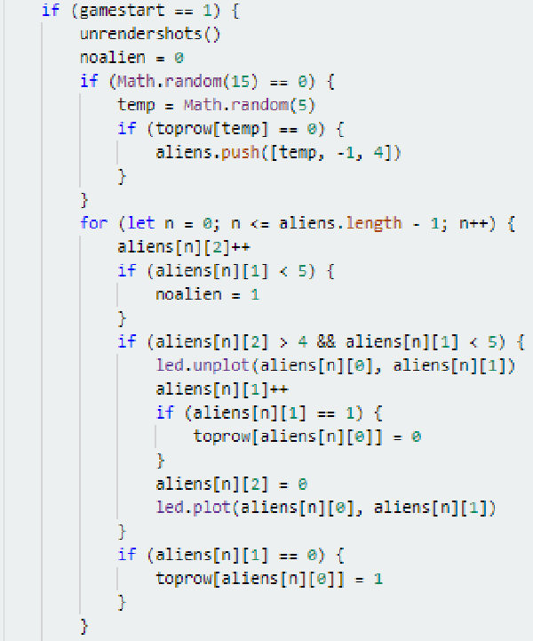

Finally, if the value of gamestart is 1, the player is currently playing the game! At the start of each loop, we turn off the LEDs of each shot the player fires, since they need to move upwards by 1 position. We use the Math.random() function to randomly determine if we should spawn an alien this frame. You can lower the number to make game harder, or increase the number to make it easier. Here, the value we use is 15, which means that there is a 1/15 chance that an alien will spawn every loop. However, we need to check that the top row of the column we want to spawn in is not occupied, or there will be overlapping aliens! Next, we loop through the aliens and move them downwards by 1 position every 5 times the forever loop runs. If an alien enters the top row, we set the value of toprow of that column to 1, and if an alien leaves the top row, we set it to 0.

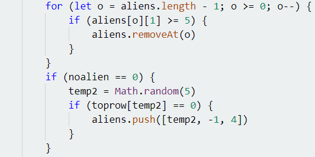

Then, we check if each alien is outside the screen, and, if it is, we remove it from our aliens array. Lastly, if there are no aliens on screen, we spawn an alien in the same was we would if it spawned from the 1/15 chance.

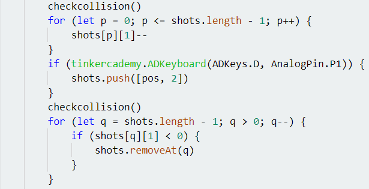

After updating the aliens’ positions, we check for collisions, then update the shots’ positions. Then, we spawn a shot if the player pressed the D button on the ADKeyboard. After that, we remove any shots which are outside the screen.

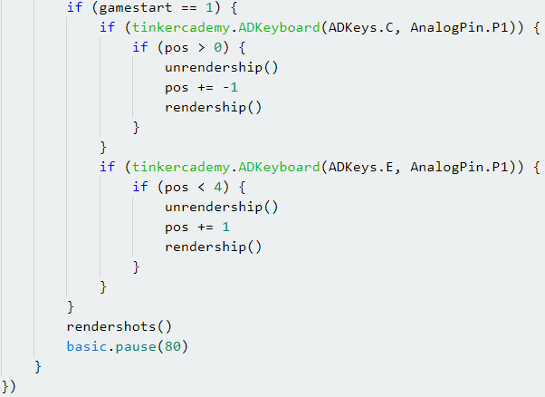

Finally, we check if the player has pressed the C or E keys on the ADKeyboard, and update the ship’s position accordingly. After that, we render the shots that the player has fired, then set a pause of 0.08 seconds per loop so that the game advances at a playable speed.

For the whole program, you can download directly from the link below：

[https://makecode.microbit.org/_euRV3uHYJAfx](https://makecode.microbit.org/_euRV3uHYJAfx)

Or download from the page below.

<iframe style="position:absolute;top:0;left:0;width:100%;height:100%;" src="https://makecode.microbit.org/#pub:88941-65098-41980-28805" frameborder="0" sandbox="allow-popups allow-forms allow-scripts allow-same-origin"></iframe>

### Step 3: Using It

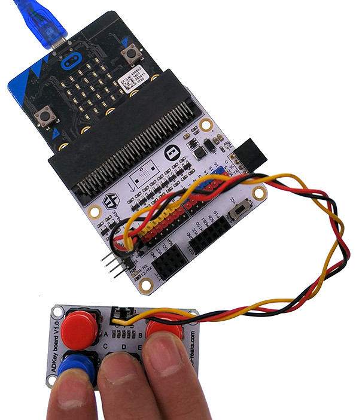

Playing the game is very simple. Just use the A button on the ADKeyboard to start the game, use the C and E buttons to move and the D key to shoot the aliens!

### Step 4 – Success!

Voila! Time to have some old fashioned arcade fun with your new space shooter. What highscore can you reach?
