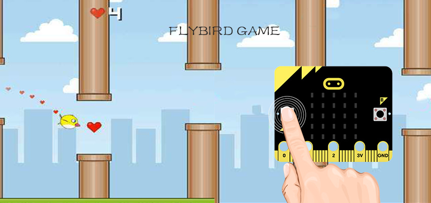
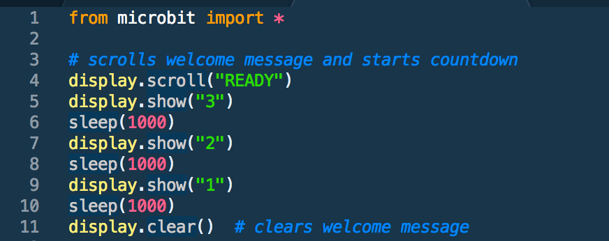
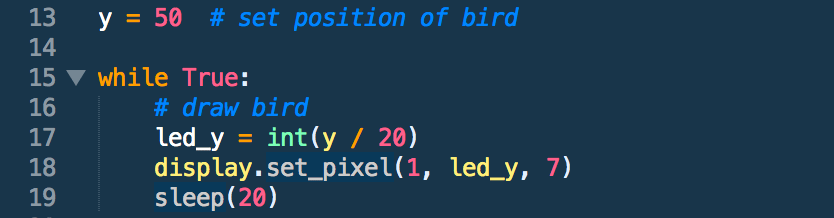
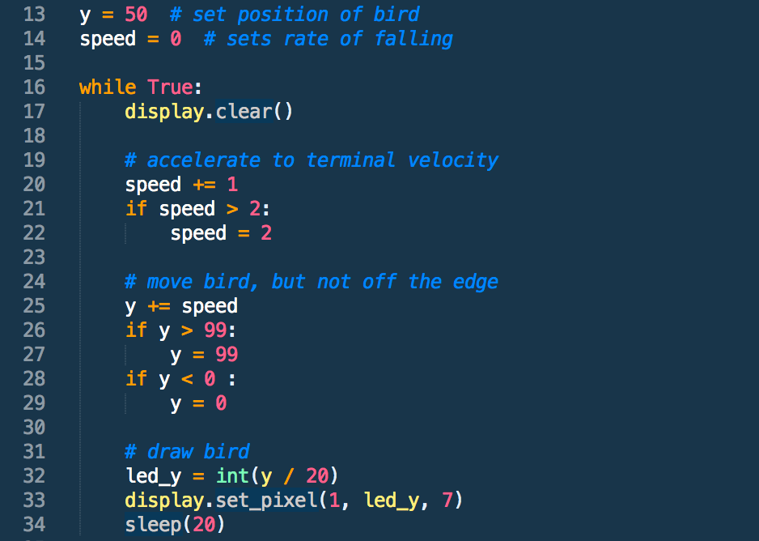
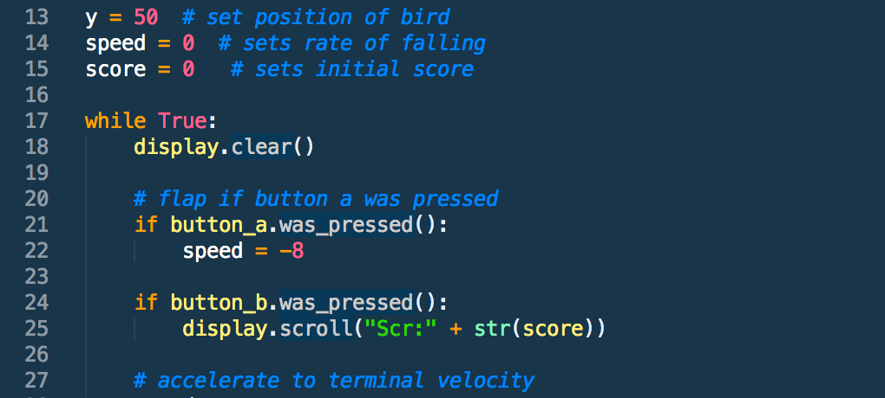
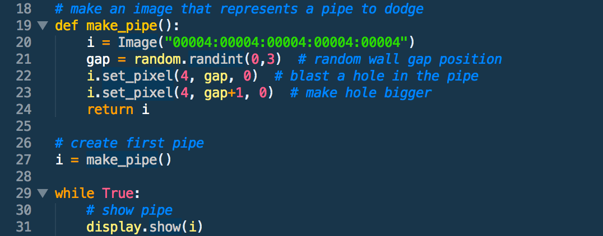
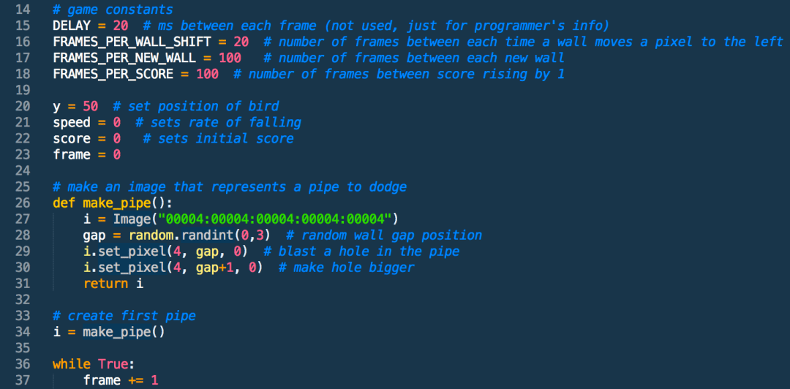
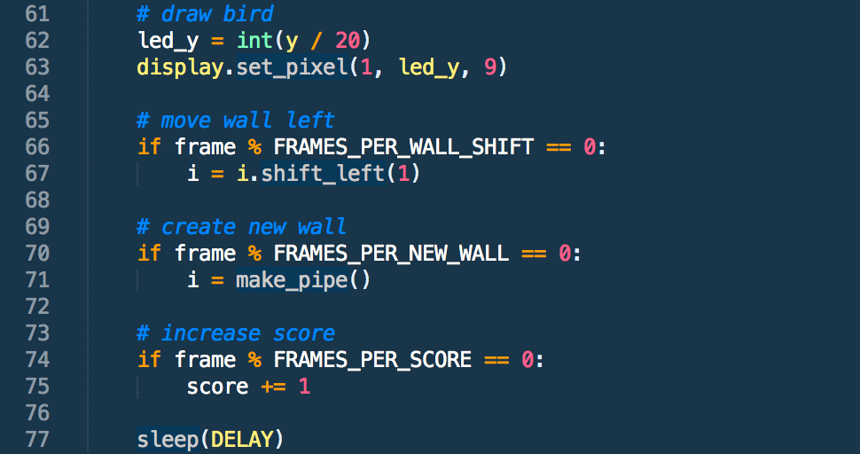
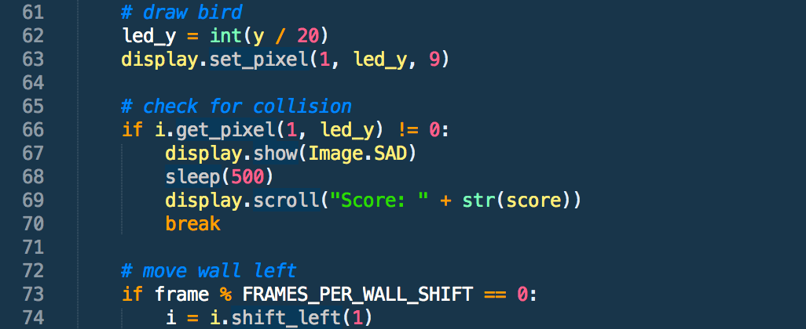

# case 21 Flappy Bird 

Take flight and achieve your pipe dreams with your own version of the notoriously challenging Flappy Bird game, using nothing but a micro:bit (no extras needed) and some Python code.

Made by Cheryl from Raffles Institution. Warning: heavy dosage of bird puns included.

## Goals
---

We’re going to create a full-fledged interactive game on your 5x5 LED screen, playable for ages 9 days to 90 years old. In the process, you’ll learn how to:
First step is to import the micro:bit library into Python. Then, let a ‘READY’ message scroll across the screen and initiate countdown that shows when the game starts.
- Line 1: This imports the micro:bit program.
- Line 4: This initiates the ‘READY’ message that scrolls across the screen. Double quotation marks indicate a string (in this case ‘READY’).
- Lines 5-10: This flashes each number on the screen for 1 second (or 1000 milliseconds, the measurement involved) by using the sleep() function.
- Line 11: clears the screen for us to draw the bird and walls later on.

**Note:**

It’s always good to add comments to explain your own code for others or yourself to understand when coming back to it. You add a comment with ‘#’. Also space out your code when necessary to indicate different segments that do different things.

## Materials
---

- 1 x BBC micro:bit
- 1 x Micro USB Cable (Seriously, that’s all you need.)

## Why Python?
---

- Reads like English – Python is one of the easiest languages to read, which makes it such a fantastic beginner’s language.

- Versatile – Python is industry standard for good reason. It can be used to do so much. This is why Google and YouTube utilise the language for part of its back-end software.

- Active community – Python is one of the most popular languages for beginners. There are tons of resources and many more than willing to help look over your code, which will prove invaluable to helping you get over stumbling blocks in your coding journey.

Actual coding looks cooler than block-based drag-drop coding. I know it’s intimidating, but look at these colours! (Demo of Flappy Bird on Sublime Text)
How Do I Start Coding in Python?

If you’re a fledgling to programming, you probably don’t have Python lying around. Don’t worry! Just go to the [official micro:bit Python editor ](http://www.python.microbit.org/) or download the offline Python editor [mu](https://codewith.mu/) to write code and send it to your micro:bit. You can also your own text editor (three cheers to Sublime 3 and Atom) but you have to flash it to the micro:bit. This might turn out to be quite troublesome. Alternatively, you can use a [micro:bit simulator](https://create.withcode.uk/), which is really useful to test code out without downloading the .hex file each time, and makes it easier to fix errors.

Once set up, connect your micro:bit to your computer using the micro-USB cable. It should connect to the port at the top of the backside of the micro:bit. Once ready to be flashed, the micro:bit should light up bright yellow. Ignore this step if you’re on the simulator. Otherwise, stop reading and set it up if you haven’t already. Don’t worry, I’ll wait.

Welcome back. Without feather ado, let’s get started!
A Bird’s Eye View of What We’re Doing.

The key to tackling every programming problem is to break it into bite-sized achievable bits. Let’s look at what we’ll need. Refer to the video to see a demo of the game. As we go through the process, let’s ask what elements are within the game.
A ‘READY’ message and countdown shows when the screen starts.

Create a coordinate to indicate the bird.
Move the bird around by pressing button A.
Keep track of the number of pipes the bird passes.
Create walls for the bird to fly past
When the bird collides with a wall, the game is over.
You might already know how to do some of these. Try covering these steps on your own first. If necessary, break the steps down further into smaller steps. There are also game checks which should be the progress you’ve made by that step. Use these to make sure you’re on track.

## How to Make  
--- 

### Step 1 – Hello, World!

First step is to import the micro:bit library into Python. Then, let a ‘READY’ message scroll across the screen and initiate countdown that shows when the game starts.
Line 1: This imports the micro:bit program
Line 4: This initiates the ‘READY’ message that scrolls across the screen. Double quotation marks indicate a string (in this case ‘READY’)
Lines 5-10: This flashes each number on the screen for 1 second (or 1000 milliseconds, the measurement involved) by using the sleep() function.
Line 11: clears the screen for us to draw the bird and walls later on.
Note: It’s always good to add comments to explain your own code for others or yourself to understand when coming back to it. You add a comment with ‘#’. Also space out your code when necessary to indicate different segments that do different things.
What you’re doing is applying functions to the object display such that the LCD screen lights up.
In Python, you also have the flexibility of slowing down the scrolling rate of text in line 4. display.scroll(“READY”, delay = 200) scrolls the text twice as fast and display.scroll(“READY”, delay = 800) scrolls the text at half the speed. The standard delay setting is 400. Increasing the value decreases scroll speed and decreasing the value increases scroll speed.
Congratulations! You finished the pre-game message! Next, we have to actually set up the game for the user to play.

### Step 2 – Fly, Birdie!

Next, we have to create the image of the bird. For those who never analysed the game, Flappy Bird only allows the bird to move upwards and downwards, and pushes it at a constant speed towards the walls. Of course, our screen only has 5 rows of LED so it’s quite limited. To make the bird-flapping more realistic, we’ll be splitting these 5 segments into 100 different positions. This gives us more flexibility when adding speed of descent later on. In this case, the top of the screen is position y=0 and the button is position y=99 so there are 100 positions. The start position is y=50.
Line 13: This sets the start position of the bird right in the middle, as y=0 is the top and y=99 is at the bottom.
Line 17: This determines the actual position of the bird on screen, since there are 100 positions and 5 LED rows. Hence, you divide the value stored in variable y by 20 so you scale the bird down onto the screen
Line 18: This displays the bird on the screen using the display.set_pixel function, which has 3 parameters: x, y and brightness. The x-coordinate is 1 so it will appear in the second column. The y-coordinate is presently 2 because we divided 50 by 20 and rounded it down. That’s the third row. (Note: Indexes begin at 0 usually for computer programming, so you have rows 0-4 from above to below and columns 0-4 for left to right.) Brightness can be any integer from 0 to 9, with 9 being the brightest. In this case, 7 will suffice to avoid eye-strain.
We add a while loop to tell the micro:bit to keep repeating the block of code that is indented. (Python uses indentations to separate code.)
The sleep code tells the micro:bit to run this loop every 20ms so it makes your game far more manageable and makes sure your CPU doesn’t work too hard and crash the browser, which would otherwise happen.
Game check: At this point, a welcome message should appear, then disappear for a bird to appear.

### Step 3 – Leaving The Nest

The previous step only created the bird image, but it still can’t move! This is what we will do in the next step, by simulating realistic gravity.
Firstly, let’s add a new variable ’speed’ right below the y-coordinate.
Shift the display.clear() into the while loop such that it no longer just clears the welcome message, but also clears the old position of the bird, as it runs before the new position is set each time
Lines 25-29: This sets a new y-coordinate of the bird within the borders (max y=99, min y=0), based on the ‘gravity’ acting at that point.
Why place it all in the while loop? Well, you want this block to continually update the position of the bird every few milliseconds (20 to be exact) so this block will keep repeating itself
Terminal velocity: to make the motion of the bird more realistic, speed reaches a constant rate of 2, but only after two iterations of the code whereby speed = 0 becomes speed =2. The if function ensures that speed does not increase beyond 2. You can play around with this to vary the speed of bird descent.

### Step 4 – Defying Gravity

Now, we have to get the bird to hop by pressing button A. In this step, we also include a new ‘score’ variable to track the number of walls that the bird flies past. This can be accessed at any point using button B.
To react to key-pressing of A, run ‘button_a.was_pressed()’ under an if-loop like in line 21. If, during that iteration, the A button was pressed at any time, we bring the bird up, reset the falling rate, then let it accelerate back down to the ground, giving the falling and flapping motion. Change the value of speed on flapping, which is currently -8, to see the visual changes to rate of bird’s descent.
Add variable ‘score = 0’ to set new variable score to 0, underneath the speed and y variables. As a coding habit, try to set all your variables in one place, above the code that uses it so it’s easier to follow, and actually can be inputted for use.
Show score when button B is pressed by creating an if loop similar to button A. display.show(score) shows the score at any point in time. We’ll learn to vary and count the score after each wall-passing later.
Game check: Welcome message appears, disappears, then bird appears that falls down. Press A for it to flap upwards and B to check the score, which should remain at 0 right now.
 

### Step 5 – Pipe Blaster

We’re going to create our first pipe using a make_pipe function! Then we’ll assign it to variable i, and show pipe within the while loop. I know it’s complicated, but it’ll also be the start of owl/our game finally looking complete!
Functions are blocks of code that are run conveniently under the function name. By calling a function, we can run the entire block of code within it. This makes it easier to understand what we’re doing at each step. In this case, we’ll name our function make_pipe() which runs code to make a new pipe each time. Let’s break down what each step of the make_pipe() function does
At line 19, we define the function using def make_pipe(): – the indented blocks beneath make up the function
At line 20, a custom image is drawn, with the ‘0’ indicating 0 brightness for each coordinate, starting from row 1, column 1 then row 1, column 2 and so on. This basically lights up the LED of the entire last column with the brightness of 4. (You can tweak this as you like. I personally like for the bird to be clearly brighter than the wall so you can identify its position.)
At line 21, we use the random library to call a random number between and inclusive of 0 and 3. This means 0, 1, 2 and 3. We don’t use 4 because we blast two holes, one which is gap+1. If 4 was selected, we would blast a hole in column 4, row 5. But there’s no row 5 so an error is returned.
We have to return this image so that it can be called as the value of i later on.
The hole is blasted by setting the LED brightness for the gap position and the LED above it to be zero. Pretty cool, eh? That’s your first function. Good job!
Note: always define the functions above the actual code, beneath the variables. This is just a convention, but it makes your program readable!
Let’s assign variable i to the function, as per line 27. Now, in the while loop, if we add a display.show(i), the display now shows the pipe (and hole) i.
Persevere! We’re nearly there. Now, we just have to get the wall moving, count scores and react to bird-wall collisions.
Game check: Same as step 4, and now there’s an unmoving wall with holes! Check earlier steps if something has gone afowl.

### Step 6 – Frame Rate

This step is where we set up the game constants. Here, the frame variable starts at 0, then increases by 1 every 20ms so it takes 400ms or 0.4s for the frames variable to increase by 20. Remember this, it’ll be easier for the incoming math. These constants aren’t used until Step 7, but let’s set them up first.
Line 15 just indicates the time taken (in ms) for frame to increase by 1, which is added as part of the while loop in line 37 (frame += 1). You can change the sleep(20) at the bottom of the code to sleep(DELAY) so it corresponds.
Line 16 sets the time taken for the wall to shift by 1 column. This is currently 0.4s or 20 frames.
Line 17 sets the time between the occurrence of another wall. This is currently 2.0s or 100 frames.
Line 18 sets the time between the score increasing. This should always be equivalent to the FRAMES_PER_NEW_WALL value so that each wall you pass is equivalent to one additional score.
To make the game harder, you would adjust these game constants, perhaps reducing the distance between each new wall for more walls (but change FRAMES_PER_SCORE to correspond to it). The game is currently set for one wall on the screen at any time, but you can definitely make it more chaotic by playing around with the values.
Note: The game constants are in uppercase, differentiating them from the other variables used. These are just [standard rules](https://www.python.org/dev/peps/pep-0008/) for Python programming. It’ll still work without following it, but your code should follow conventions to be readable.

### Step 7 – Pipe Dreams

Here, we will compare the frame value with game constants to move the wall left, create a new wall and increase the score. This is all within the while loop so it’s checked every 20ms. Ready? Let’s go.
At this step, we’ll use the modulo sign (%). This provides the remainder when a number is divided by another number. So 4 % 2 returns 0 but 4 % 3 returns 3. Here, we’ll use it to check that the frame variable is equal to any of the game constants.
Moving wall left: Look at lines 65-67. This means the wall shifts when the frame is equal to 20, 40, 60… since they’re divisible by FRAMES_PER_WALL_SHIFT value of 20. You can vary this to make the walls move faster and increase the difficulty. Currently, the walls move every 0.4s.
Creating new wall: Look at lines 69-71. Every 100 frames, or 2 seconds, a new pipe is made by calling the make_pipe() function for i. This is the constant used to create and move the wall.
Increasing the score: look at lines 73-75. This means that a point is added when the bird travels for 2 seconds, or 1 wall. This value corresponds with the distance between walls so each wall passed is one point.
Game check: The game should be almost fully playable, with the welcome message, then the bird moving by pressing button A. You can see score with button B. There’s gravity acting on the bird so it falls down over time. Then the walls created randomly move right past it. Wow, you’re nearly done! Now, we just have to react to pipe collisions, ending the game and revealing the score when the bird collides with any pipe.

### Step 8 – Collision Course

Phew, you made it to the last step! Ready to wing it? Now, we just need to add a collision reaction. This uses a get_pixel function that returns the LED brightness value at that position. ‘!=‘, the NOT function is also used. Let’s explain how it’s used below.
Add this collision checking code to the while loop, between the bird-drawing and wall-shifting. This means it checks for collision before new walls are created so there’s no extra scores by error.
As shown in line 66, we use an if loop. ‘i.get_pixel(1, led_y) != 0 checks if there is a pipe in the position of column 1 (where the bird is), specifically at led_y, the displayed position of the bird. If there is a pipe pixel in the same position as the bird’s coordinates, the i.get_pixel(1, led_y) returns 4, the brightness of the wall. This is NOT 0 so the function beneath, the collision checker, runs
Line 67-68 display the in-built sad face image for 0.5s. You can change how long this lingers, and to whatever other image you like. Python has a lot of images you can input. You can find the entire list [here](http://microbit-micropython.readthedocs.io/en/latest/tutorials/images.html).
Line 69 displays the score as a string, behind “Score”.
Line 70 ends the while loop so the game ends. This means that it’s ‘game over’.

### Start Game!

And… that’s it! You’re done. Your game should be able to run and end, revealing the score at the end. It’s now a full-fledged frustratingly simple yet challenging game. Pat yourself on the back! That was a lot of hefty coding and new concepts. Look through your code, and try and figure out what each line. Add comments to explain it to yourself if necessary. This is a good practice for you to easily read your own code when coming back to it months later.

Good job! Have fun frustrating your friends with this novel interface for the annoying game. Now, you’re free as a bird to look for other projects, with a better understanding of the Python code.
Extension: Add a game loop, such that you can play again without resetting the device. I suggest changing the while loop’s requirements from True to a certain variable, a play_again function which can be changed with the press of a button. Look at other Python game loops for inspiration, like a scissors, paper, stone game.
