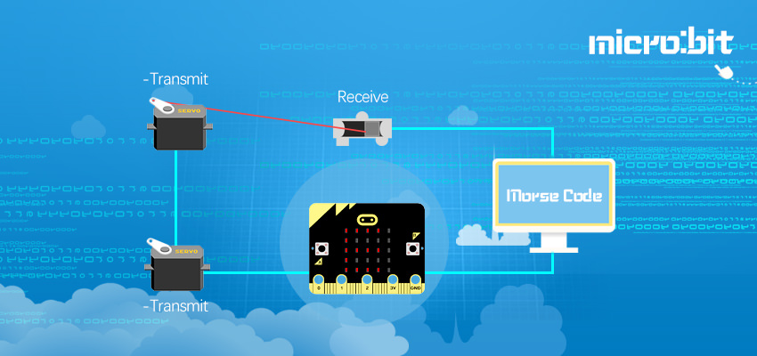
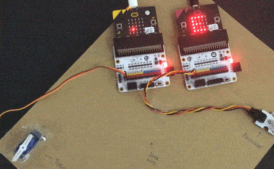
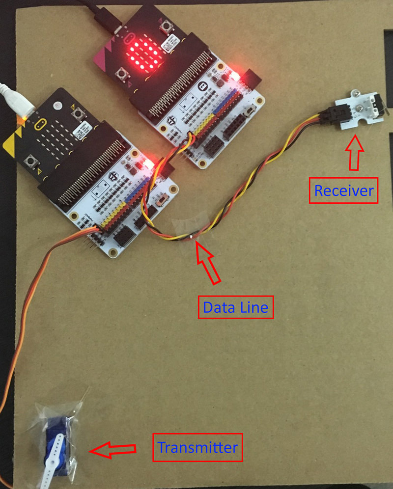
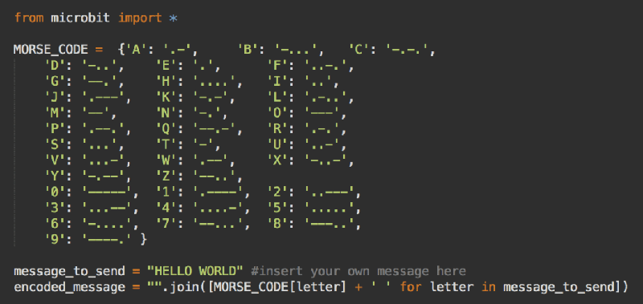
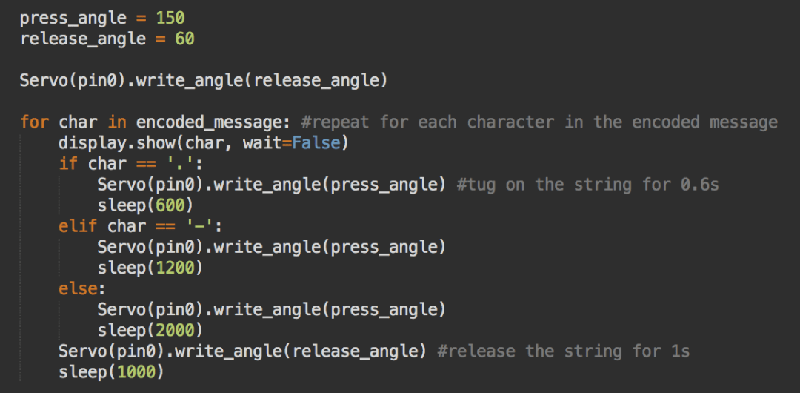
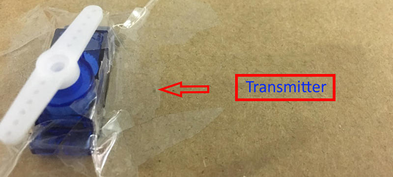
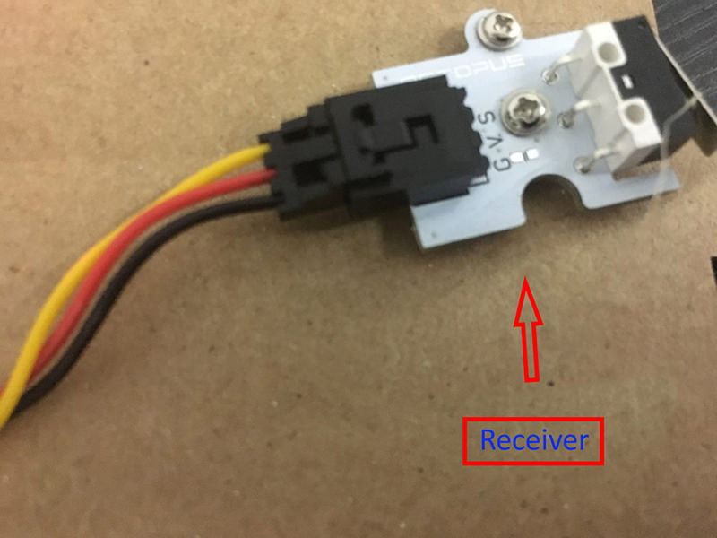
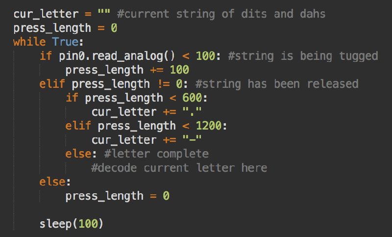
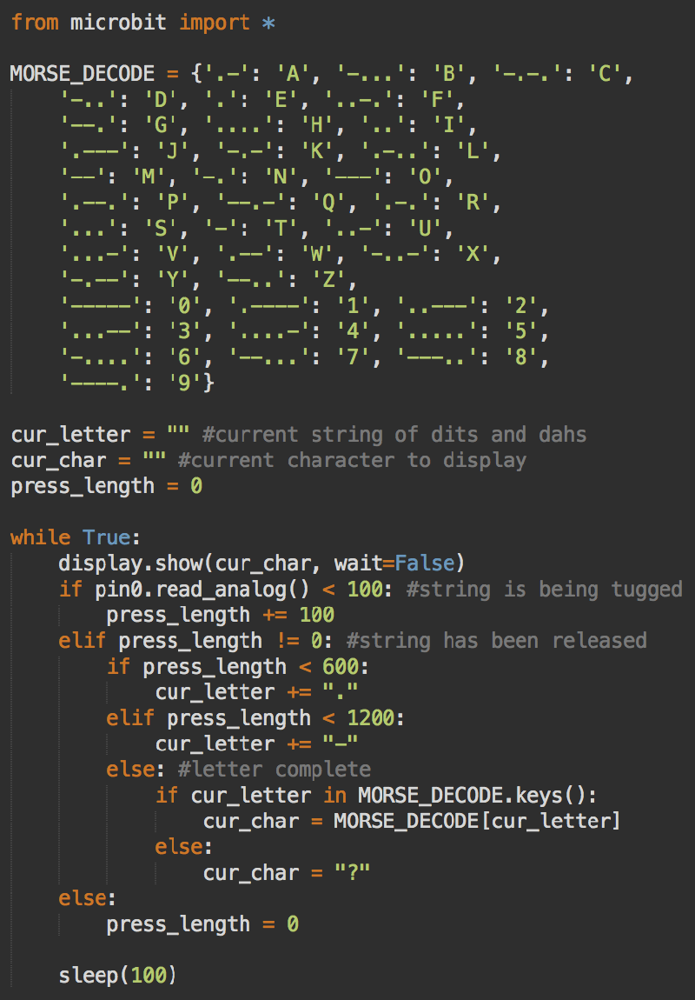
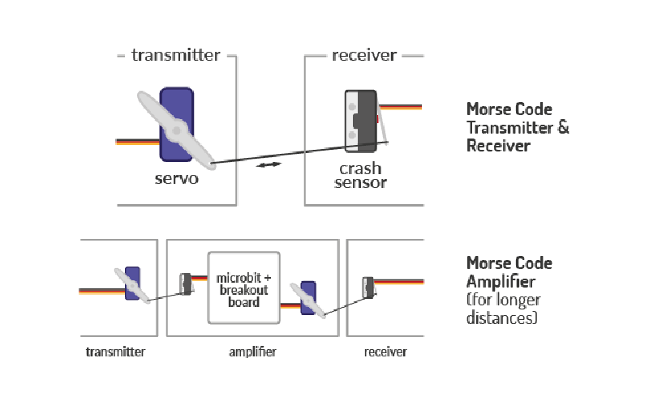

# case 22 Wire Transmission 

Communicate between two micro:bits using Morse code, fishing line, a servo and a sensor! Why use micro:bit’s radio when this is so much cooler?

## Products Link

[Tinker Kit](https://shop.elecfreaks.com/products/elecfreaks-micro-bit-tinker-kit-without-micro-bit-board?_pos=1&_sid=a3579b340&_ss=r)

## Goals  
---

- Use Python to programme the micro:bit  
- Use dictionaries to encode and decode Morse code  
- Move the servo, and detect using the crash sensor  

  

## Materials  
---

- 2 x BBC Micro:bit  
- 2 x Breakout board  
- 2 x Micro-USB cable  
- 1 x Servo  
- 1 x Crash Sensor 
- A thin string (e.g. fishing line)  
- Optional: Cardboard sheet  

You can’t see the string in this gif, but it’s there between the servo and crash sensor!  

## Why Python?  
---

- Reads like English – Python is one of the easiest languages to read, which makes it such a fantastic beginner’s language.  
- Versatile – Python is industry standard for good reason. It can be used to do so much. This is why Google and YouTube utilise the language for part of its back-end software.  
- Active community – Python is one of the most popular languages for beginners. There are tons of resources and many more than willing to help look over your code, which will prove invaluable to helping you get over stumbling blocks in your coding journey.  

## How Do I Start Coding in Python?  
---

You can write your code in Python on the official micro:bit Python editor. To run a program, click the download button, and drag the .hex file into the MICROBIT drive connected to your computer.  

## Overview  
---

We’ll be using two micro:bits, one to transmit Morse code and one to receive Morse code. The transmission of data will be done over a length of string. As the servo tugs on the string (based on the encoded input), the crash sensor detects the tugging and decodes it from morse code into letters. Of course, you could transmit data over the radio component of the micro:bit, but where’s the fun in that?  

## Physical Assembly  
---
  

Attach the servo to the cardboard sheet, and tie the string around the end of the rotor attached to the servo. Tie the other end of the string around the metal flap of the crash sensor. Attach the crash sensor at a distance such that when the servo turns, the string is pulled and the sensor is activated. If you don’t have a cardboard sheet, you could tape everything to a table. For the transmitting micro:bit, attach the servo to pin 0 on the breakout board. For the receiving micro:bit, attach the crash sensor to pin 0 on the breakout board.  

## What’s Morse Code?  
---
Morse code is a type of code used to transmit text by a combination of short (“.”, or “dit”) and long (“-“, or “dah”) signals. Every letter of the alphabet and number from 0 to 9 has its own Morse code representation. Letters are separated by pauses.  

## Transmitter  
---

### Step 1: Encoding Text into Morse Code  

Suppose we are given the text “HELLO WORLD”, and would like to convert this into Morse code. First, we need to have a ‘table’ of what each letter’s morse code is, so that we could, for example, find that “E” is “.” and “W” is “.–”.  
 
We can use one of Python’s data structures, the dictionary, which allows us to associate keys to values. In this case, the keys should be the letters of the alphabet, and the values should be the Morse code representation of the corresponding letter.  

  

Here is a dictionary that should do the trick:  

MORSE_CODE = {'A': '.-', 'B': '-...', 'C': '-.-.', 'D': '-..', 'E': '.', 'F': '..-.', 'G': '--.', 'H': '....', 'I': '..', 'J': '.---', 'K': '-.-', 'L': '.-..', 'M': '--', 'N': '-.', 'O': '---', 'P': '.--.', 'Q': '--.-', 'R': '.-.', 'S': '...', 'T': '-', 'U': '..-', 'V': '...-', 'W': '.--', 'X': '-..-', 'Y': '-.--', 'Z': '--..', '0': '-----', '1': '.----', '2': '..---', '3': '...--', '4': '....-', '5': '.....', '6': '-....', '7': '--...', '8': '---..', '9': '----.' }  

Now that we can translate each individual letter into Morse code, we should assemble the entire message, adding a space to the end of each letter to tell the receiver that a letter has been sent.  

### Step 2: Moving the Servo based on Morse Code  

Once we’ve converted our message into the Morse code form, the next step is to move the servo based on the encoded message. In this case, dit will represent a 0.6s tug, dah a 1.2s tug, and a space a 1.6s tug.  

First, we need to find the correct angles for the servos that will either tug on the sensor to activate it, or release the string to deactivate the sensor. We’ll call these values press_angle and release_angle. For this set-up, their values are 150 and 60, but this will differ based on how you’ve positioned the sensor and servo.  

To move the servo, we’ll need to use a class, which can be obtained here. To use this class with the online editor, copy and paste this code at the start of the programme.  

For each character (dit, dah or space), we should tug on the string for the appropriate length of time, and then release the string for a short period of time.  

  
  

## Receiver  
---

### Step 1: Translating Sensor Data into Morse Code  

When the string tugs on the sensor, it will press the flap down, and this can be detected using analog input. Whenever the flap is down, the analog reading of the pin drops below a threshold value. In this case, we’ll use a threshold value of 100.  

While we could use event listeners that trigger events when the flap is pressed, it’ll be easier to perform polling, which means checking the analog reading at a certain interval, in this case 0.1s.  

If in a cycle, the flap is being held down, we’ll increase the press_length by 100, to keep track of how long the flap has been pressed so far. If the flap is found to be released, we can use press_length to figure out how long the button has been pressed, and use it to determine what character (dit, dah or space) has been transmitted. We’ll add this to the variable cur_letter, which keeps track of the dits and dahs that have been sent over so far.  

  
  

### Step 2: Translating Morse Code into Letters  

Every time a space is detected, it should take the characters (dits or dahs) detected so far, and convert that into a letter. We’ll need to use a dictionary again. This time the keys should be the Morse code representation, and the value should be the letter of the alphabet.  

Here’s the code for the decoding dictionary:  

MORSE_DECODE = {'.-': 'A', '-...': 'B', '-.-.': 'C', '-..': 'D', '.': 'E', '..-.': 'F', '--.': 'G', '....': 'H', '..': 'I', '.---': 'J', '-.-': 'K', '.-..': 'L', '--': 'M', '-.': 'N', '---': 'O', '.--.': 'P', '--.-': 'Q', '.-.': 'R', '...': 'S', '-': 'T', '..-': 'U', '...-': 'V', '.--': 'W', '-..-': 'X', '-.--': 'Y', '--..': 'Z', '-----': '0', '.----': '1', '..---': '2', '...--': '3', '....-': '4', '.....': '5', '-....': '6', '--...': '7', '---..': '8', '----.': '9'}

  

Now, whenever a letter is detected (a space is pressed), we can look in the decode dictionary to obtain the original letter. However, sometimes the receiver may not correctly detect the sequence of string tugs, and so the sequence cannot be found in the dictionary. If we try to look for a sequence that cannot be found in the dictionary, Python will throw an error and the programme will stop executing.  

Hence, we should first check if the sequence exists in the dictionary’s keys, and if it does not, we’ll set the current character to “?”. Once we have the current character, we can display it on the LEDs, by setting the cur_char variable. At each cycle, we’ll display the character detected.  

## Putting it all Together  
---

If the set-up doesn’t work flawlessly at first, that’s fine! Try adjusting the positions and orientations of the servo or sensor, as well as the press and release angles of the servo. Also, you can try adjusting the durations of the tugs.  
Here is the full code for the [transmitter](https://pastebin.com/Qm7ZjxHJ) and [receiver](https://pastebin.com/JLEkPyYS).  

## Extensions  
---

Although this method of data transmission isn’t used for …obvious reasons, many concepts in data transfer are relevant. Try to experiment with the length of string to see how long distance can be reliably transferred, and at what point the “signal” becomes too weak to be detected.  

To boost the “signal”, a third micro:bit can be used as an amplifier that converts sensor signals into new tugs, similar to how signal amplifiers are installed every 20km in underwater fibre-optic cables.  

Morse code certainly isn’t the most efficient way to transmit data, nor is it the most reliable way. Experiment with different types of encodings (binary + ASCII, Hamming codes, etc.), as well as explore some error-correcting codes to detect and fix any losses/errors in transmission.  

  
