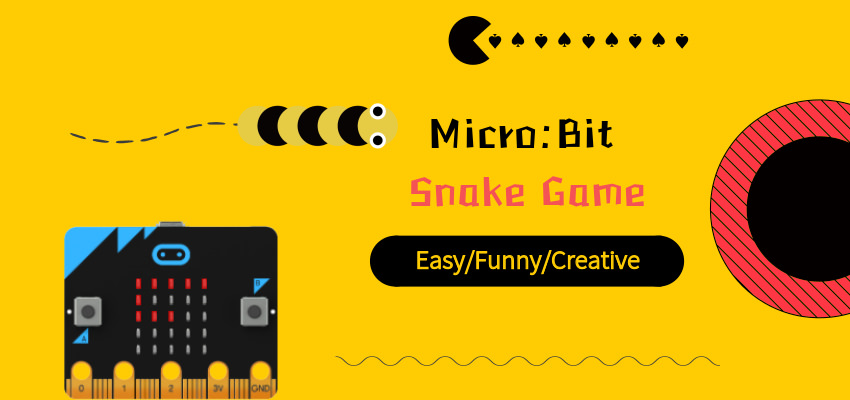
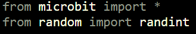
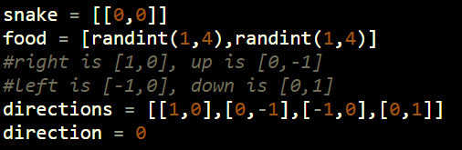
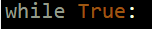
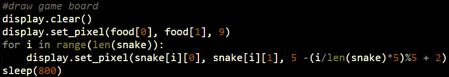
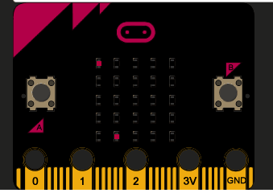
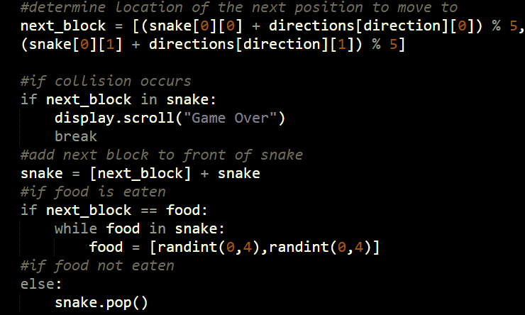
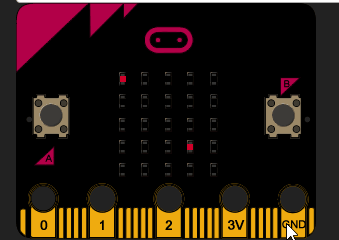
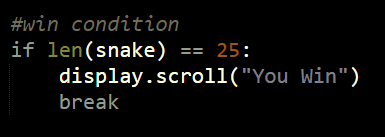
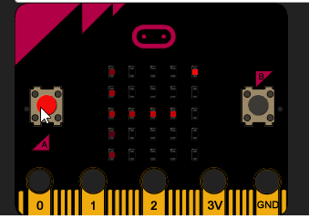

# case 23 Snake Game 

Anyone remembers the Snake game that used to come with old Nokia phones? This micro:bit version in glorious 5×5 resolution is easy to make and fun to play!

## Goals
---

In this step by step guide, we will build a snake game from scratch, handling controls, movement, win and lose conditions, as well as the drawing of the game board.

## Materials
---

- 1 x BBC micro:bit
- 1 x Micro USB Cable 
- 1x Patience (coding should take approx. 30 min)

## Why Python?
---

- Reads like English – Python is one of the easiest languages to read, which makes it such a fantastic beginner’s language.

- Versatile – Python is industry standard for good reason. It can be used to do so much. This is why Google and YouTube utilise the language for part of its back-end software.

- Active community – Python is one of the most popular languages for beginners. There are tons of resources and many more than willing to help look over your code, which will prove invaluable to helping you get over stumbling blocks in your coding journey.

- Actual coding looks cooler than block-based drag-drop coding. I know it’s intimidating, but look at these colours!

## How Do I Start Coding in Python?
---

If you’re a fledgling to programming, you probably don’t have Python lying around. Don’t worry! Just go to the [official micro:bit Python editor](http://www.python.microbit.org/) or download the offline Python editor [mu](https://codewith.mu/) to write code and send it to your micro:bit. You can also your own text editor (three cheers to Sublime 3 and Atom) but you have to flash it to the micro:bit. This might turn out to be quite troublesome. Alternatively, you can use a [micro:bit simulator](https://create.withcode.uk/), which is really useful to test code out without downloading the .hex file each time, and makes it easier to fix errors.

Once set up, connect your micro:bit to your computer using the micro-USB cable. It should connect to the port at the top of the backside of the micro:bit. Once ready to be flashed, the micro:bit should light up bright yellow. Ignore this step if you’re on the simulator. Otherwise, stop reading and set it up if you haven’t already.

## Six Simple Steps to SNAKE!
---

By breaking the code into separate portions, each aspect of the game can be tested individually to ensure that they are all functioning as they should.

- Import libraries
- Initialize variables
- Create the main loop
- Display snake and food
- Move snake every frame
- Set win and game over conditions

By checking the code constantly, we can be sure that what has been written so far is correct.

## How to Make  
---

### Step 1 – Import  

All necessary libraries for the project.

Since the project is a fairly simple one, we just need the default micro:bit library and this nifty function called randint that produces the random numbers we need.

### Step 2 – Initialize  

All the variables we will need later.

A point on the board is represented by a list [x, y] with x representing the column and y representing the row. The snake is a list of these points (yes, a list of lists!) as it contains more than one point. It starts as a single pixel at the top left of the screen, denoted by [0,0]. After which, more points will get appended to the list. The food is a single pixel positioned randomly somewhere else (not in the same row or column).

Each direction is represented by a list containing an increase/decrease in the column, or increase/decrease in the row (In essence, a vector). For example, right is represented by [1, 0] – an increase in the column by one, and no increase in the row. The snake is moving right by default, which is the first option in the list of directions. For the snake to turn leftwards, we simply go to the next direction in the list (right -> up -> left -> down -> right). For the snake to turn rightwards, we go to the previous direction in the list.

### Step 3 – Create  

The main loop.

The code within the loop repeats an infinite number of times, or until the loop is broken. Remember, this is Python, so all subsequent lines will have to be indented.

### Step 4 – Display    

The snake and the food.

First, we clear the display of anything that was previously drawn, so that we start with a blank slate. Next, we draw the food particle as a bright light on the display. After that, we loop through the snake list and draw every single pixel at medium brightness. Then, the program pauses for 0.8 second before redrawing the screen again.

Run the code!
It is important to constantly check that everything is as it should be. At this point, there should be two pixels on the board lighting up on the board. Press the reset button and the food particle will move to a different location.

### Step 5 – Move    

The snake and figure out what happens next.

The whole code should be placed on top of the previous display code. (See completed code for reference). The first line determines the next pixel the snake will move to. Based on the current location of the head of the snake and adding the direction (in terms of row and column), we can find the next pixel. By obtaining the modulo 5, we can wrap the snake around the edge of the board.

What happens if this next block is already occupied by the body of the snake? In this case, a collision happens and the game ends. Note that break stops the while: True loop from running.

The next block is now made the new head of the snake. Next, we check if a piece of food has been eaten. If so, then a new piece of food should be generated. If not, the tail of the snake should removed so that the snake is moving, not simply growing longer.

Run the code!
Become infuriated as you realize that there is no way to win the game.

### Step 6 – Win the game!  

This code should be placed on top of the display code, but below the movement code. (See completed code for reference). What it does it continually check if the snake contains twenty five pixels, which is the entire board. If that is the case, the player wins!

### Congratulations!  

Enjoy your fully functional snake game.

