# case 25 µ reMorse 

## µ reMorse
---
- Make a  Morse Code “Keyboard”/Editor the hard way.

## Products Link

[Tinker Kit](https://www.elecfreaks.com/micro-bit-tinker-kit.html)

### Goals
---
- A Morse Code keyboard/Editor made using the C/C++ Micro:bit Runtime

    1. Interprets a combination of short and long button presses into characters using Morse code.
    2. Send characters over the serial interface to your computer, just like a “keyboard”.
    3. Special button combinations for non-visible characters such as spaces and newlines.
    4. Unfortunately, the author use unable to figure out how to send  keyboard events, hence a “keyboard” in quotes.
    5. Built using only the Micro:Bit runtime in C/C++
    6. Leverage the built Micro:Bit display provide an interactive typing experience.
       

      
    
   

### Materials & Prerequsites
---
- 1 x BBC micro:bit
- 1 x Micro USB cable
- 1 x Computer with Unix Like OS
- C language experience
- Command Line  experience

### Step 1 –  Development Envrioment
---

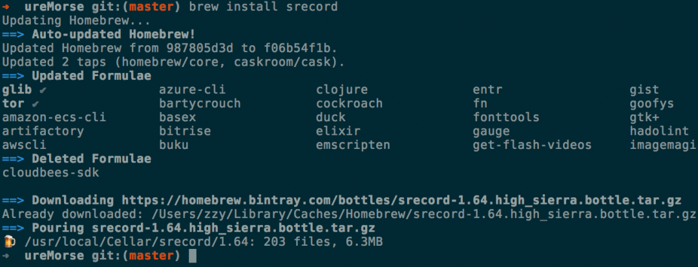

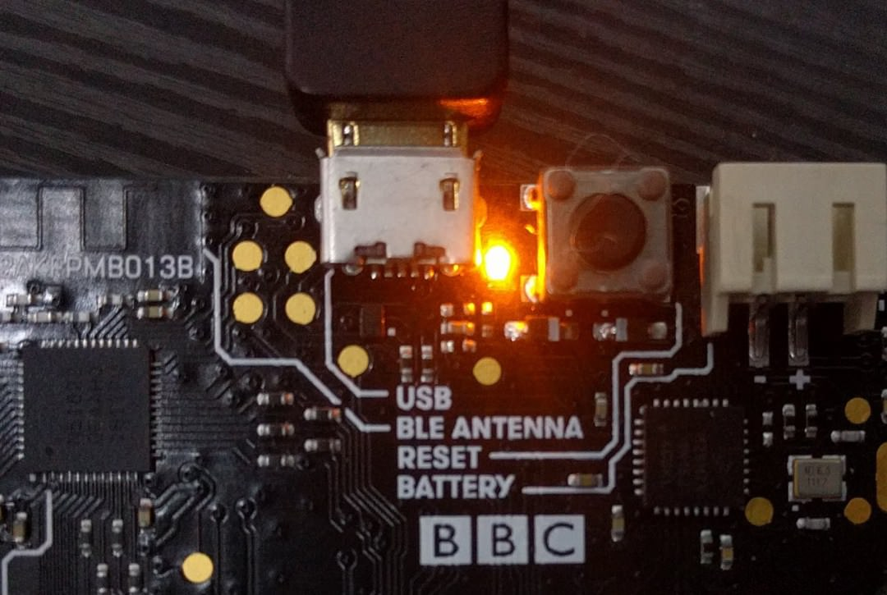

1. Install the dependencies to build  your microbit project. Using your package manager (brew, apt-get, pacman, …), or any method you fancy, install yotta  and srecord.  Direct your terminal to the  project directory. Here you will write your code in source/main.cpp.

2. To build the program, Micro:Bit runtime program employs the Yotta build system. First we would target the architecture of Micro:Bit by running yotta target bbc-microbit-classic-gcc.  We can now build the project with yotta build. Finally, to install the compiled program into your microbit, plug in your Micro:Bit and find a file ending with .hex in the build//source/ folder.  Copy this file into your Micro:Bit, which should now be mounted.

3. Check out module.json where you can configure the program’s name, version, description, source code  folder … etc.
4. Now that is quite an overwhellming amount of infomation all at once, fortunately what you need to do would be much simpler. The author has provided a convience makefile to handle building with yotta and installing the compiled file into the microbit.
5. To build the project, run make and to install the compiled program into the microbit, run make install.  When the micro:bit is recieving instruction, the LED on the back of the microbit near the USB port would flash. Once installation is complete, the LED at the micro-USB port would stop flashing and the program would run automatically.
6. To reset the Micro:Bit at any time and restart the program running the Micro:Bit, press the button next to the micro-USB port on the back of the Micro:Bit
7. For more infomation, see the runtime documentation on setting up the development enviroment here.

### Step 2 – Hello World
---

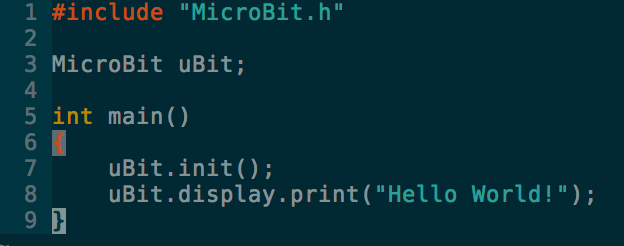

1. Lets begin by writing the time tested “Hello World” program on the microbit. Copy this into main.cpp. As usual,  but different from the Arduino prototyping platform, code execution starts from the main function.
2. First we would include the MicroBit.h to get the Mirco:Bit runtime defintions. (The include path would be configured automatically by the build system).  The Micro:Bit program is centred around one object/instance, the  MicroBit object, which you will interact with do almost every action that involves the microbit.  In this tutorial, we will name the object “uBit“.   The first thing any Mirco:bit program should do is initialise the Micro:Bit using uBit.init().
3. Now we want the Micro:Bit to scroll “Hello World!” across its screen. This is done using uBit.display.scroll() which displays its argument scrolling across the display. Note that the call blocks while the text is displaying scrolls across the screen.Take a look at uBit.display for  more infomation on driving the Micro:Bit’s built in display, such  as non blocking calls.
4. Thats it, run make && make install with your Microbit plugged in to install the program. Once the program is installed, “Hello World!” should scroll across the screen.

### Step 3 – Buttons & Events
---

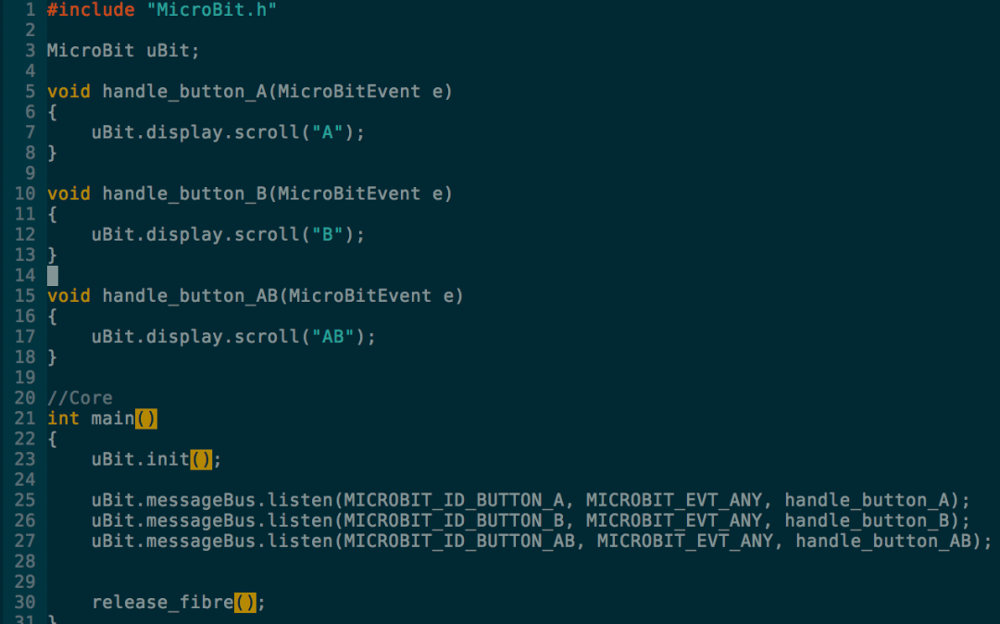

1. We will employ the two buttons on the Micro:Bit, namely button A & B in some combination of clicks & holds to trigger a specific functionality.
2. When something happens to the buttons on the Micro:Bit, this happening is tranlated into an ‘event’ in to the system. Events are not simply limited to button presses. They could represent anything from a the radio recieve a datagram or the accelerometer detecting a change in orientation.
3. To run code whenever a specific event is raised,  we write an ‘event handler’, which is simply a function that contains the code that you want to run.  The function takes in an MicroBitEvent argument, which is the event that caused the function to be run  and returns nothing.
4. Micro:Bit uses messageBus  as it to deliver events run registered event handlers when a certain event happens, such when one of the buttons on the microbit is pressed, which messageBus would call the event handler, provided that the event meets the handlers listening criteria.
5. Use uBit.messageBus.listen() to register your function as an event handler for a speicific event criteria. Here we are registering event handlers to the buttons on micro:bit, for any event. This means that any event that is related to the specified button would call the event handler that was registered for that button. In an actual program, we can be more specific like specifing MICROBIT_EVT_BUTTON_HOLD  to run the event handler only if the specific button is held down for some time.
6. Note that ALL execution would cease if the Micro:Bit reaches the end of main() function, hence, we release the main thread or this case the main “fibre” to allow the micro:bit to process button events.
7. Thats it, run it with make && make install. Once the program is installed, pressing button(s) A and/or B  should scroll “A” or “B” depending on which button you press. If you press A and B together, you should see “AB” scrolling across the screen.

### Step 4 – Registering Morse Code
---

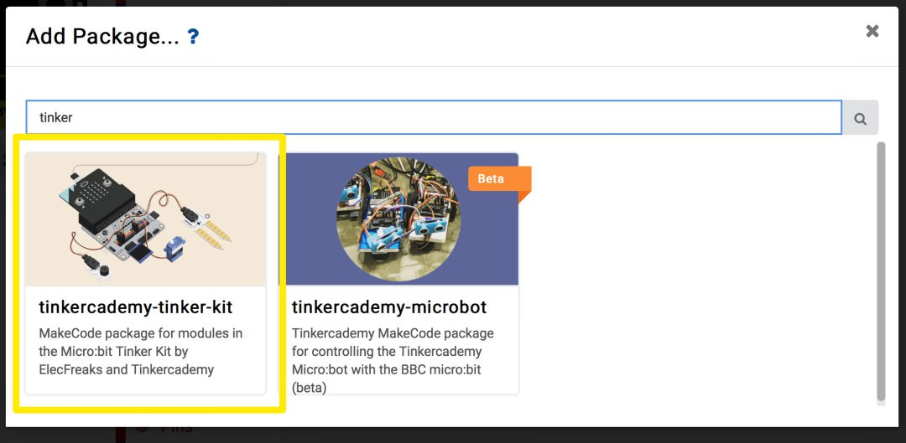

1. Morse code is made up of a variable combination short and long signals, or in this case, button presses.
2. Expand the ‘Advanced’ section and scroll to the bottom and click on ‘Add Packages’
3. In the search box, type in ‘Tinker’. Click on the box labelled ‘tinkercademy-tinker-kit’
4. Now you’ll see something new in MakeCode – a bright green Tinkercademy category has been added!
5. Inside this category you’ll find blocks to sense button presses on the ADKeypad. Note that importing this package only happens for the current project. So if you start a new project and want to use the category, you’ll need to re-import it.

 
### Step 5
---

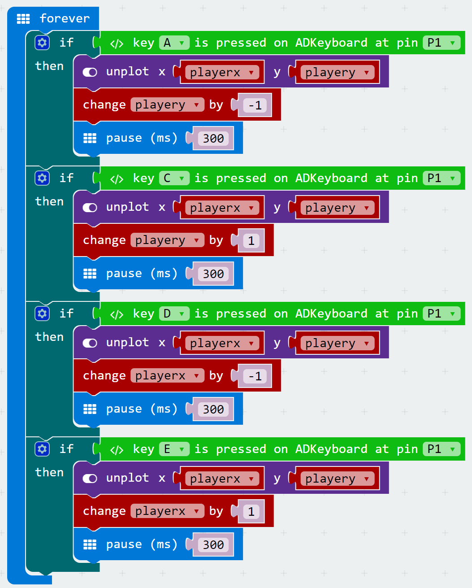

1. Now that we have our Tinkercademy category added, we can use the ADKeypad to move up, down, left, and right. In this example, we’ll set the A button to move up, the C button to move down, the D button to move left, and the E button to move right.
2. To do this, we use if statments. If statements test to see if a condition is true; if it is true, then they run any blocks inside the if block. When we place an if statement inside a forever loop, we forever test to see if the condition is true.
3. To move the player, we simply change the player x or player y variables. Remember, decreasing or increasing playerx causes the player to move left or right respectively, and decreasing or increasing playery causes the player to move up or down respectively. We’re constantly plotting the location of the player using these variables, so when we change them, it automatically changes the player’s location!
4. Note that we add a short 300ms pause after each button press. Otherwise the micro:bit would move you many spaces every time you pressed a button because it runs the code so fast.

### Step 6
---

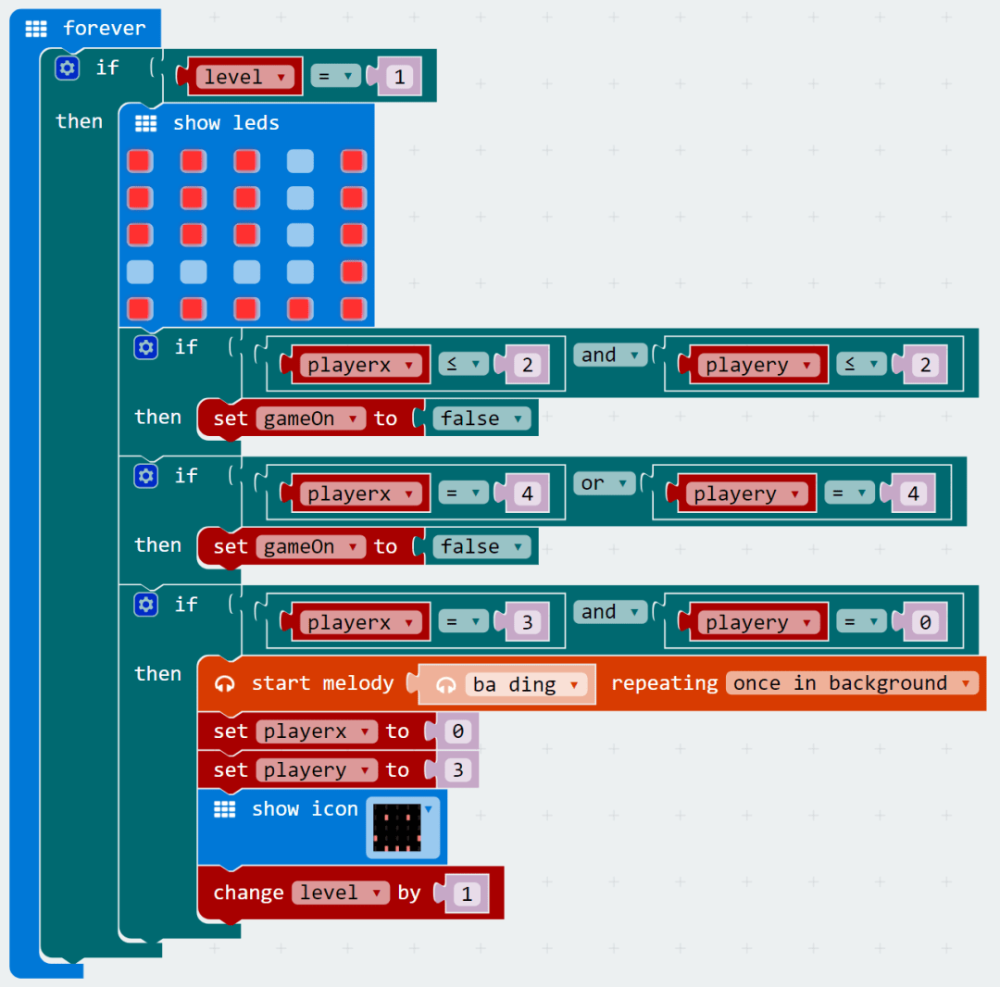

1. Now that we can move our player around, let’s start creating our maze levels! Every time we start a level we need to do a few things: First we need to display the maze walls on the LED display. Second, we need to forever check if the player runs into a wall (if they do, it’s gameover!). And third, we need to forever check if the player makes it to the end of the maze level (if they do, let them know they succeeded and move onto the next level!).
2. For each level, we’re going to use a forever loop. Inside the loop, we use an ‘if’ statement to check if the level variable equals 1. This means this code will only ever run if the level variable equals 1.
3. Inside the if statement, we first display the maze walls. We light up LEDs to serve as maze walls, and leave them turned off to represent the maze path. This can be done using the ‘show leds’ block. One thing to be careful about though: remember above we set the starting position of the player? Make sure your player starting position is not inside a maze wall! In this example, the starting position of the player is x=0, y=3.
4. Next, we need to check if the player ever runs into a wall. How to do this? Once again we’ll use if statments to check if our playerx and playery variables are ever in the same place as a wall. We do this using the coordinate system of the 5x5 LED grid. In this example, there are two sections of walls.
5. The first wall exists where playerx is less than or equal to 2 AND playery is less than or equal to 2. We create an if statement with these conditions, and inside we set gameOn to ‘false’ (since if it’s ever ‘true’, it means the player ran into a wall and should get a Game Over).
6. The second wall exists where playerx equals 4 OR playery equals 4. We create another if statement with these conditions, and inside we set gameOn to ‘false’ (because once again if it’s ever True, it means the player ran into a wall and should get a Game Over).
7. Finally, the last test we need to add is to see if the player makes it successfully through the maze! In this example level, the end of the maze is at x=3, y=0. We create another if statment to check if x=3 AND y=0, and inside we do a few things: First, we play a success melody in the background. Second, we set the starting position of the player for the next level (in this example, we use the same starting position, but it can be different!). Third, we show a smily face to tell the player they succceeded! And fourth, we change the level variable by 1 (this will cause the next level to display).

### Step 7 
---

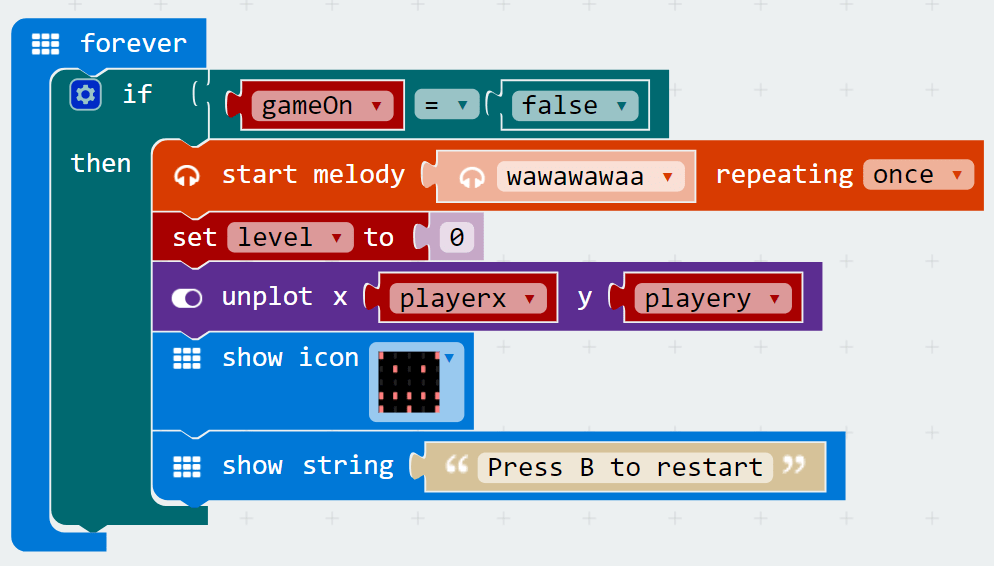

1. Whew, setting up a level was a lot of work! Now that we have a single level, let’s make something happen when a player gets a game over. This will happen whenever they run into a wall, and it’s tracked by the ‘gameOn’ variable.
2. Inside a forever loop, we use an if statment to check the value of the ‘gameOn’ variable. If it equals ‘false’, then we want our game over code to run!
3. In this example, we play a sad melody in the background, reset the ‘level’, unplot the player LED, show an angry face, and finally display a string telling the player they can press B to restart the game.

### Step 8
---

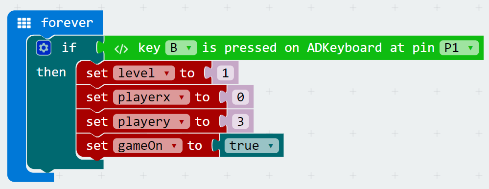

1. Speaking of pressing B to restart the game, we haven’t yet created the code to do that!
2. Inside a forever loop, we test to see if button B on the ADKeypad is pressed. If it is, we want to set ‘level’ to 1, reset the player’s starting location by setting the ‘playerx’ and ‘playery’ variables to 0 and 3 respectively, and set the ‘gameOn’ variable back to ‘true’.

### Step 9
---

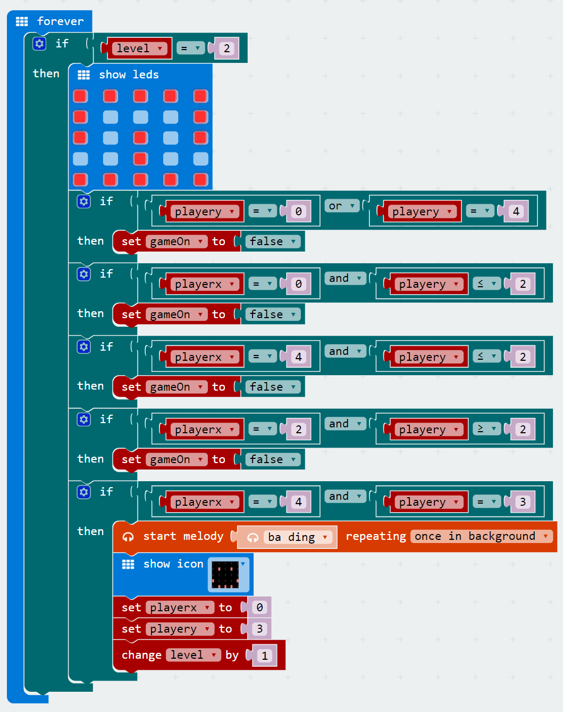

1. Now our game should be working as intended! The only thing missing is more levels!
2. It’s quite easy to add more levels by duplicating our level 1 code from above. The only things that will change are the maze walls and the coordinates for our if statments (for testing if the player moves into a wall or completes the level.
3. Tip: sometimes it can be complicated to create if statements to test for every wall. In these cases, try to break down your walls into separate rectangles and create an if statement for each rectangle.
4. One thing to watch out for: after the player completes the level and you reset their playerx and playery variables, make sure the position matches your next level. Otherwise they could start inside a wall!

### Step 10
---

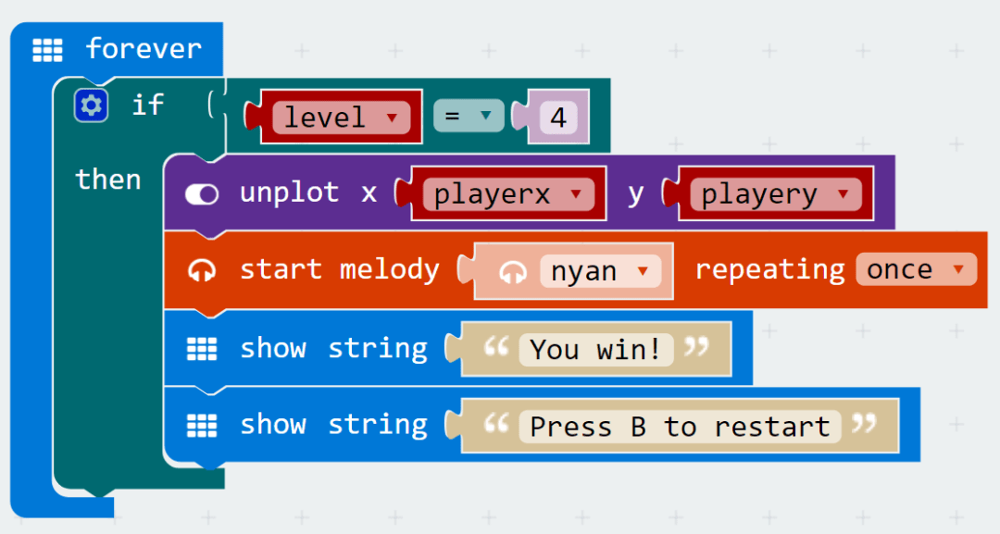

1. Once you’re done adding in levels, you can optionally create a victory section. In this example, once the player successfully completes the first 3 levels and level equals 4, we: unplot the player, play a victory melofy in the background, and show a victory message!

### Cool stuff!
---

Now that you’ve learned how to use the ADKeypad, you can try using it to control LEDs, servos, and other components! You also learned about if statements which are useful in many micro:bit projects! Try customising your maze runner game by adding more levels!

