# case 26 Coin Sorter with micro:bit 

## Coin Sorter with micro:bit
---
- Ever just accumulate a bunch of coins in a jar and now want to sort out the giant mess your past self should have foreseen? No? Just me? Ok well let’s build a coin sorter for fun then, adding on an ultrasound to count the amount you have sorted. Written by Hannah from Raffles Institution during a job attachment.

### Goals
---
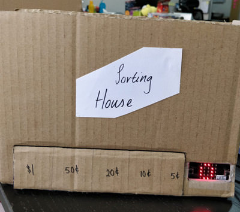

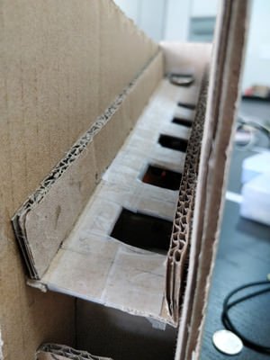

 1. Make a simple mechanical coin sorter.
 2. Learn how to wire up and use an ultrasound HC SR04.
 3. Have fun!

            
    
### Materials
---
- 3 5x25cm pieces of cardboard
- 2 25x2.5cm pieces of cardboard
- 2 19x26cm pieces of cardboard
- 2 5x19cm pieces of cardboard
- 6 5x5cm pieces of cardboard 
- 1 2x5cm piece of cardboard
- Jumper wires and 3 crocodile clip heads
- Solder
- 5V battery supply or 3AA batteries and a battery holder
- 1 micro:bit
- 1 micro USB cable
- 1 Ultrasound HC SR04
- Superglue

### Hardware Step 1 – Creating the slots
---

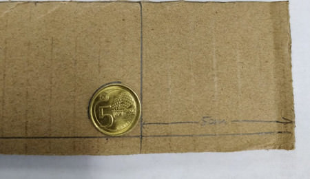

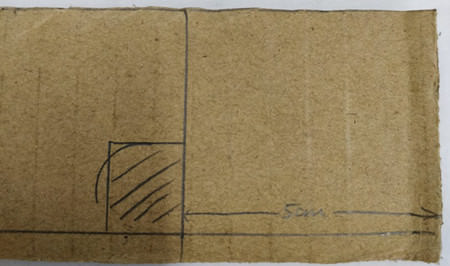

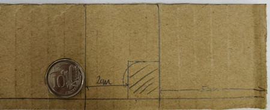

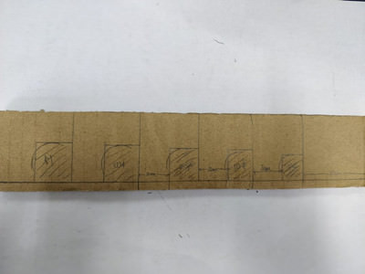

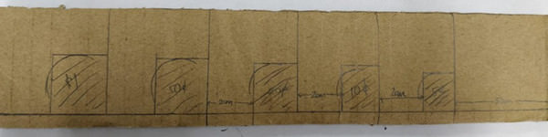

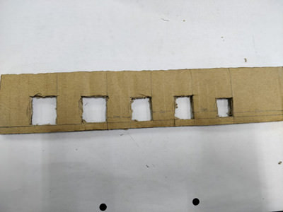

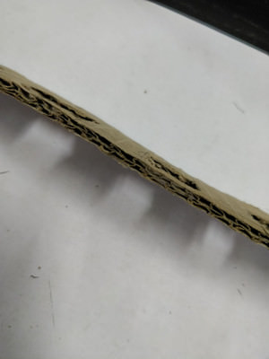

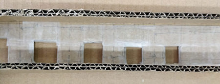

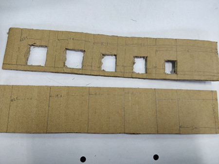

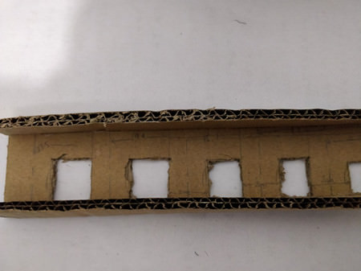

1. Take a 5x25cm piece of cardboard (A) and draw a line 0.5cm away from the long edge of the cardboard.
2. Leave a gap of 5cm from the short edge to the cardboard and draw a reference line.
3. Place a 5cm coin at the corner of these two lines and trace its edges.
4. Draw a rectangle of width which is the diameter of the coin and length 0.2cm shorter than the diameter of the coin. Shade this rectangle to indicate that it is to be cut out later.
5. Leave a 2cm gap from this rectangle and draw another reference line
6. Repeat steps 3 to 5 using a 10 cents, 20 cents, 50 cents and $1 coins in this order.
7. Cut out the shaded rectangles using a pen knife.
8. Since the cutting of the board left some parts flatter than others, flatten the whole piece of cardboard.
9. Since the cardboard is pretty rough, there might be too much friction for the coins to slide down. Rectified this by taping the cardboard in smooth scotch tape (p.s. The transparent scotch tape might also have too much friction)
10. Measure the distance from the middle of each of the 2cm gap to the end of the cardboard. Taking these measurements, draw reference lines on the other piece of 5x25cm cardboard (B).
11. Paste the two pieces of 2.5x25cm pieces of cardboard on to the edges of A.

### Step 2 – Creating the front piece
---

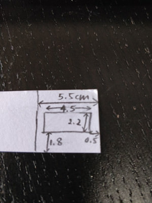

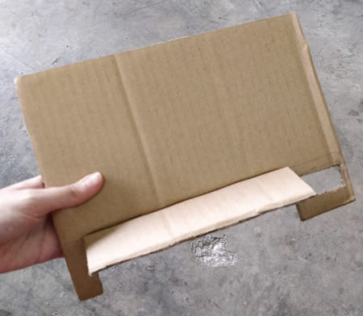

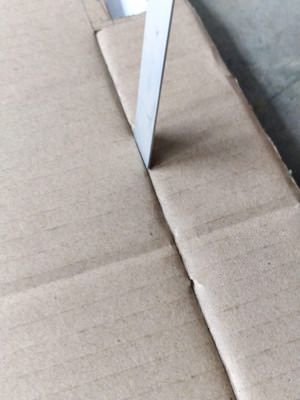

1. Leave a 5.5cm gap from the edge of the 19x26cm piece of cardboard (C) and draw a reference line.
2. Draw a rectangle at the corner of the C (within the area enclosed by the 5.5cm gap) as shown.
3. Cut out this rectangle.
4. Draw a 5x18cm rectangle from this reference line as shown. This will be the opening to the sorted coins.
5. Cut out the widths of the rectangle as shown to make a door.
6. Using a ruler, press in the side of the door to make it easier to bend outwards

### Step 3 – Creating the side piece
---

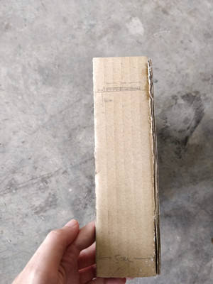

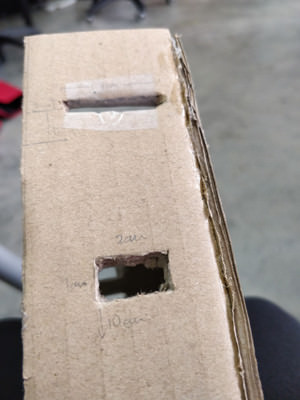

1. Take a piece of 5x19cm piece of cardboard (D).
2. Create a rectangular coin slot of 0.3x3cm dimensions whose lower length is 16cm from the bottom of the cardboard.  (see picture for better visualisation)
3. Create a hole for the wires by cutting out a 1x2cm rectangle whose lower length is 10cm from the bottom of the cardboard. (see picture for better visualisation)

### Step 4 – Setting up the electronics
---

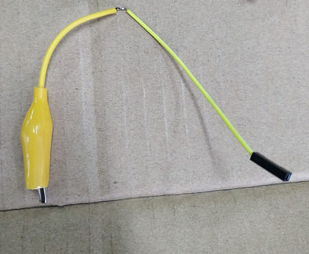

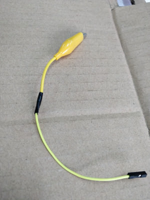

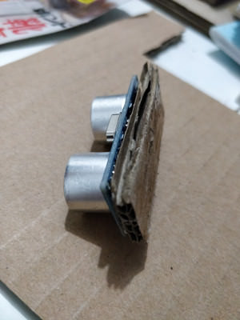

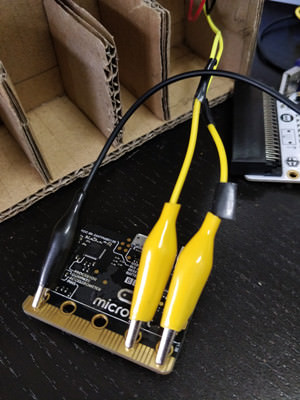

1. Solder one male header jumper wire to a crocodile clip as shown. Insulate the exposed wire using either electrical tape or shrink tubing.
2. Repeat step 1 2 more times to create 2 signal connection wires and 1 ground wire.
3. Connect the 2 signal connection wires to the trig and echo pins of the ultrasound and pins 0 and 1 respectively on the microbit.
4. Connect the the ground pin of the ultrasound and the ground of the microbit using the ground wire.
5. Paste the ultrasound to the 2x5cm piece of cardboard such that the the large flat back of the ultrasound is flushed against the board and the pins are sticking out.
6. Connect the micro USB of the microbit.
7. Connect a jumper wire separately to the 5V and ground pin of the ultrasound.

 
### Step 5 – Putting it altogether
---

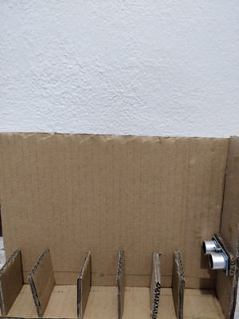

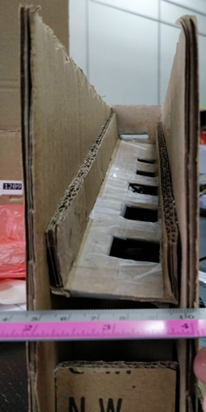

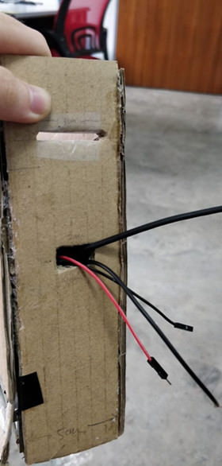

1. Paste the 6 5x5cm pieces of cardboard on B on its reference lines.
2. Paste D on the right side of B
3. Paste the ultrasound about 5.7cm from the bottom of the D
4. Using tape, tape the microbit 0.5cm from the bottom of B, with its screen and buttons facing outwards
5. Thread all the wires through the hole for the wires.
6. Paste the other 5x19cm board (E) at the back of B
7. Orientate A such that the 5 cent slot is on the right. Paste the back of A on B such that the tip of A near the $1 slot is 9cm from the bottom of B and the 5 cent slot side is 16cm from the bottom of B. (see picture for better visualisation)
8. Paste C to the front of the coin sorter such that A is 8cm and 15cm from the bottom of C.
9. Paste the other 5x19cm piece to the left side of the coin sorter and the last 5x25cm board onto the top of the sorter to close the setup.

### Step 6 – Powering the microbit and ultrasound
---

1. Attach the ground and 5V wires of the ultrasound to a 4.5V to 5V power supply
2. Power the microbit in parallel to the ultrasound using the same power supply.
3. If a different power supply is used, attach the ground wire of the microbit in parallel to the ground from the same 5V power supply. (Sharing of the ground wire)

### Software Step 1 – Calibrating the ultrasound 
---

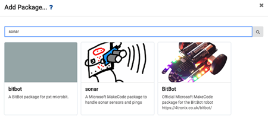

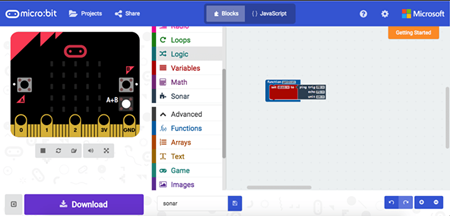

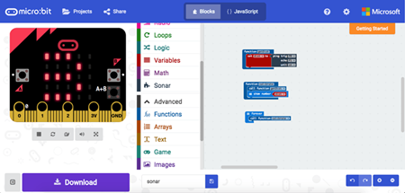

- Every ultrasound is different and the environmental conditions at your place might be different from mine so the values I use might be different from yours. Calibration helps you find what values you should be using in your situation.

1. Download the Sonar package for easy access to the ultrasound function.
2. Create a function to get the distance of the ultrasound as shown.
3. Create a function to show the distance that the ultrasound is sensing on the screen
4. Continuously call this function
5. Drop different coins into the coin sorting machine and record the minimum and maximum distances you get from each type of coin.

*Do make sure that the ultrasound is placed neatly vertically and is not obstructed by anything*.

### Step 2 – Sum of the value of the coins
---

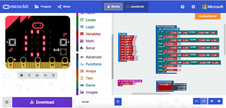

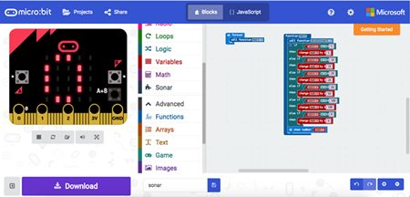

1. Record the min and max values from above as variables.
2. Initialise the sum of the coins to be 0.
3. Logically, if the ultrasound gets a reading between the min and max of a coin, the coin that has been sorted must be of that particular value. Hence, if the reading is larger than or equal to the min value and smaller than or equal to the max value, it is for example a 5 cent coin. Store the value of the current coin being sorted in a variable.
4. If the coin has been found, we need to increase the total sum value by its value. Create a function that checks for and does this.
5. Continuously call this function.
6. Now we need a way to restart the sum value if we take out our coins, so go ahead and reset the sum to 0 if the buttons A&B are pressed.

### Good job!!!
---

Hopefully, you had fun building the coin sorting machine. Now, think of ways to further develop the project… maybe add a function to see if the machine is full? Either way, enjoy ^ ^

