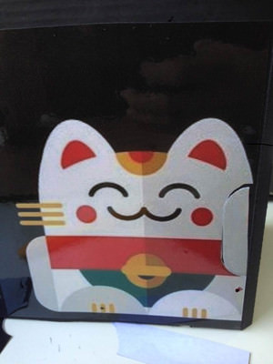
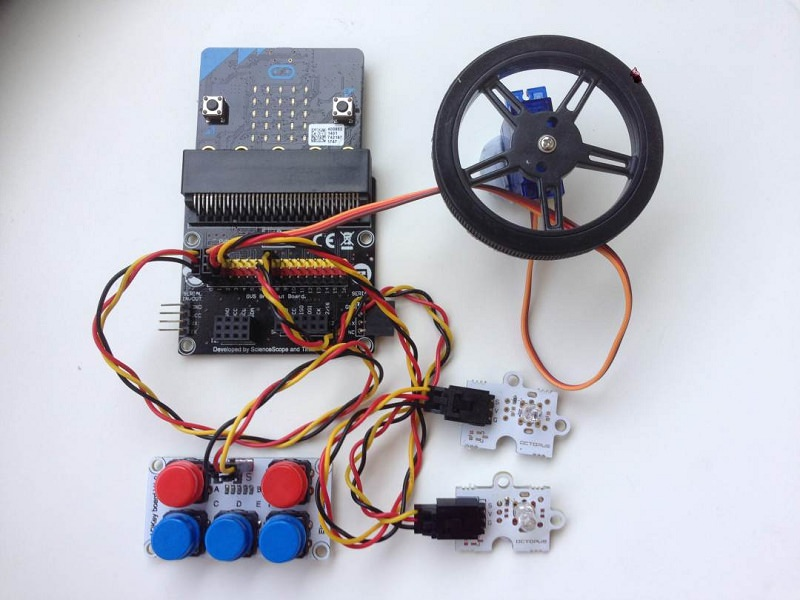
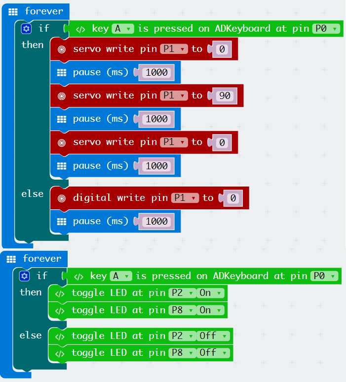

# case 27 Make a Waving Fortune Cat 

## Make a Waving Fortune Cat
---
- Use a micro:bit and mini servo to make your very own Maneki-Neko, or Fortune Cat, who waves its hand when you press a button!Designed and written by Tim Ho from the National University of Singapore.

### Goals
---

 1. Make a moving cardboard cat.
 2. Give cat an action which you desire. 
 3. Hint: Follow the steps and pictures during your building process!
 
           
    
### Materials
---
- 1 x ADKeypad
- 1 x Battery Pack
- 2 x Yellow LED
- 1 x Breakout Board
- 1 x micro:bit
- 1 x Mini Servo

### Step 1 – Choose a cat
---

- Find a cat image and stick over a cardboard for support.
- Choose a cat personality of your choice. Happy, relaxed or friendly!

### Step 2 – Connect electronic parts
---

Connect the following on the breakout board

1. ADKeypad to Pin ‘0’.
2. Mini Servo to Pin ‘1’.
3. Two LED lights to Pin ‘2’ and Pin ‘8’.

*The colours of the jumper wires don’t actually affect how the electronics work. But it is good practice to follow a colour convention so that you can easily identify where which cables are attached to.*

### Step 3 – Join up electronics to cardboard
---

1. Mount the mini servo to right side of your cardboard cat.
2. Create two openings on the cardboard for the LED lights to shine through

### Step 4 – Code Microbit
---

1. Create block code in make code on the left.
2. When Button ‘A’ is pushed (Two LED lights up, Servo motor turns)

### Cool stuff!
---

Now you’ve brought your cat to life. Think of a variety of movements for your cat. Enjoy and add them on to the cat!

