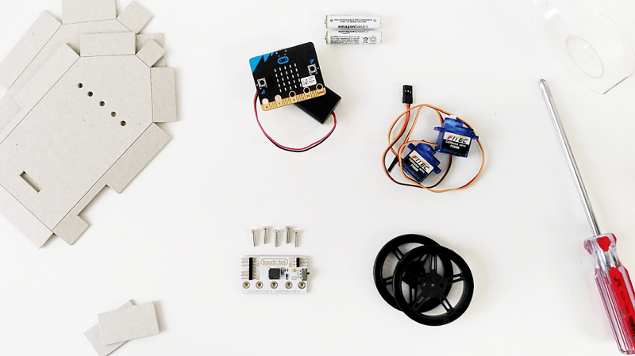
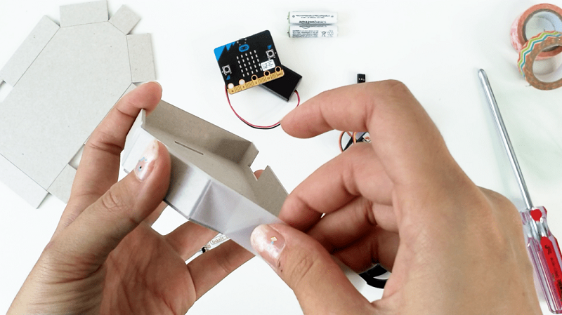
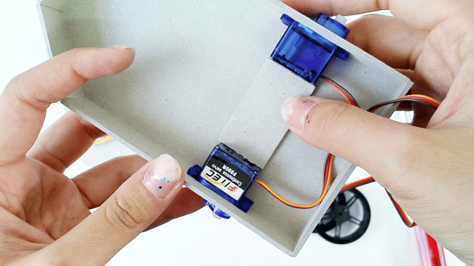
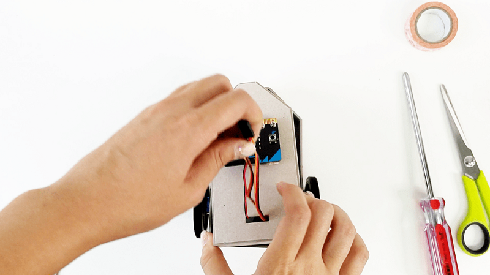
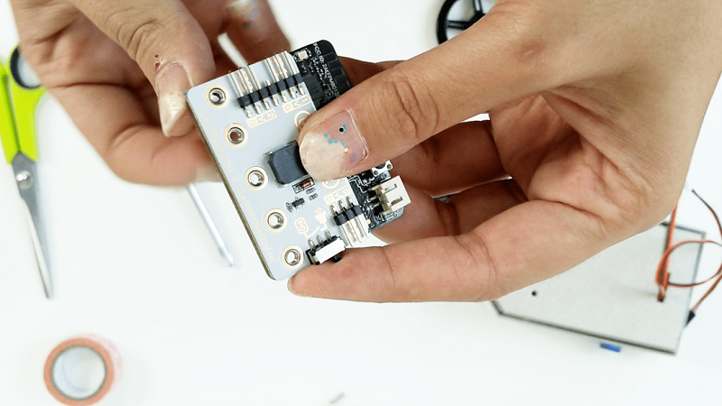
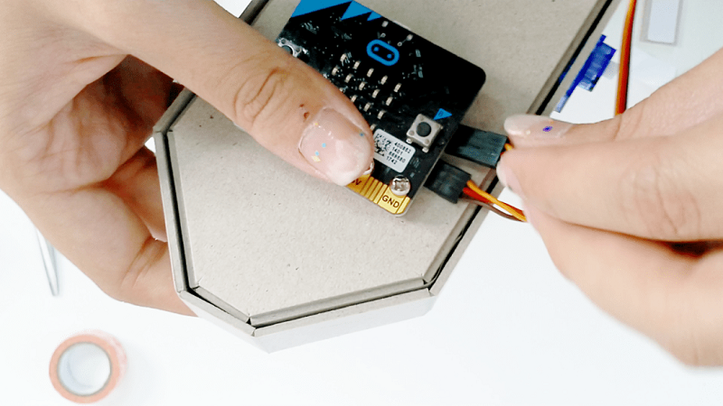
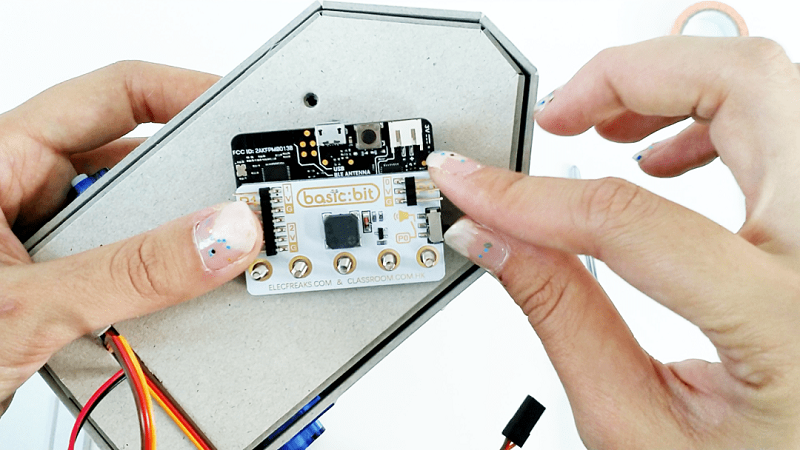

# case 28 Put together the Krazy Kar v2 

## Put together the Krazy Kar v2
---
- Got our Krazy Kar Kit and ready to get started? Follow along to put it together here.
Don’t like instructions? Use your creativity and make a krazy octopus instead.

## Goals
---

 1. Make the Krazy Kar.
 2. Don’t break anything.
 3. (Or if you break anything, learn how to fix it).
 
           
    
## Materials
---
- 1 x Krazy Kar Shell
- 2 x Continuous Servos
- 2 x Wheels for Servos
- Some x Tape
- 1 x Basic:bit
- 5 x Screws
- 1 x micro:bit
- 1 x Battery Pack

## Hardware Step 1 – Shell it! 
---

- Fold up the cardboard shell where the line cuts are.
- Tape it such that the sides stand 90 degrees to the base.
- You should be able to slot the top shell (one with 5 holes) into the bottom shell now.

### Step 2 – Put in the Innards.

- Insert the two servo motors into the holes at the sides.

- Behind the stabilizing rectangle is some double-sided tape. Peel off the paper and push the rectangle in between the servos to secure them in. Stick it down well onto the base!

- Fill the battery pack with batteries and place it in the front of the krazy kar.

### Step 3 – On to the Outside!

- Screw the wheels onto the continuous servo motors.

- Thread the servos and battery pack’s wire through the rectangular hole in the top shell. And fit the top shell onto the bottom. 

### Step 4 – Upgrade the micro:bit

- Screw the micro:bit onto the basic:bit using the longer screws provided. Note that the holes should align, P0 to P0 and G to G.

- Affix the two servos into P1 and P2 of the basic:bit, making sure that the brown wires goes to G and the yellow wires go to S. 

- Switch the P0/Buzzer switch on the basic:bit to buzzer. If it was already there – lucky you.

### Step 5 – On to the Outside!

- Using the 5 screws, fit the micro+basic:bit cyborg into the 5 holes on the top of the krazy kar.

- Decorate decadently. And code it to get moving! 
