# case 29 Shoot Em Up Kit 

## Shoot Em Up Kit
---
- You’ve got a town to save and a dragon to shoot! 
This here is the formula to get your own tabletop shooter arcade working in good form!

## Goals
---

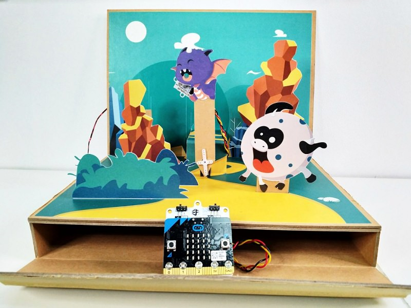

 1. Connect all the parts of the Shoot Em Up Kit.
 2. Code the micro:bit to fly dragons, detect lasers and score your player.

 
              
## Materials
---
- 1 x Shoot Em Up Box
- 1 x Light Sensor
- 1 x Servo motor
- 1 x Ring:bit
- 5 x Screws
- 1 x micro:bit
- 3 x AAA batteries

## Hardware Step 1 – Put your town in order! 
---

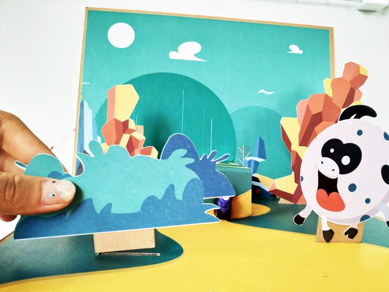

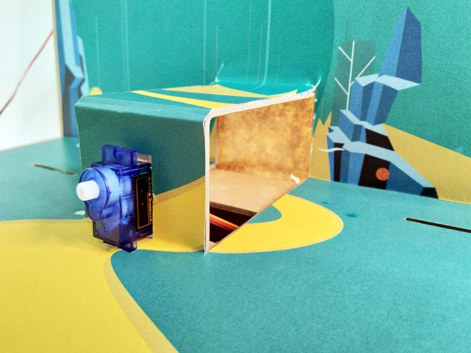

- Insert all the mountain cutouts and bushes around the path to your town.
- Fit the servo motor into the hole at the pop-up center.
- Thread the servo’s wires into the hole and out the box at the front.

### Step 2 – Attach your ring:bit

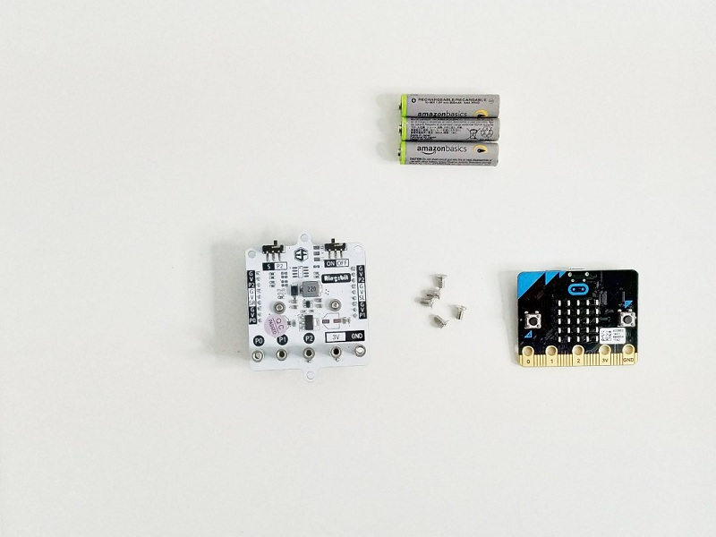

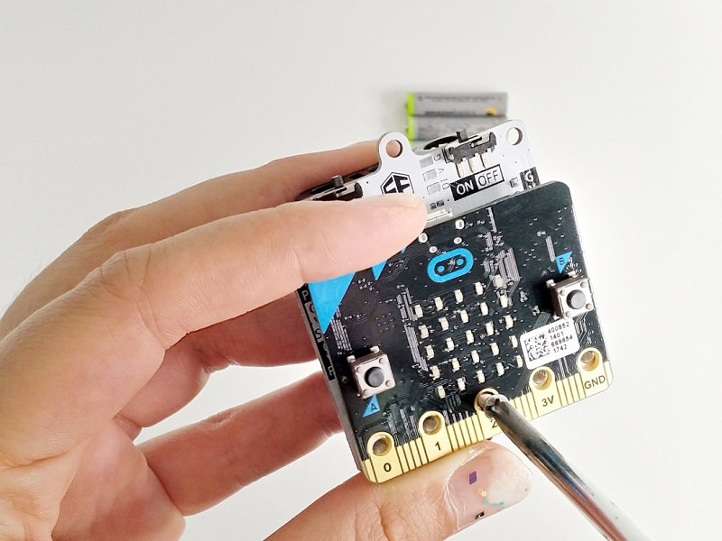

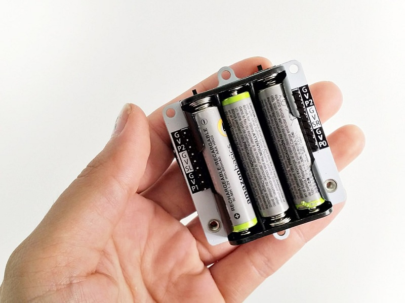

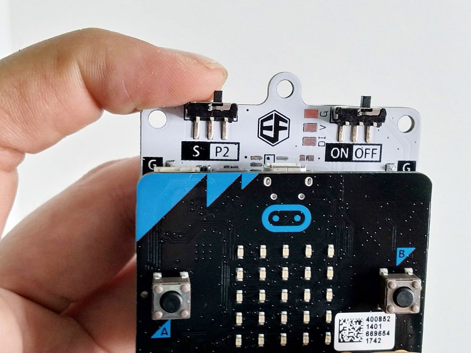

- Attach the micro:bit atop the ring:bit and screw it down with all 5 screws.
- Insert all 3 batteries into the back of the pack.
- Switch the left switch to P2 and the right switch to OFF. We’ll turn it on after we’ve coded the micro:bit.

### Step 3 – Connect all the parts!!

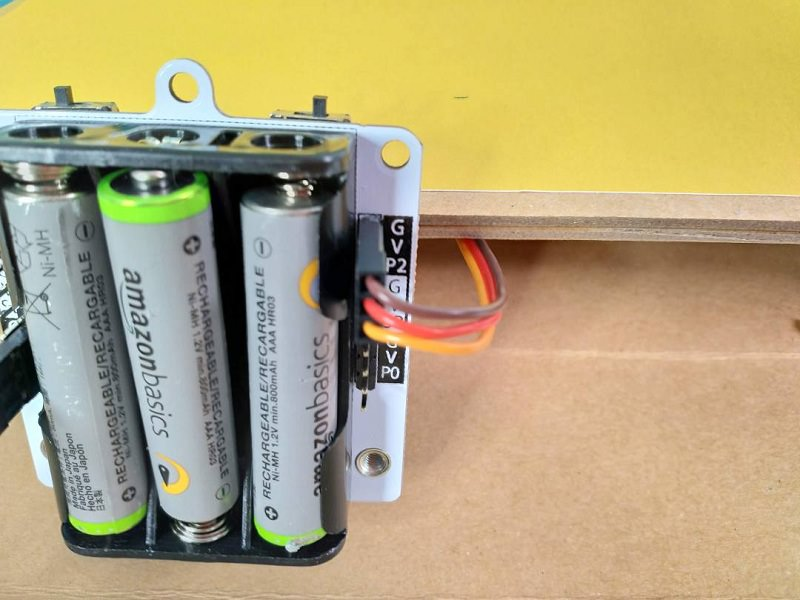

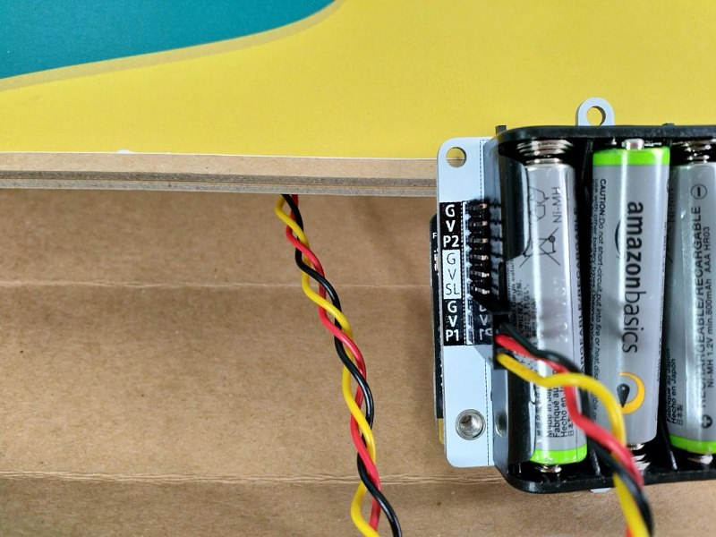

- Connect the servo to P2 on the ring:bit. And make sure that the brown wire goes to G and the yellow wires go to P2.
- Connect the light sensor to P1 on the ring:bit. The black wire should connect to G. 

### Step 4 – Code it up!

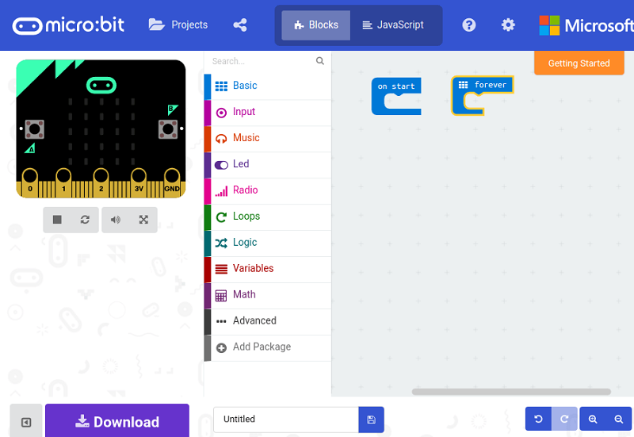

### Step 5 – The real challenge – calibration.

Calibrate your dragon to make sure it’s flying back and forth in the sky and not face flat into the ground repeatedly.
- With your servo firmly in place – code the micro:bit to turn your servo to 0 deg when button A is pressed, and to turn to 180 deg when button B is pressed.  
- Place a servo arm onto the head of the servo after pressing button A and watch to see where it goes when you press button B. If the servo arm points too far down or to the side, adjust the arm and reduce the angle coded. (e.g. adjust 0 – 180 deg to 20 – 160 deg).
- Replace the servo arm with the dragon arm at the same angle and screw it down to secure it.

### Step 6 – Calibration Part 2

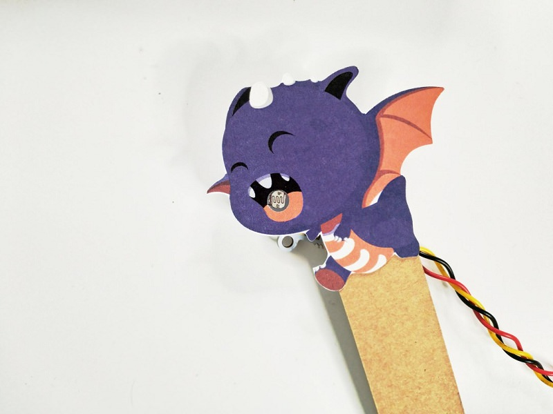

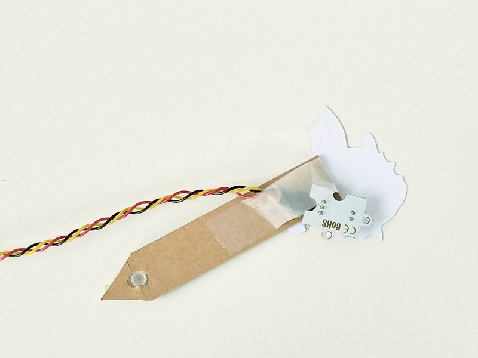

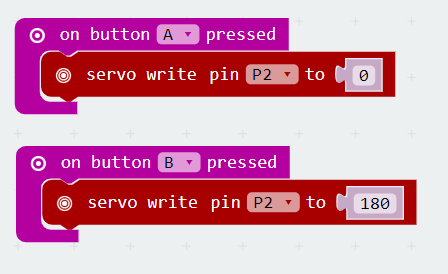

On to the light sensor. We’ve got to capture the current light levels and when a laser passes over, the sensor will alert the micro:bit that the light levels has suddenly gone way up.
-  Thread the light sensor through the hole under the pop-up and to the front of the box.
-  Place the light sensor into the dragon’s mouth and tape it down to secure it.
-  Code the micro:bit to detect the light level through the light sensor when a button is pressed.

### Step 7 – Putting it all together.

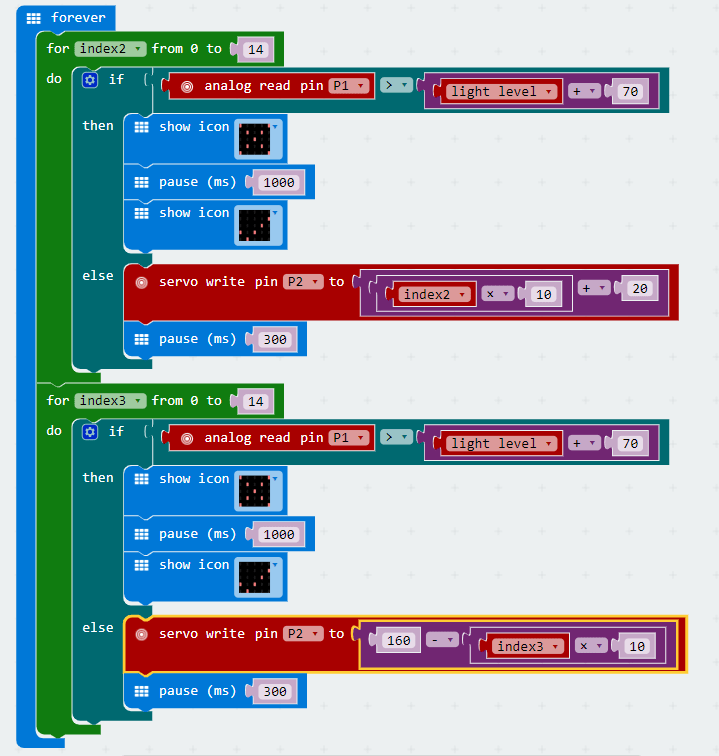

Now we want to be able to stop the dragon when it gets hit and also score points!
-  So we should combine the two pieces of code and use an IF logic block to check if we got hit. 
-  IF we get hit, then we change the icon on the micro:bit and pause for a while, before changing back to the default icon.
-  ELSE (if we don’t detect and hits) then we allow the servo to move as per normal.
-  Also – add in more blocks so when the dragon gets hit it increases a score variable.

## Cool stuff!
---

You’ve killed the dragon. Now what? Add extra mountains, make it more challenging. Or write your own story, and see what you can do with your magical micro:bit!

