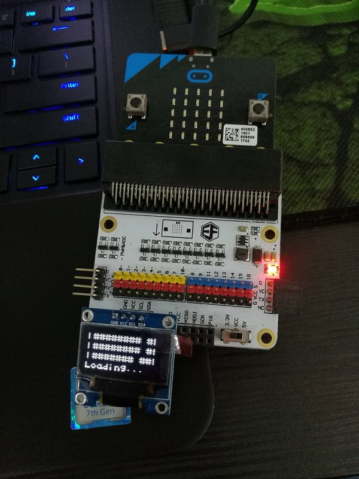
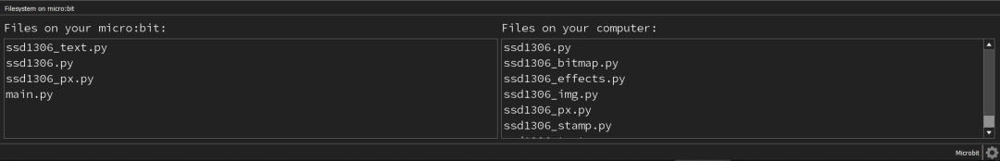
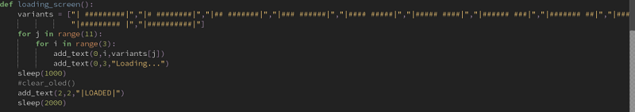
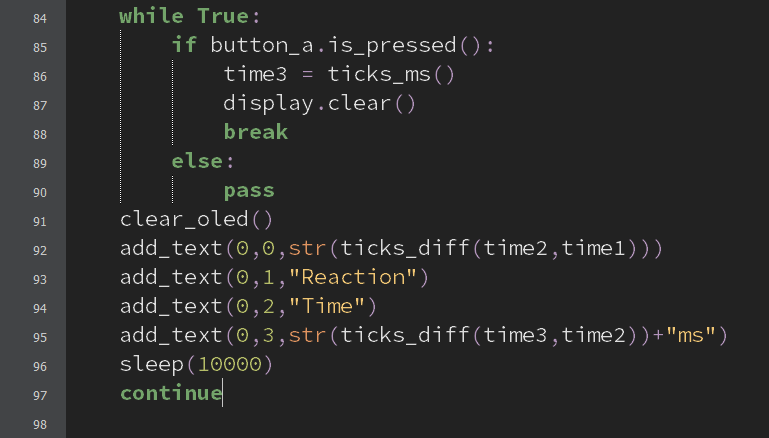
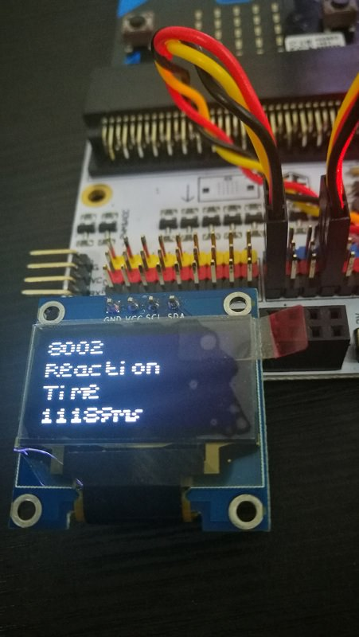

# case 30 Reaction Time Tester 

## Reaction Time Tester
---
- Test yourself with this Python-based mini-game for the micro:bit and OLED! Written by Jensen from Raffles Institution.

## Goals
---

 1. Assemble a reaction time tester.
 2. Try not to break it when testing yourself!

 
              
## Materials
---
- 1 x Tinker Kit (or OLED display)
- 1 x Brain
- 1 x You

## Hardware Step 1 – Input/Output
---

- Attach the MicroBit to the Breakout Board.
- Connect the LED to pin 12, which is a digital pin.
- Connect the light detector to pin 8, another digital pin.
- Brown to G (ground), red to V (voltage) and orange to S (signal).
- These tell us if light is on or off.
- Connect the OLED display to the I^2C pins. Any one set will do.
- Connect your micro:bit to the computer, and download the Mu Editor.

### Step 2 – File Transfer

- We need to download some modules to be used in the project.
- From This link, download the module as a zip file.
- Write the code (first screenshot)  in Mu Editor to import the files.
- Be sure to have the files in the same folder as the project.
- Transfer a few of the files from your computer to the microbit.
- On Windows, be sure to put the files in a folder under users/”Username”/mu-code for them to be detected my mu-editor.
- These files are the modules that are not originally present on the micro:bit for you to import.

### Step 3 – Loading Screens

- This step isn’t really necessary , but it adds a little flair into your project.
- We display this loading on the OLED module
- Using the module “add_text”, we can display text and other characters onto the display
- We show the animation using the function “loading_screen()”
- If you want more variations of the loading screen, head down to the bottom of the post.

### Step 4 – Code the Game

- Here’s the actual test itself.
- First, we have to have a time to wait before showing the indicator for the player to press the button.
- We randomly generate the number and parse it into milliseconds by adding “000” to the end of the number after turning the original number into a string.
- The variables time1 and time2 refer to 2 arbitrary points in time before the “#” ( the indicator to the player) symbol is shown.
- One quirk about micropython and the MicroBit to note is that the time module is replaced by the utime module, and utime has to be imported instead of time.

### Step 5 – A Little More Logic

- This is the step where we calculate and display the player’s reaction time.
- This is done by calculating the time between when the indicator is displayed and when the player presses the button.
- Then, we display the player’s reaction time to the OLED display.

## Bonus loading effects:
---

- This one utilizes the light sensor and the LED to start the game.
- It detects light and once the light is covered, the game will start.

This next animation is simple: display the characters “3”, “2” , and “1”, as a countdown before starting the game. The code is pretty self explanatory.
