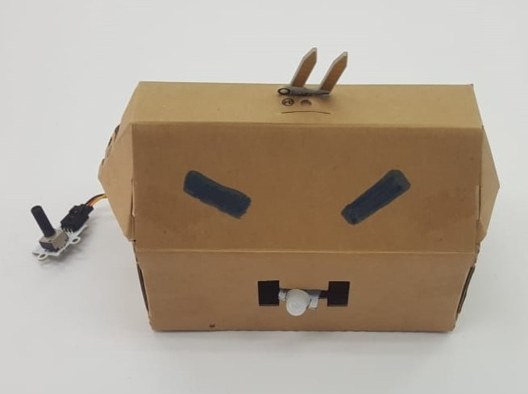
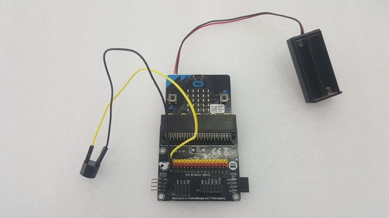
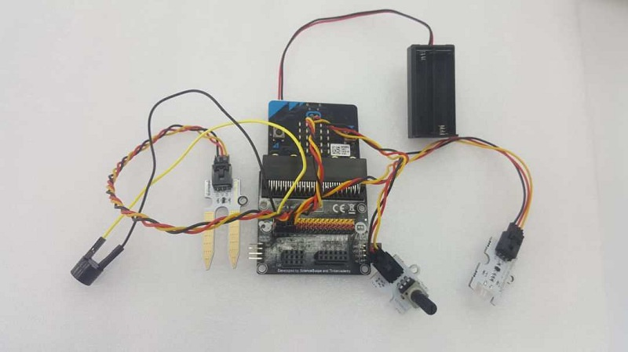
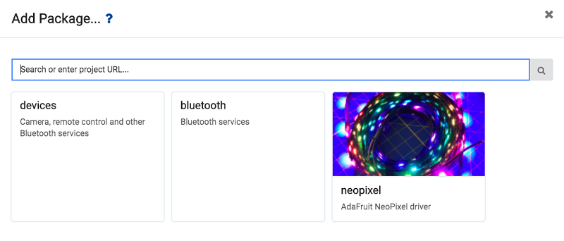
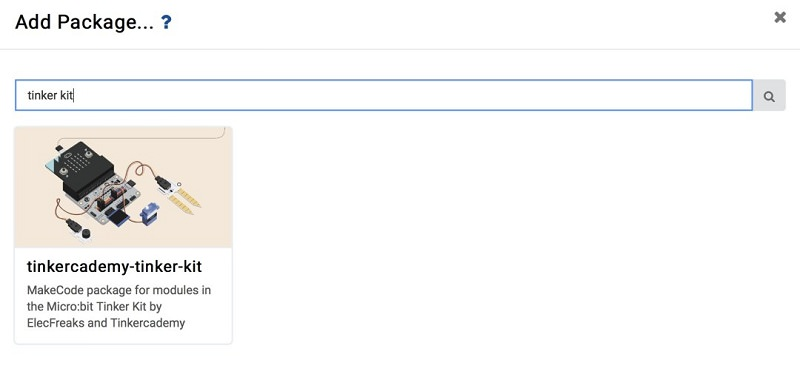
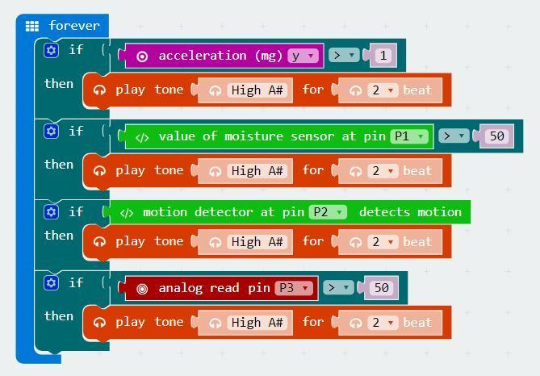
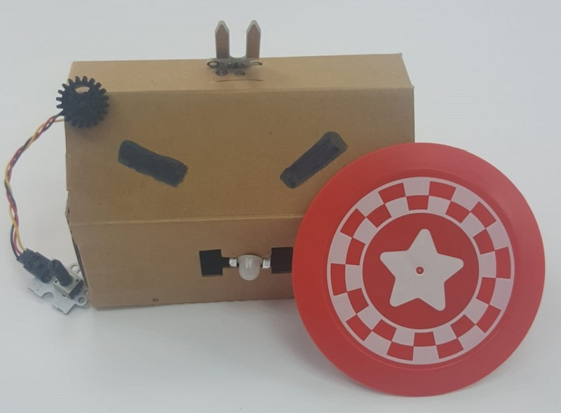

# case 32 reclusebot 

## Reclusebot
---
- Make a reclusive robot that squeals when toggled, touched, or when it detects motion
Use the micro:bit to make a robot that squeals when it detects motion, is touched on any of its sensors or when lifted up. Written by Shaun Toh, from the Singapore University of Technology & Design, on his summer internship.

## Goals
---

 1. Assemble a shy reclusive robot
 2. Input code to make a shy robot

           
## Required Materials
---
- 1 x Micro:bit
- Batteries
- Any Box (Large enough to fit Micro:bit)
- PIR Sensor
- Potentiometer 
- Passive Buzzer
- 2 x Female-Female Jumper Wires

## Hardware Step 1 – Connect the Micro:bit parts
---

1. Attach the buzzer into pin 0 as shown. The + sign on your buzzer connects with the yellow port on the breaker board.
2. Attach the soil moisture sensor to pin 1.
3. Connect the PIR sensor to pin 2.
4. Connect the Potentiometer into pin 3.

### Step 2: Add the Tinker Kit Package

1. We will need to add a package to the code editor to enable to use the kit components. Click on the advanced in the micro bit text editor and you will see a section that says Add Package.
2. This will open up a dialog box. Search for Tinker Kit. Click on the search icon or press enter, then select tinkercademy-tinker-kit.
3. This will add two libraries: Tinkercademy, for general-purpose sensors found in our kit, and OLED, for the OLED module (ours has a height of 64 and width of 128). We're not using the OLED module in this tutorial, but you can!

### Step 3 – Start Coding!

Put on the Micro:bit code- Coding your reclusive robot.
Your program consists of a few “if” statements. We want the robot to only react to four conditions.

1. The first condition is the robot being picked up.
2. The second condition is someone touching the soil moisture sensors.
3. The third condition is if the robot detects movement in front of it.
4. And the last condition is someone toggling the potentiometer.

## You’re Done!
---

You have finished building all components needed to make a reclusive robot that makes a sound whenever someone surprises it! Place it into any box you large enough to contain the components while leaving some of them sticking out, and you have your very own recluse bot! Feel free to dress it up, but take care or it’ll start squealing in surprise!

