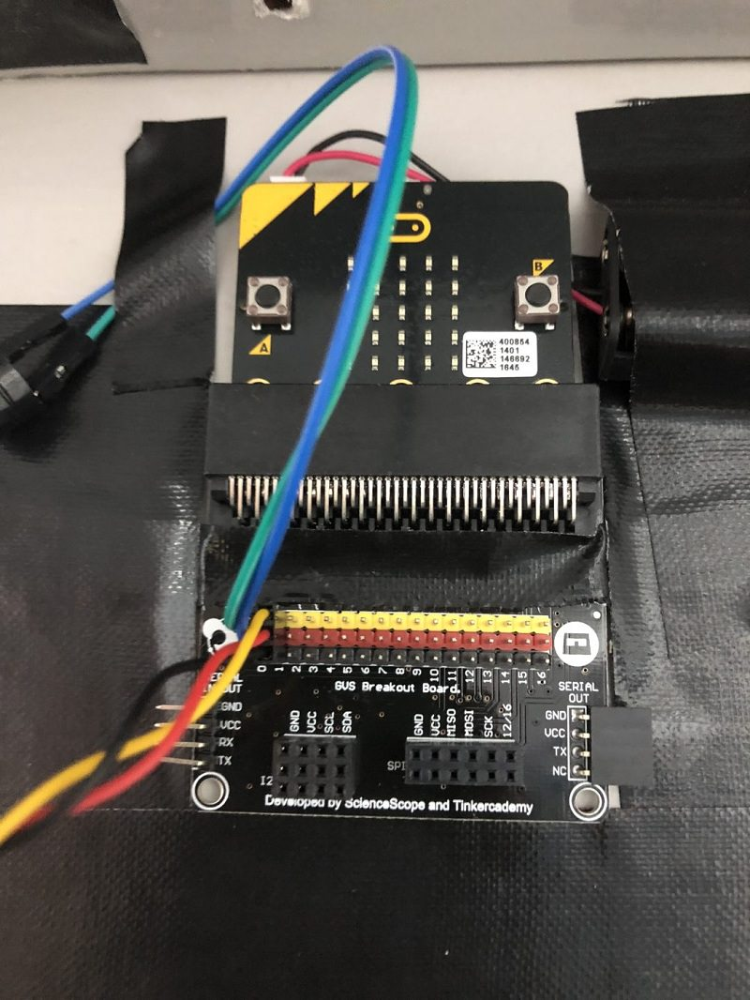
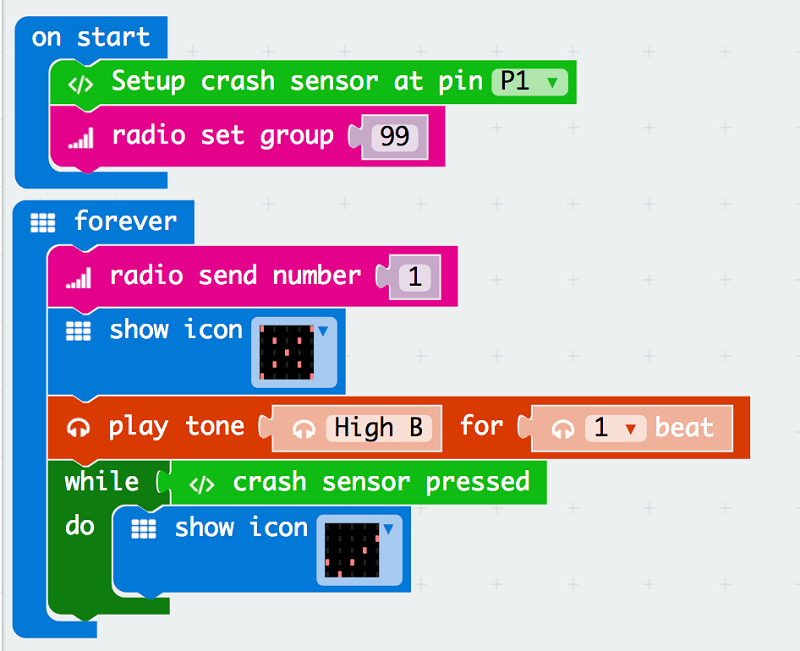
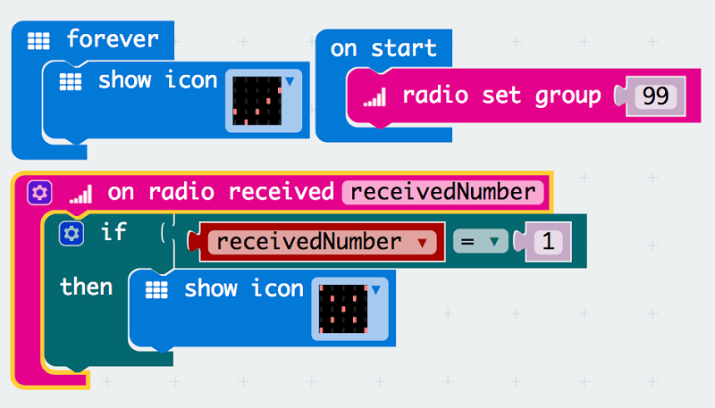

# case 33 access denied 

## Access Denied! A Door Entry Tutorial
---
- Enhancing door security with micro:bit. This tutorial was written by Sean Lew, from the Singapore University of Technology and Design, during his summer internship with us in 2018.

## Products Link

[Tinker Kit](https://www.elecfreaks.com/micro-bit-tinker-kit.html)

## Goals
---

 1. Build your own wireless door security!
 2. Setting up alerts for any intruders or unlocked doors!

           
## Required Materials
---
- 2 x micro:bit
- 1 x Breakout Board
- 1 x Crash Sensor
- 1 x Buzzer

## Step 1 – Setting Up!
---

1. Slot one of the micro:bit into the breakout board.
2. Connect the Buzzer to Pin 0 of the breakout board and the crash sensor to Pin 1.
3. Before moving on to Step 2, make sure you download the “tinkercademy-tinker-kit” package.

### Step 2 – Code away!

1. Drag these set of codes into your makecode platform and download it into the micro:bit connected to your breakout board.
2. Give the crash sensor a few press to see if your code is working correctly!

### Step 3 – Almost there!

1. Download this set of codes for the second micro:bit (receiver).
2. Now give test out the crash sensor to see if the receiving micro:bit is working correctly!
3. Now that you have set up your very first wireless door security, you can try it with more than just 1 door!
4. Feel free to also add add other form of alerts on the receiving micro:bit to enhance your own security.

