# case 35 build your own microbit security Door 

## Build your own Micro:bit Security Door!
---
- Protect your house or valuables with a micro:bit, a servo motor, and a 4x4 keypad!
  Created by Mohd Shafiq from NUS.

## Goals
---
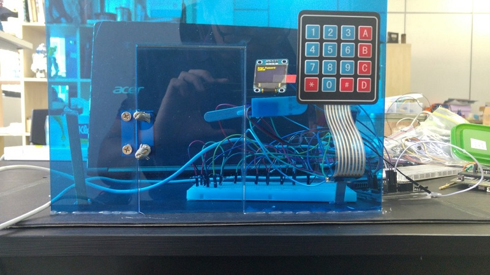

 1. Connect the wiring to interface the keypad with the microbit
 2. Set your own unique password for the lock
 3. Add a lock down counter in case an intruder tries to guess your password

           
## Required Materials
---
- 1 x Breakout board
- 1 x micro:bit
- 1 x Mini Servo
- 1 x Breadboard
- 4 x 4 Membrane keypad
- 3 x 5kohm resistor
- 3 x 1kohm resistor
- 1 x 10kohm resistor
- Jumper Wires
- 1 x OLED
- 18.5cm x28cm Acrylic
- 1 x small Metal Hinge

## Hardware Step 1 – Interfacing the Keypad
---

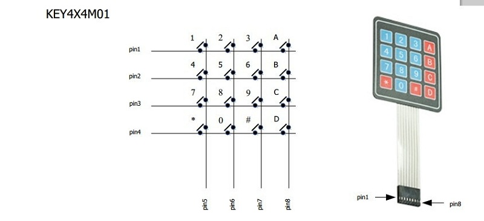

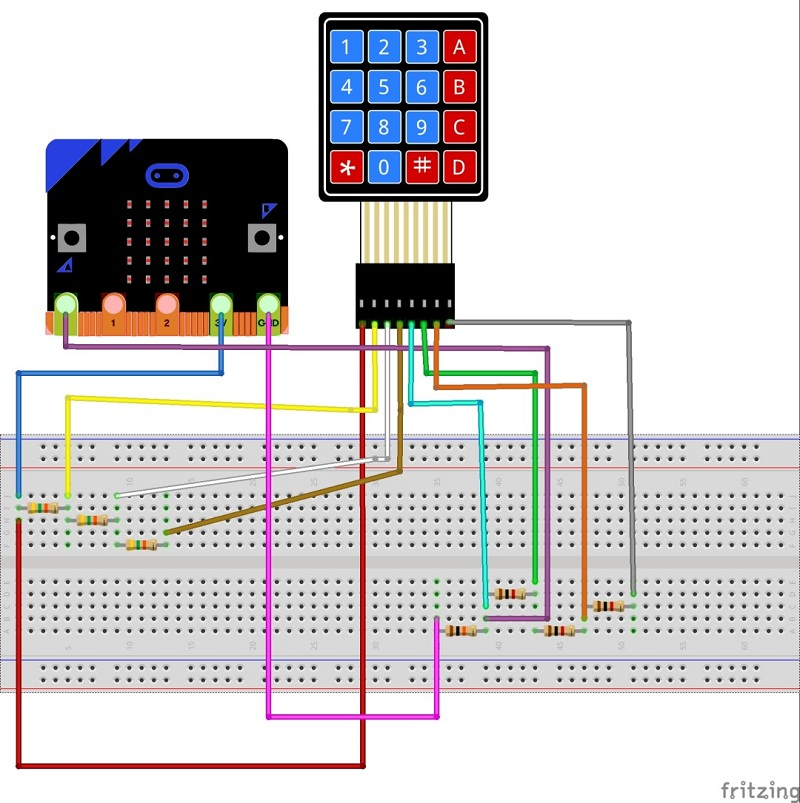

1. The membrane keypad has 16 different switches which have 16 different characters
2. The switches are grouped together by row and column for example (R1,C1) corresponds to 1 and so on. When the     controller detects a 1 at Pin 1 and Pin 5  it would mean key 1 is pressed.This is called digital output
3. Therefore we can use the Microbit’s digital pins to interface with they keypad.However if we do that it will be quite messy.
4. Let's create a driver circuit for the 4x4 keypad!
5. Follow the diagram as shown:

### Step 2 – Wire it Up

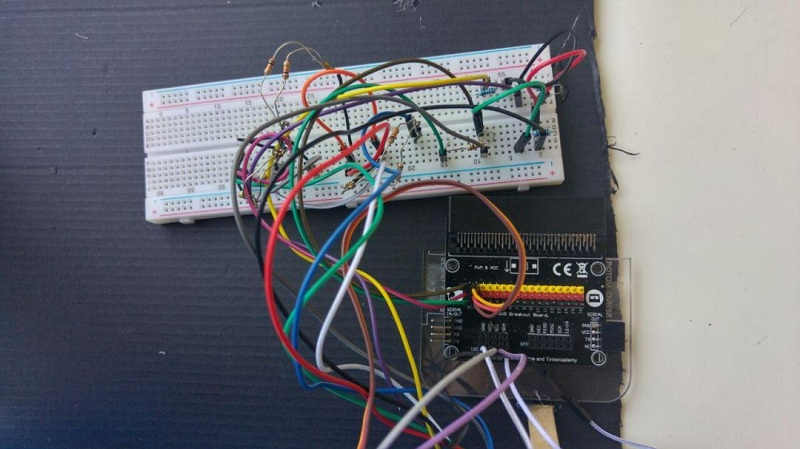

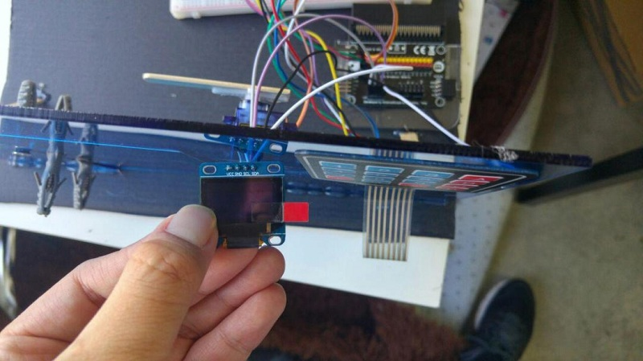

1. Attach the 3 pins of the Servo motor to P2 of the breakout board
2. Attach Ground (Black pin) of the Micro:bit to the  10kOh resistor
3. Attach the 3V (Red pin) to the 5k Ohm resistor
4. Attach A0 (Yellow pin) to the point between the 10k Ohm Resistor and 1k Ohm resistor

  Connect GND,VCC,SCl and SDA of the breakout board to GND,VCC,SCl and SDA of the OLED respectively.

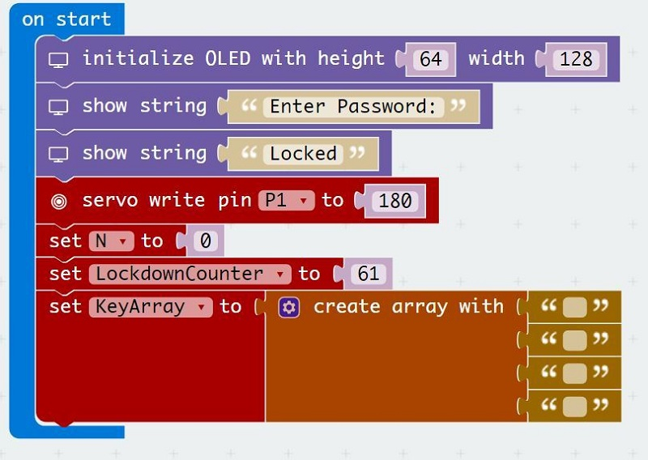

### Step 3 – Coding the micro:bit

On start we have to:

- Initialize the servo to position 180 (Locked Position)
- Initialize the OLED display
- Initialize a 4x1 array
- Initialize the lockdown counter

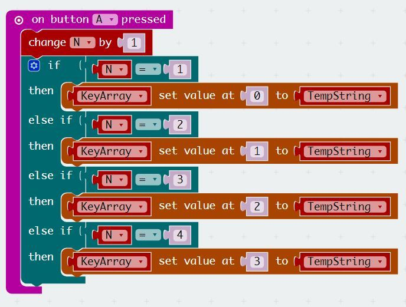

-  Button A acts as the enter character button
-  Every time you press a key on the 4x4 keypad you have to press Button A in order to key in a 4 digit Number

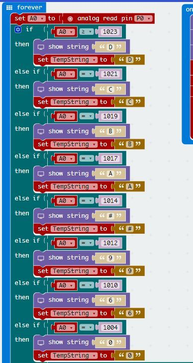

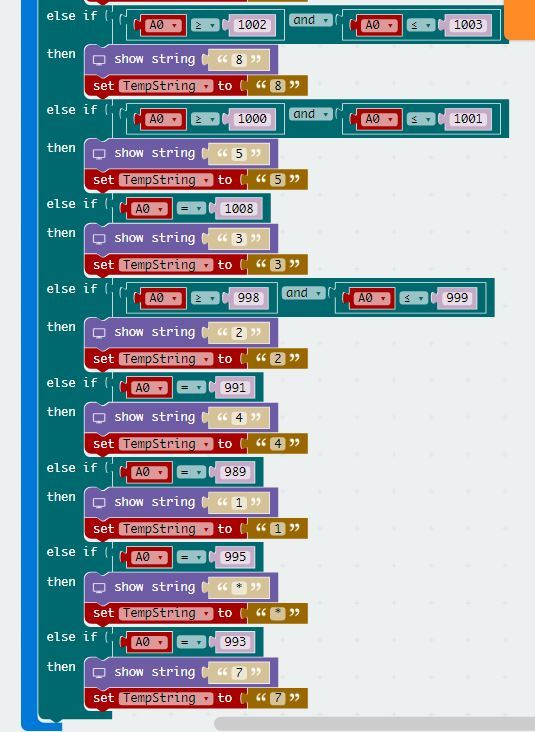

Now we need to set up the micro:bit to detect the key presses!

- Each key press  corresponds to a unique analog value from 0 to1023 by using the driver circuit
- The analog value can be read using the analog read function
- The value in the character is stored in the “TempString” variable
- The code block is quite long,so the download link is provided below

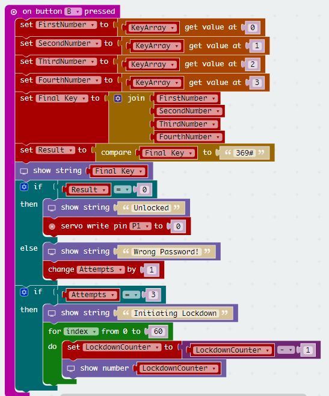

- Button B acts as the final “Enter” button
- Pressing button B causes the program to check if the entered string is equal to “369#” using the compare block
- If the answer is 0 it means that the strings are equal.If it is 1,then the strings are not equal
- The number of wrong Attempts will increase by 1 every time an intruder enters the wrong password
- Once 3 wrong attempts are detected,the program will enter a loop for 60 seconds

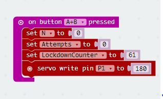

- To reset the number of attempts and the characters entered,press Button A+B
- The reset button also resets the servo to the “Locked Position”

### Step 4 – Build it!

1. Using a laser cutter cut out 18.5cm by 28cm of 3mm acrylic
2. If you do not have acrylic you can use cardboard instead
3. Cut out slots for the OLED as well as the keypad wires
4. Drill/poke holes forthe door hinge and use screws to fasten the door
5. Attach an ice-cream stick to the servo.This will serve as the lock
6. Glue the servo with the ice-cream stick on the other side of the door

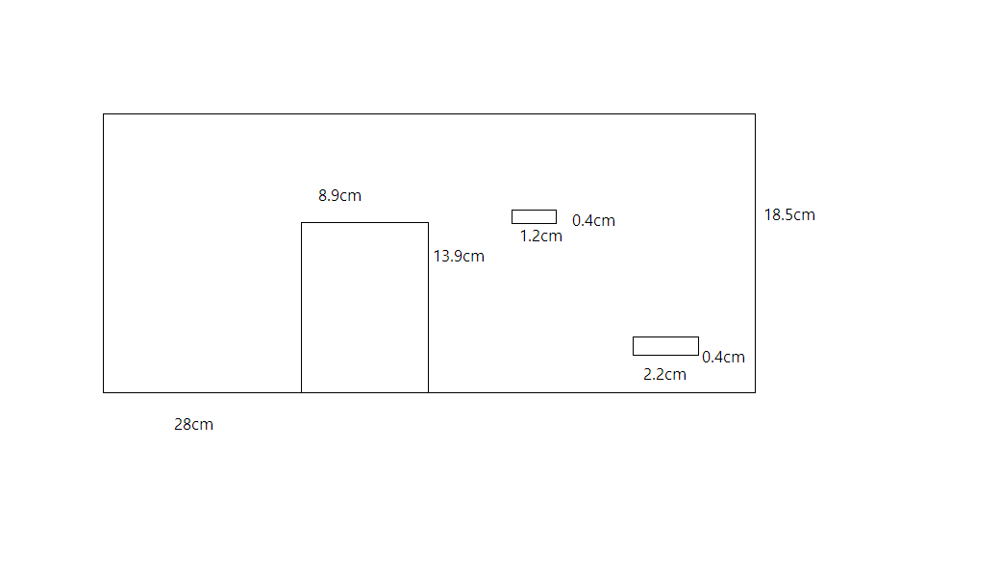

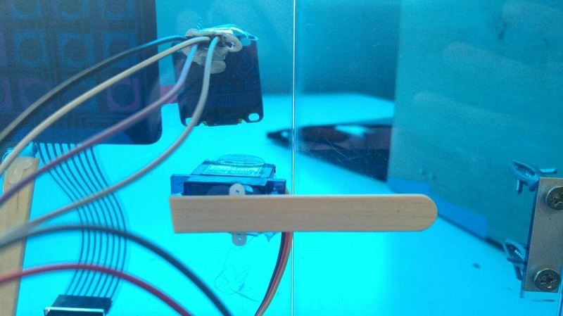

### Step 5 – Demo Time!

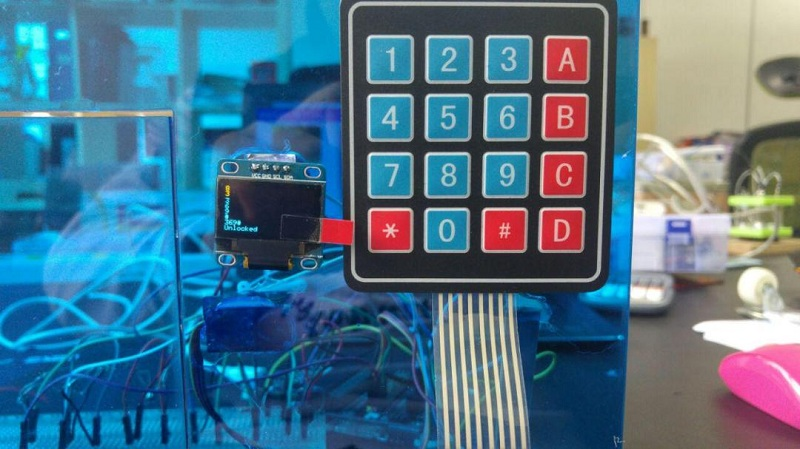

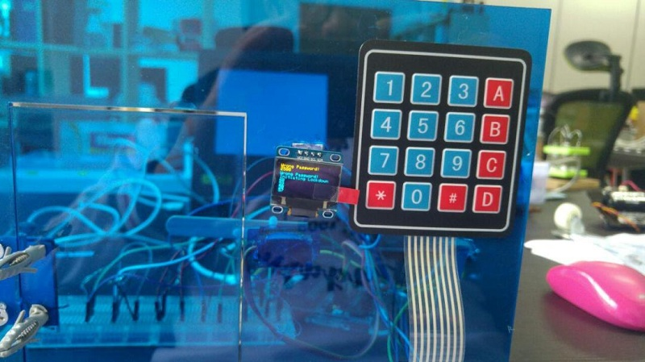

1. Each time you press a key,the corresponding character will appear on the OLED
2. To unlock the door key in 3,Button A,6,Button A,9,Button A,#
3. Then press button B
4. To reset press A+B
5. If you try to enter the wrong password three times the OLED will display a lockdown timer.You will only be able to enter the password after 60 seconds have passed.
6. Congratulations! You have made your own micro:bit door.

