# Case 01: The Motorcycle

## Purpose
---
To make a motorcycle with the Wonder Building kit. 
 

## Link 
---
[micro:bit Wonder Building Kit](https://shop.elecfreaks.com/products/elecfreaks-micro-bit-32-in-1-wonder-building-kit-without-micro-bit-board?_pos=5&_sid=2094afd2f&_ss=r)

## Materials Required
---
 

Video link:
[https://youtu.be/rLnMMkofipM](https://youtu.be/rLnMMkofipM)

## Bricks build-up
---

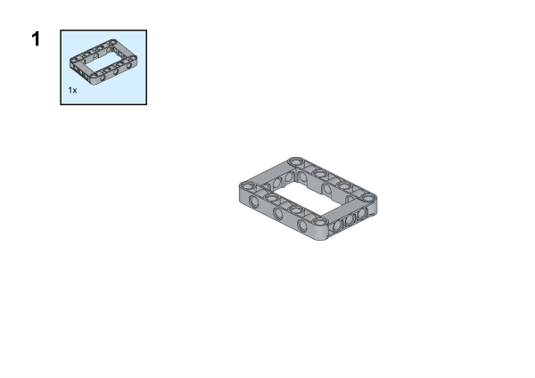

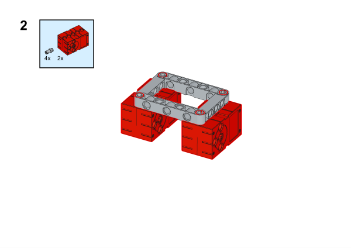

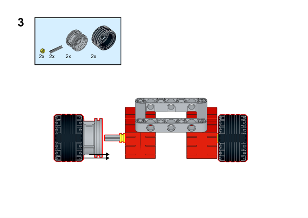

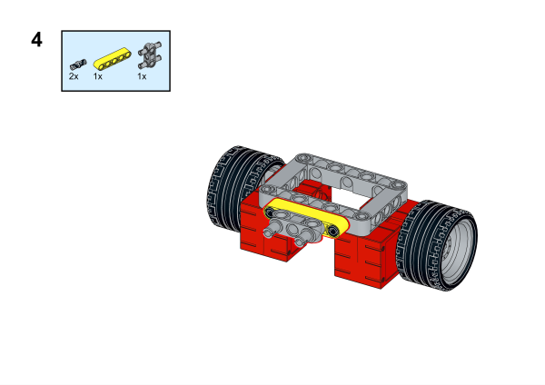

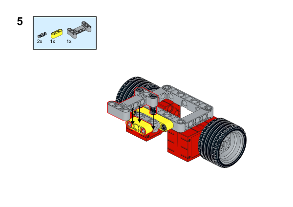

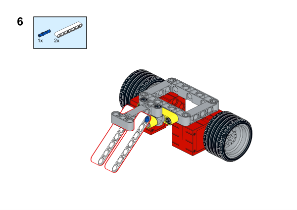

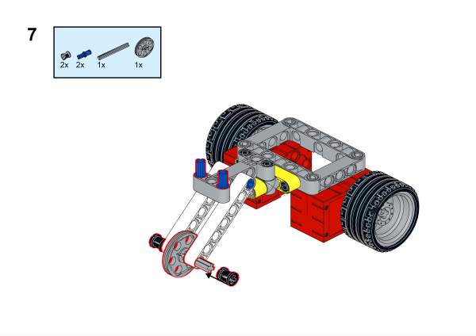

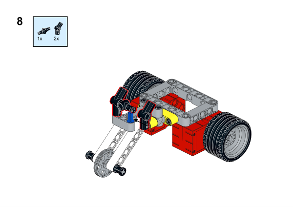

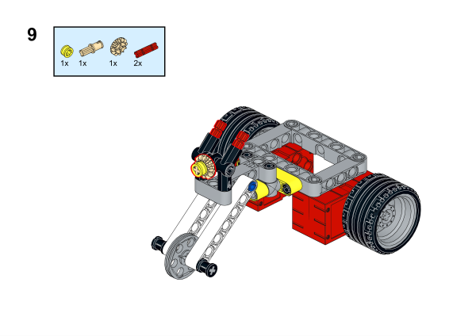

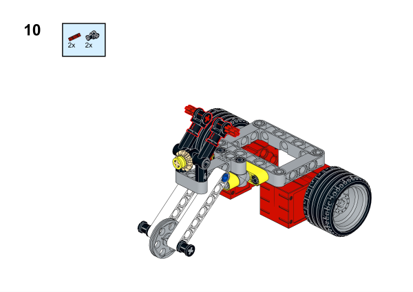

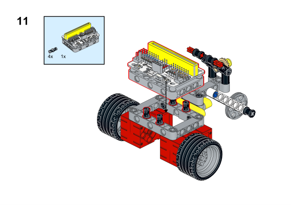

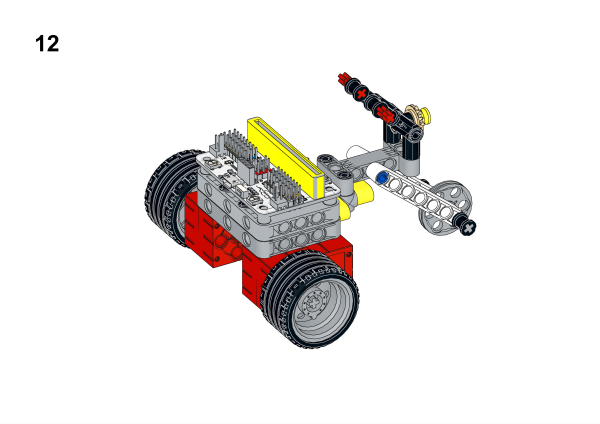

## Hardware Connection

Connect two [motors](https://www.elecfreaks.com/geekservo-motor-2kg-compatible-with-lego.html) to M1 and M2 ports on [Wukong breakout board](https://www.elecfreaks.com/wukong-board-with-lego-holder-for-micro-bit.html). 

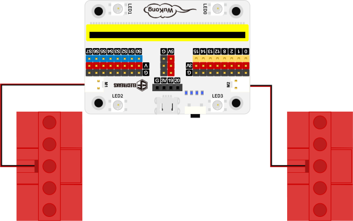

## Software Platform
---
[MakeCode](https://makecode.microbit.org/)

## Coding
---
### Add extensions
Click "Advanced" in the MakeCode to see more choices.
 

Search with Wukong in the dialogue box to download it. 

 

### Program
 

Link:[https://makecode.microbit.org/_K6mFyJ16ofCj](https://makecode.microbit.org/_K6mFyJ16ofCj)

### Result
While button A being pressed, the motorcycle moves forward and it reverses if button B is pressed, while pressing button A+B, it stops driving. 

