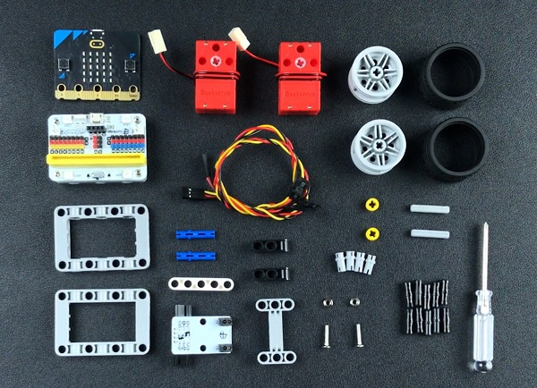
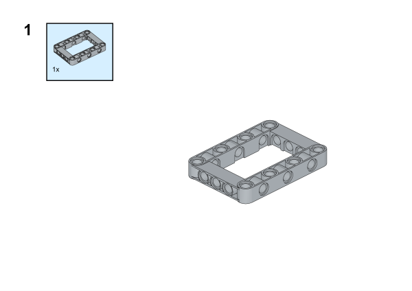
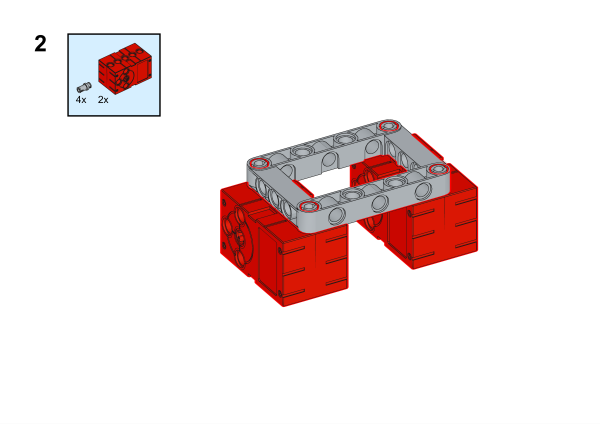
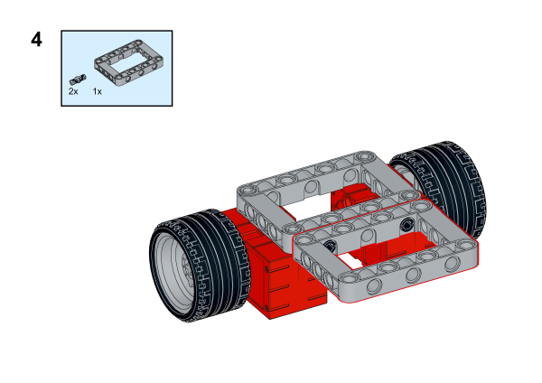
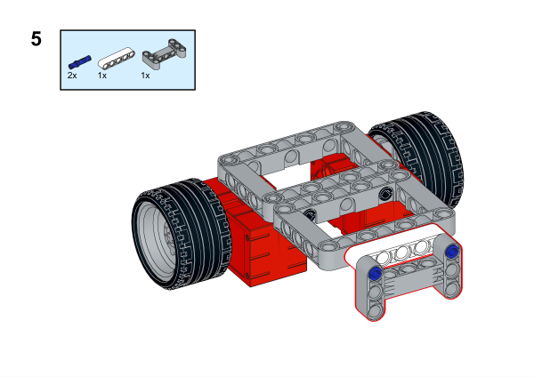
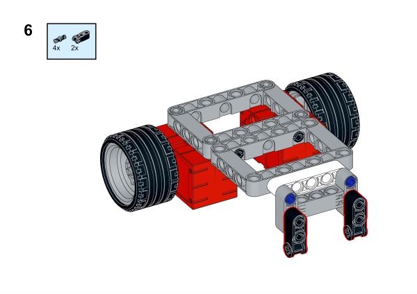
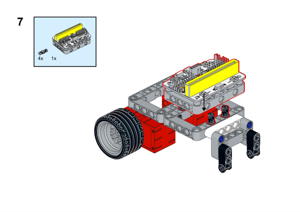
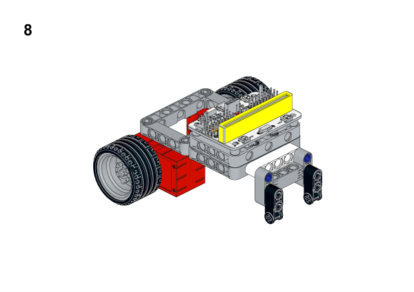
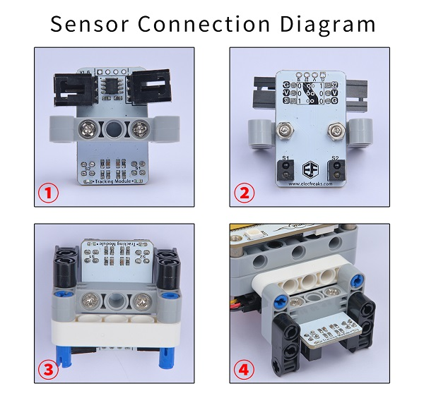
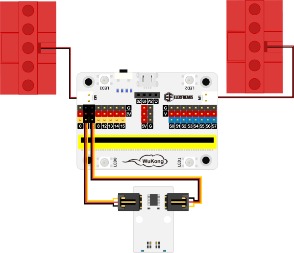

# Case 02: Line-following Cars

## Purpose
---
To make a line following car. 
 

## Link: 
---
[micro:bit Wonder Building Kit](https://www.elecfreaks.com/micro-bit-wonder-building-kit-without-micro-bit-board.html)

## Materials Required
---

Video link:
[https://youtu.be/J2QKDKnTklw](https://youtu.be/J2QKDKnTklw)

## Bricks build-up
---

## Installation Mthods of Hardwares

Install the dual-line tracking sensor with the bricks. 

## Hardware Connection

Connect two [motors](https://www.elecfreaks.com/geekservo-motor-2kg-compatible-with-lego.html) to M1 and M2, the [dual line-following](https://www.elecfreaks.com/octopus-2-channel-tracking-module.html) sensor to P1 and P2 ports on [Wukong breakout board](https://www.elecfreaks.com/wukong-board-with-lego-holder-for-micro-bit.html). 

## Software Platform
---
[MakeCode](https://makecode.microbit.org/)

## Coding
---
### Add extensions
Click "Advanced" in the MakeCode to see more choices.
 

Search with Wukong in the dialogue box to download it. 

 

### Program
 

Link:[https://makecode.microbit.org/_azffEJVztHiW](https://makecode.microbit.org/_azffEJVztHiW)

### Result

The car moves along with the maps at a uniform speed, it will keep its speed and directions if it deviates from the black line until it goes back. 
