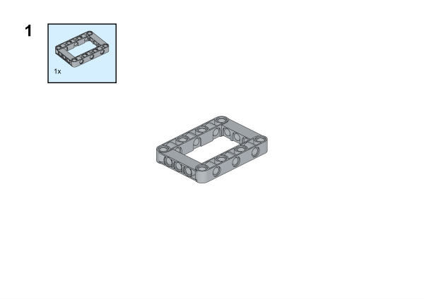
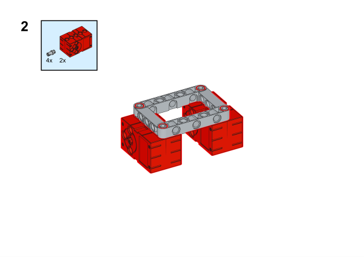
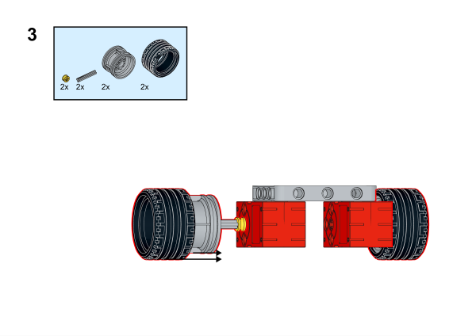
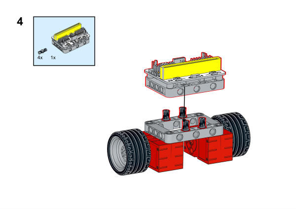
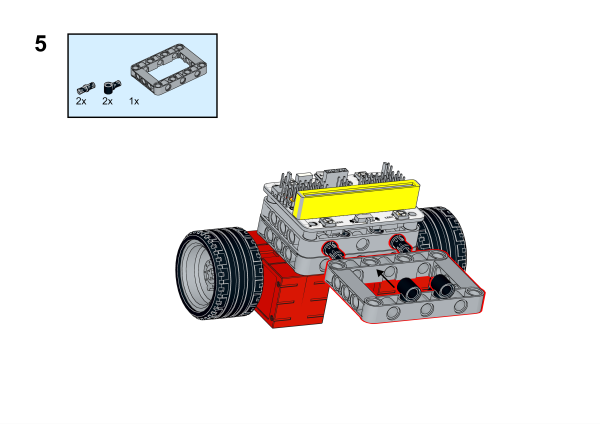
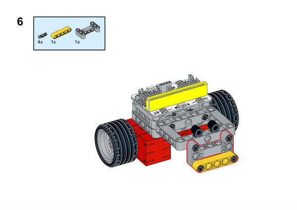
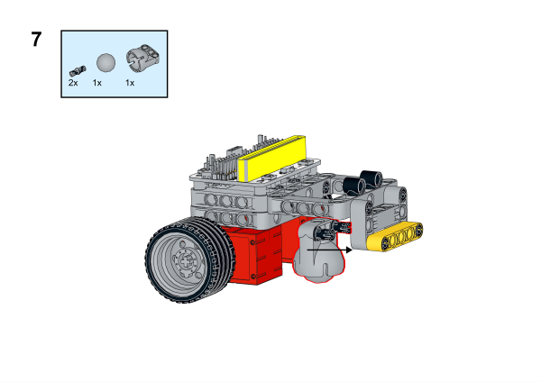
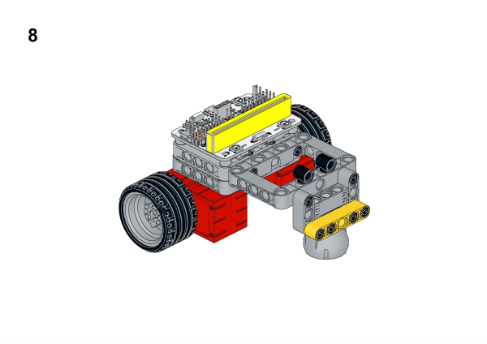
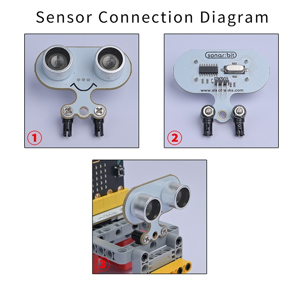
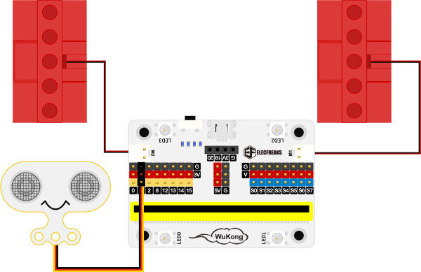

# Case 04: Obstacles-avoidance Cars

## Purpose
---
To make an obstacle-avoidance car.
 

## Link
---
[micro:bit Wonder Building Kit](https://www.elecfreaks.com/micro-bit-wonder-building-kit-without-micro-bit-board.html)

## Materials Required
---

Video link:
[https://youtu.be/jYkSCfRpj1Y](https://youtu.be/jYkSCfRpj1Y)

## Bricks build-up
---

## Installation Mthods of Hardwares

Install the sonar:bit with the bricks. 

## Hardware Connection

Connect two [motors](https://www.elecfreaks.com/geekservo-motor-2kg-compatible-with-lego.html) to M1, M2, and the [sonar:bit](https://www.elecfreaks.com/sonar-bit-for-micro-bit-ultrasonic-sensor-distance-measuring-3v-5v.html) to P1 port on [Wukong breakout board](https://www.elecfreaks.com/wukong-board-with-lego-holder-for-micro-bit.html).

## Software Platform
---
[MakeCode](https://makecode.microbit.org/)

## Coding
---
### Add extensions
Click "Advanced" in the MakeCode to see more choices.
 

Search with Wukong in the dialogue box to download it. 

 Search with https://github.com/elecfreaks/pxt-sonarbit in the dialogue box to add the sonar:bit extension. 

### Program
 

Link:[https://makecode.microbit.org/_7K4bgpCKv2WJ](https://makecode.microbit.org/_7K4bgpCKv2WJ)

## Result

While on start, the car moves forward at the full speed and it turns right if it detects any obstacles within the scope of 20cm, and then it keeps moving forward. 
