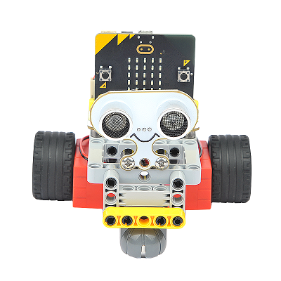
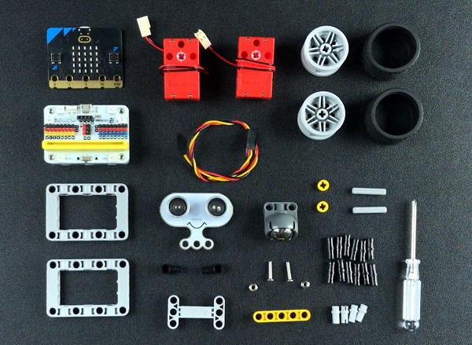
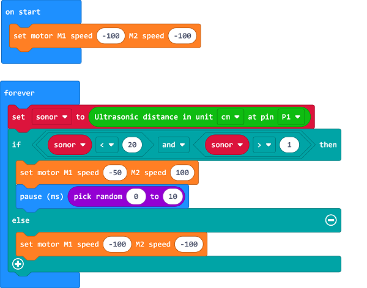

# Case 04: Obstacles-avoidance Cars
## Purpose
To make an obstacle-avoidance car.
 

## Link: 

[micro:bit Wonder Building Kit](https://www.elecfreaks.com/micro-bit-wonder-building-kit-without-micro-bit-board.html)

## Materials Required

Video link:
[https://youtu.be/jYkSCfRpj1Y](https://youtu.be/jYkSCfRpj1Y)

## Software Platform

[MakeCode](https://makecode.microbit.org/)

## Coding
### Add extensions
Click "Advanced" in the MakeCode to see more choices.
 

Search with Wukong in the dialogue box to download it. 

 Search with https://github.com/elecfreaks/pxt-sonarbit in the dialogue box to add the sonar:bit extension. 

### Program
 

Link:[https://makecode.microbit.org/_Ph47qr3aM6cP](https://makecode.microbit.org/_Ph47qr3aM6cP)

