# Case 07: The Basketball Counter 

## Purpose
---
To make a basketball counter.
 
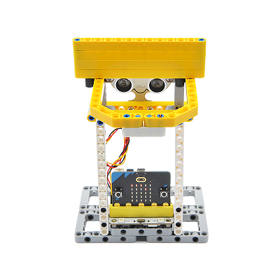

## Link: 
---
[micro:bit Wonder Building Kit](https://www.elecfreaks.com/micro-bit-wonder-building-kit-without-micro-bit-board.html)

## Materials Required
---
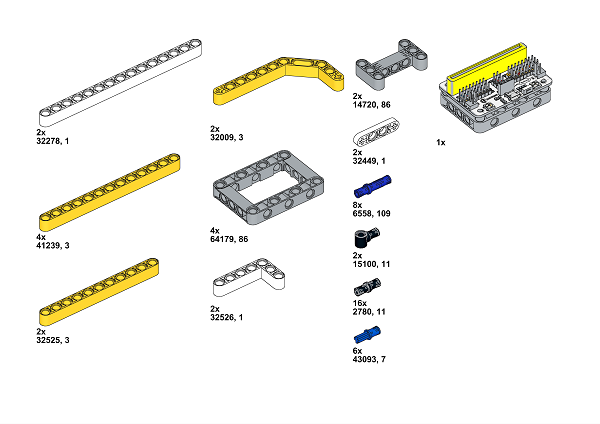

Video link:
[https://youtu.be/0P88GP4RQaw](https://youtu.be/0P88GP4RQaw)

## Bricks build-up
---

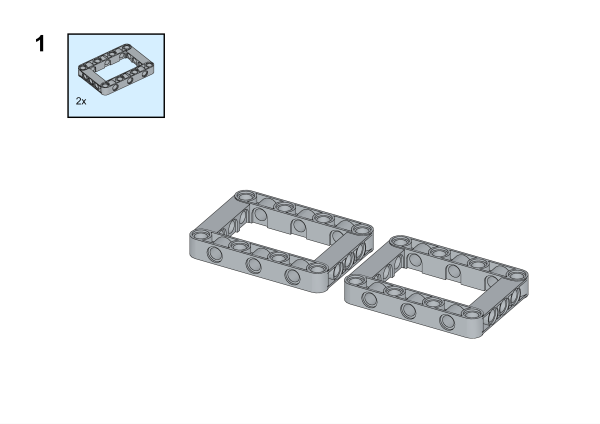

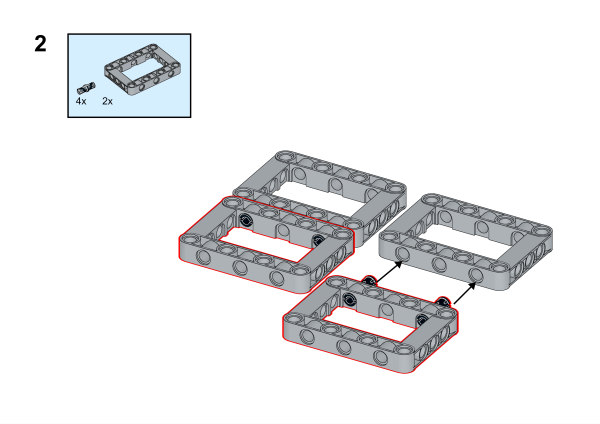

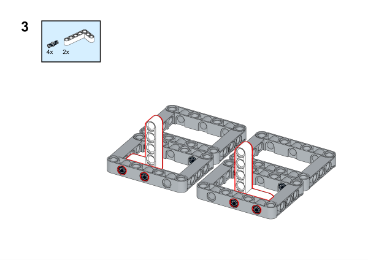

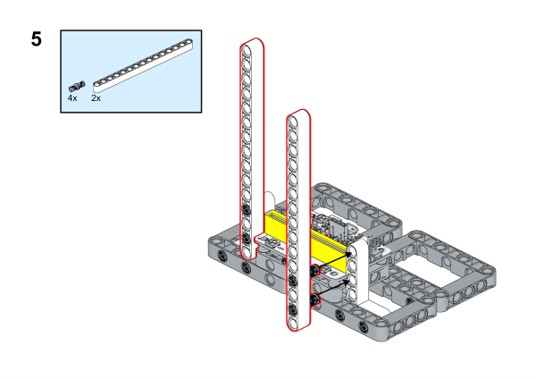

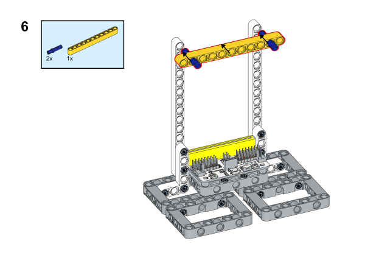

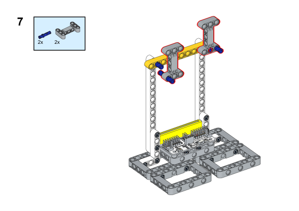

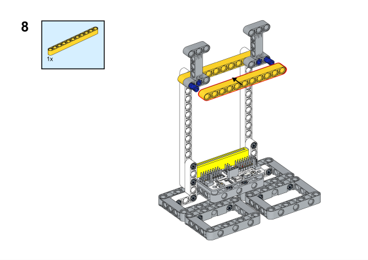

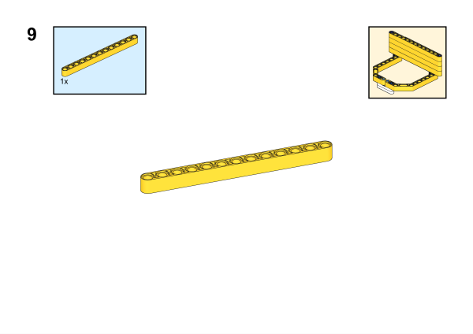

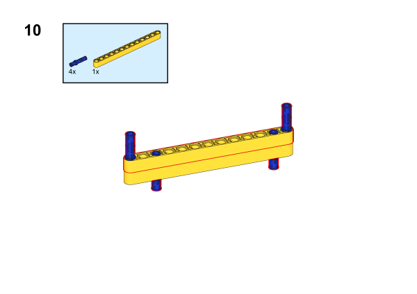

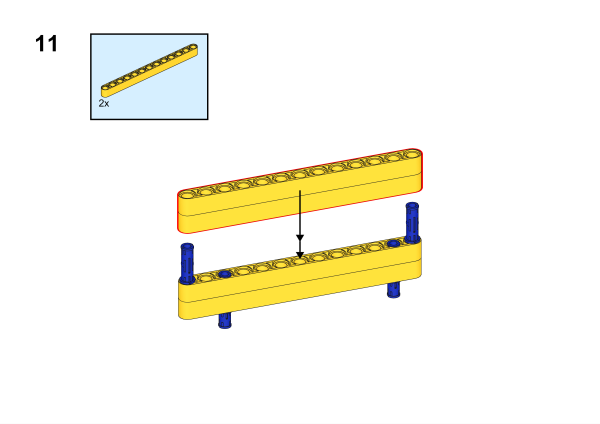

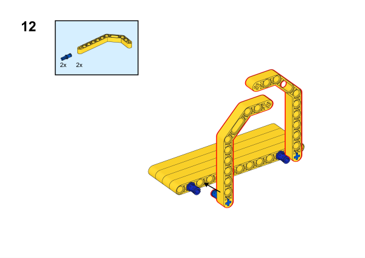

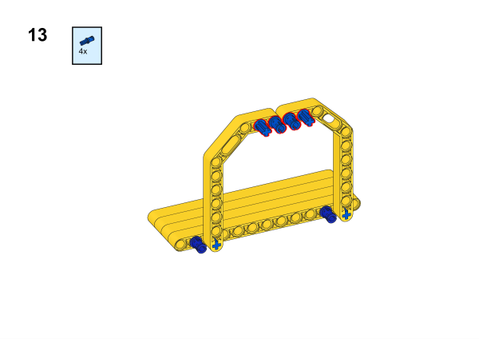

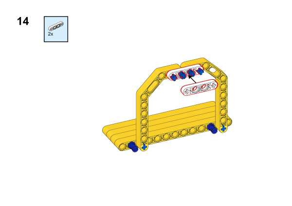

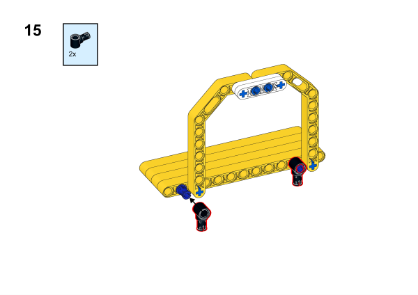

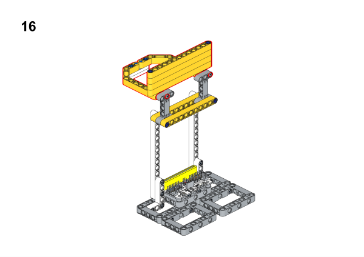

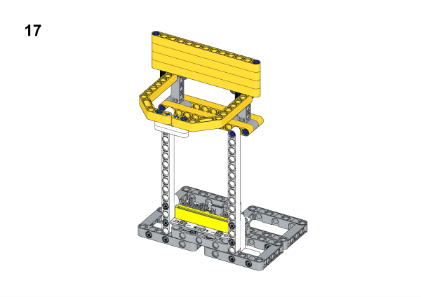

## Hardware Connection

Connect a [sonar:bit](https://www.elecfreaks.com/sonar-bit-for-micro-bit-ultrasonic-sensor-distance-measuring-3v-5v.html) to P1 port on [Wukong breakout board](https://www.elecfreaks.com/wukong-board-with-lego-holder-for-micro-bit.html). 

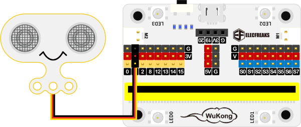

## Software Platform
---
[MakeCode](https://makecode.microbit.org/)

## Coding
---
### Add extensions
Click "Advanced" in the MakeCode to see more choices.
 

Search with Wukong in the dialogue box to download it. 

 Search with https://github.com/elecfreaks/pxt-sonarbit in the dialogue box to add the sonar:bit extension. 

### Program
 
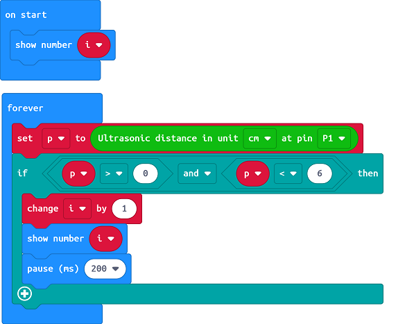

Link:[https://makecode.microbit.org/_hueHXycJJgv1](https://makecode.microbit.org/_hueHXycJJgv1)

### Result

When the ultrasonic sensor detects the ball goes through the basket, it will be counted, and the value will be displayed on the micro:bit. (The principle of ultrasonic counting in this case requires to be tested according to the actual construction of the basket, it is the detection of ultrasonic sensors to the ball basket with the fixed distance value, and by judging this fixed distance value, the score plus one, so as to achieve the purpose of counting. (Ultrasonic sensor counting may have deviations, inaccurate, belonging to the normal situation of not detecting the small ball.
