# Case 08: The Robot Arm 

## Purpose
---
To make a robot arm.
 
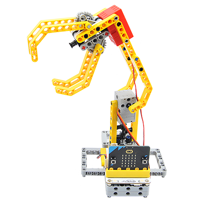

## Link: 
---
[micro:bit Wonder Building Kit](https://www.elecfreaks.com/micro-bit-wonder-building-kit-without-micro-bit-board.html)

[Joystick bit](https://www.elecfreaks.com/joystick-bit-2-for-micro-bit.html)

## Materials Required
---
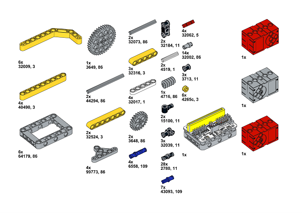

Video link:
[https://youtu.be/IRJKXAfJf9M](https://youtu.be/IRJKXAfJf9M)

## Bricks build-up
---

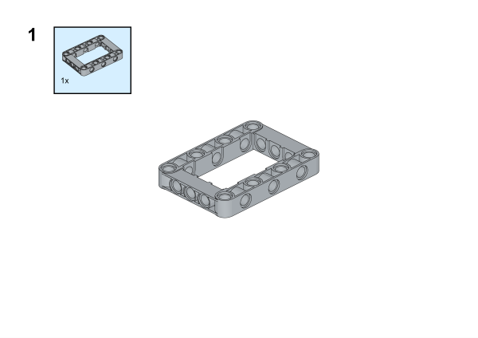

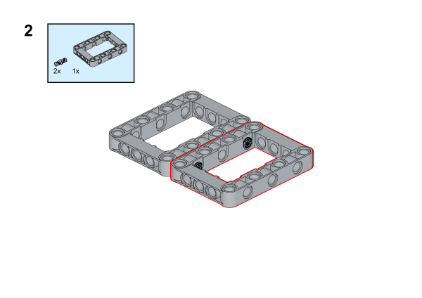

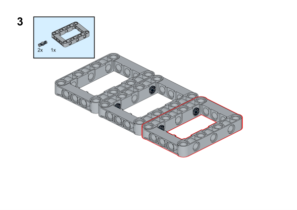

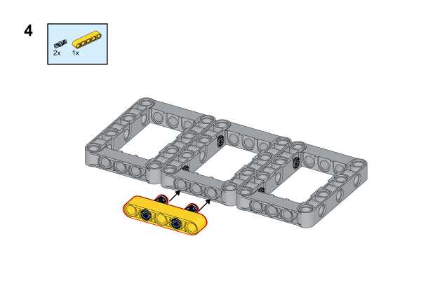

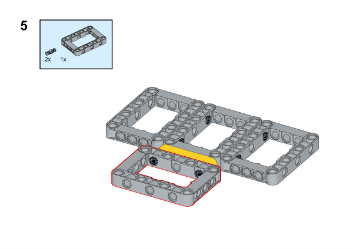

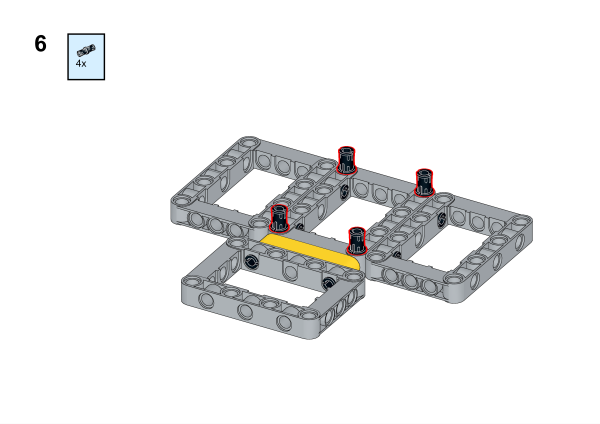

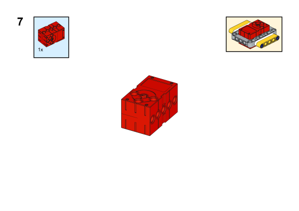

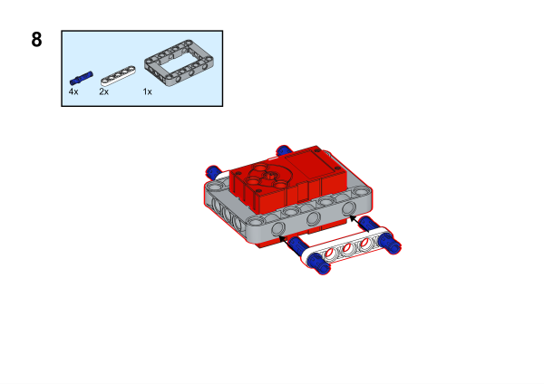

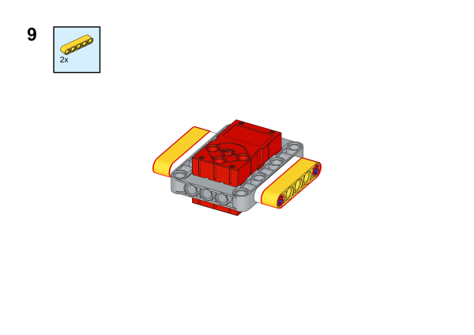

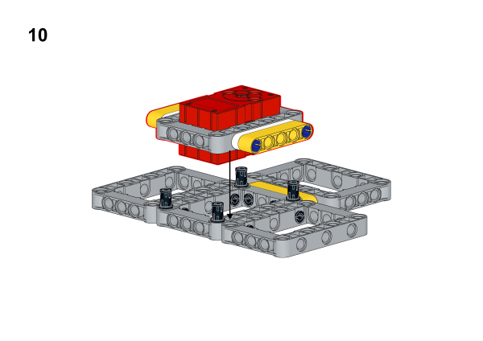

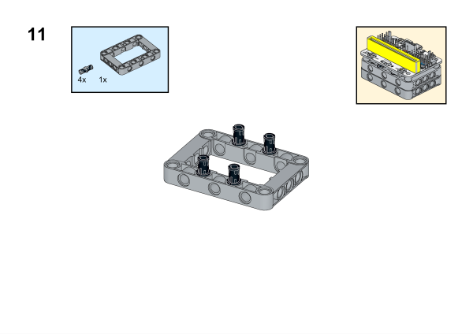

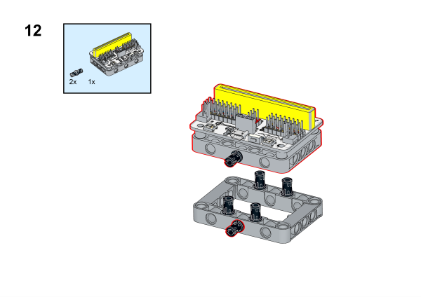

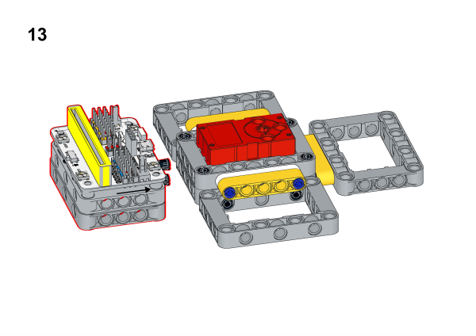

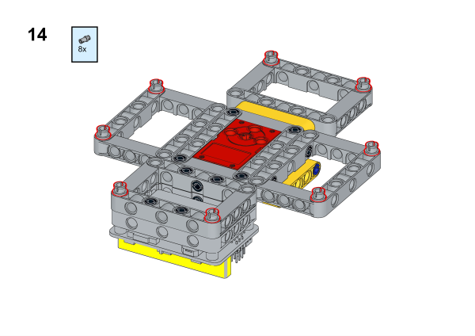

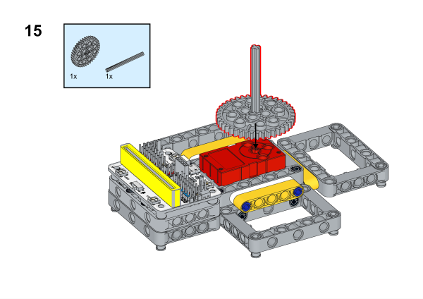

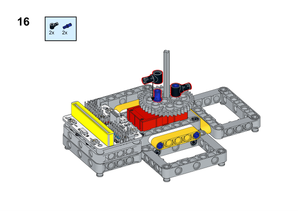

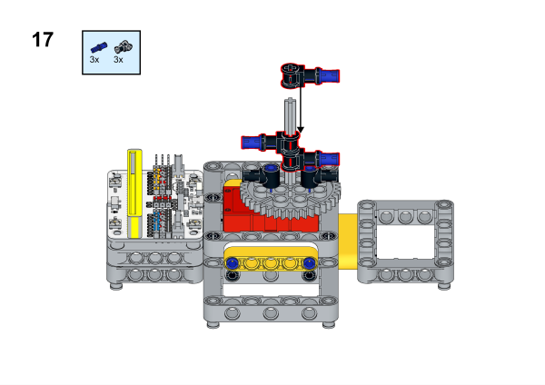

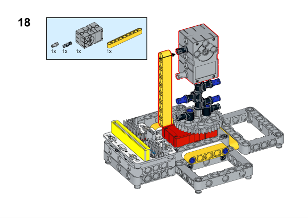

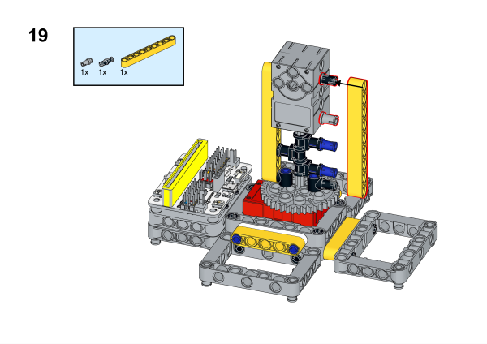

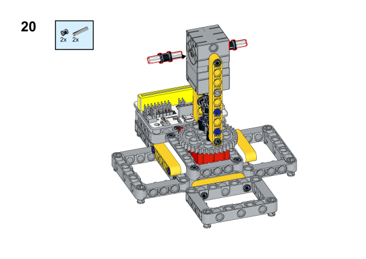

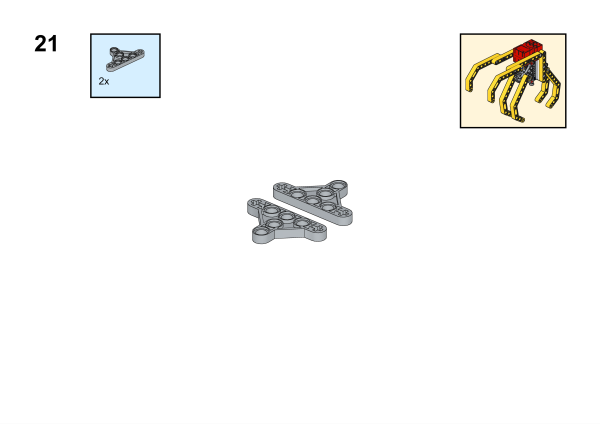

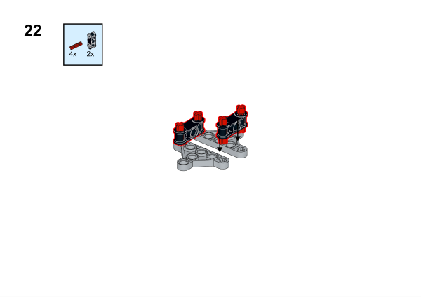

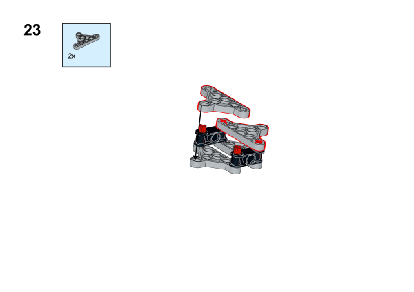

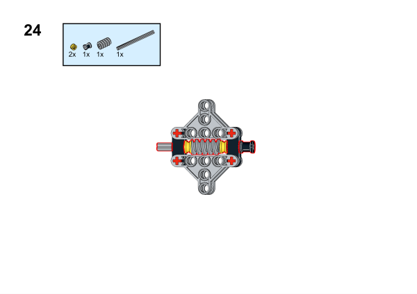

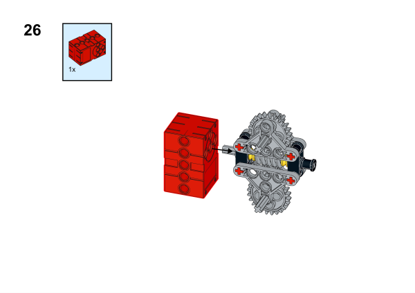

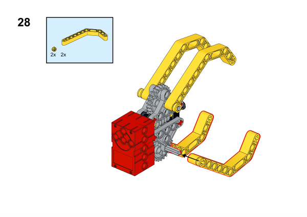

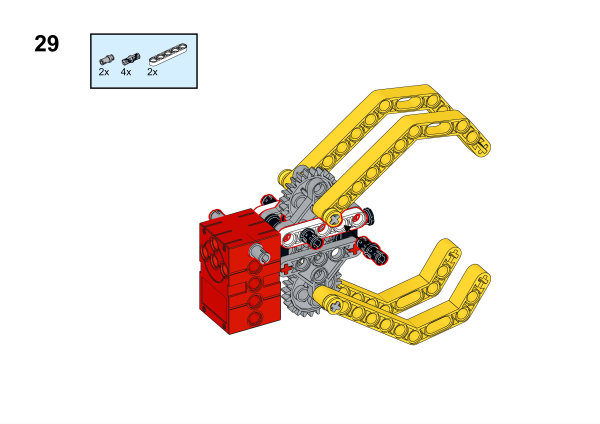

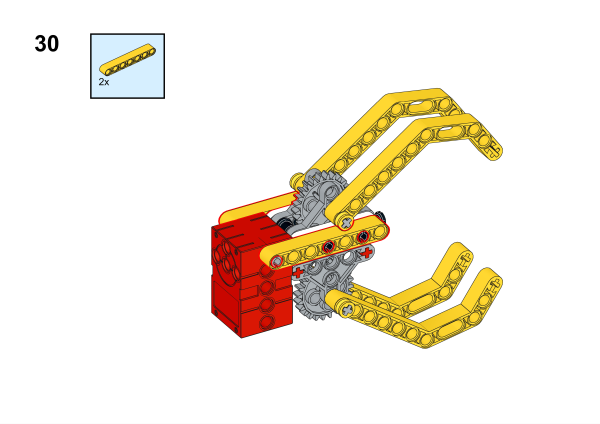

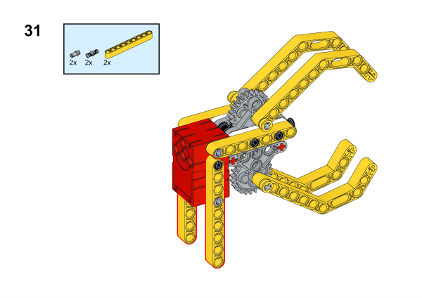

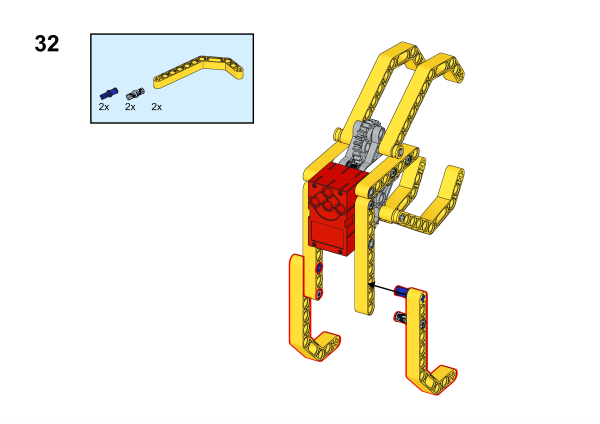

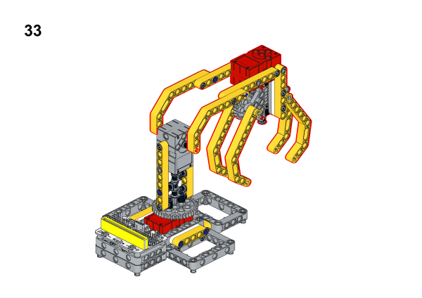

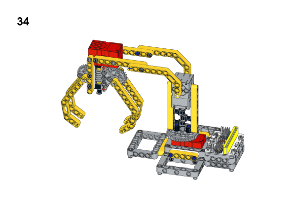

## Hardware Connection

将两个[电机](https://www.elecfreaks.com/geekservo-motor-2kg-compatible-with-lego.html)分别连接到[悟空扩展板](https://www.elecfreaks.com/wukong-board-with-lego-holder-for-micro-bit.html)的M1，M2接口，将[舵机](https://www.elecfreaks.com/geekservo-2kg-360-degrees-compatible-with-lego.html)连接到[悟空扩展板](https://www.elecfreaks.com/wukong-board-with-lego-holder-for-micro-bit.html)的S0端口.

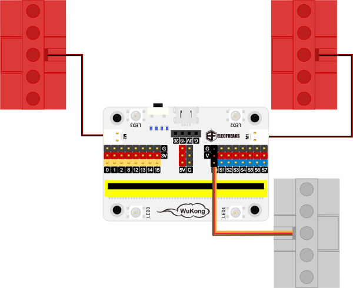

## Software Platform
---
[MakeCode](https://makecode.microbit.org/)

## Coding
---
### Add extensions
Click "Advanced" in the MakeCode to see more choices.
 

Search with Wukong in the dialogue box to download it. 

Search with joystickbit in the dialogue box to download it.

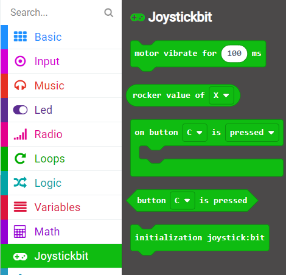

### Program
For Joystick:bit:  

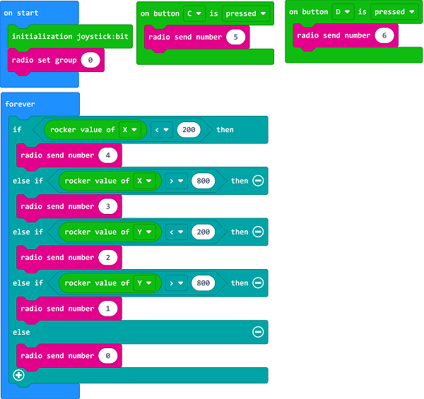

Link:[https://makecode.microbit.org/_3mK9cbULkLCy](https://makecode.microbit.org/_3mK9cbULkLCy)

For the robot arm:

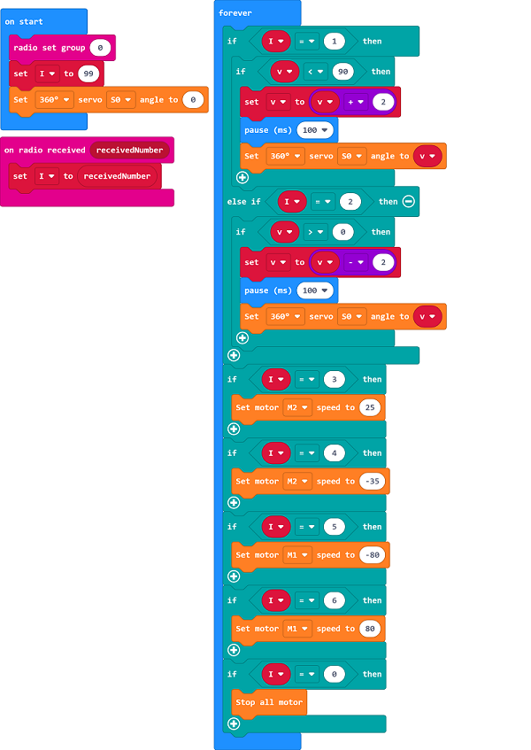

Link:[https://makecode.microbit.org/_92hgiPE9Kdec](https://makecode.microbit.org/_92hgiPE9Kdec)

