# Case 09: Automatic Doors

## Purpose
---
To make an automatic door. 
 

## Link: 
---
[micro:bit Wonder Building Kit](https://www.elecfreaks.com/micro-bit-wonder-building-kit-without-micro-bit-board.html)

## Materials Required
---

Video link:
[https://youtu.be/JimDF7ArSjQ](https://youtu.be/JimDF7ArSjQ)

## Bricks build-up
---

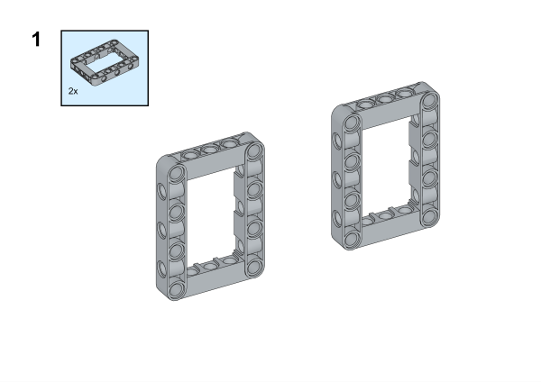

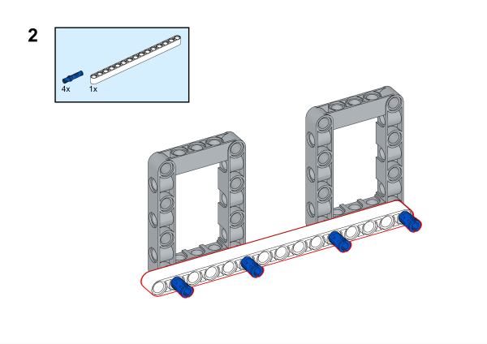

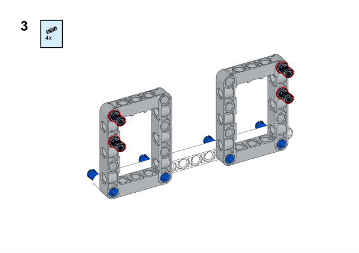

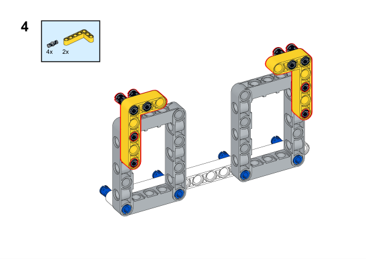

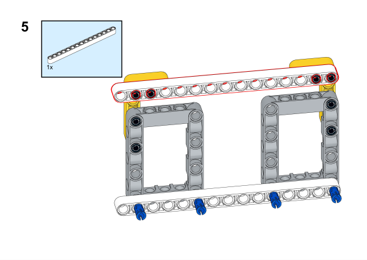

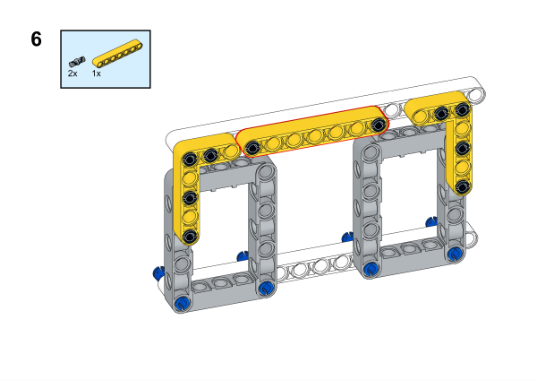

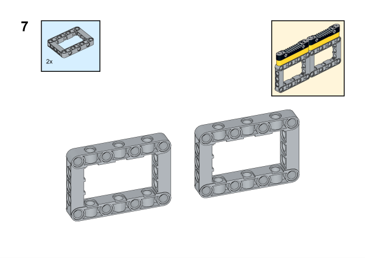

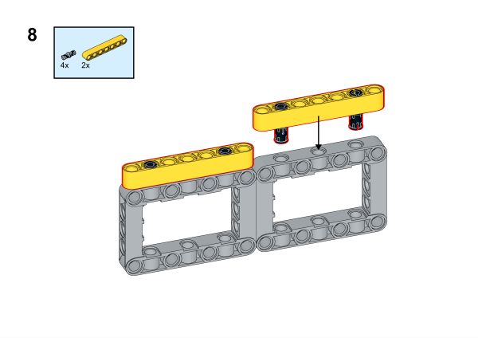

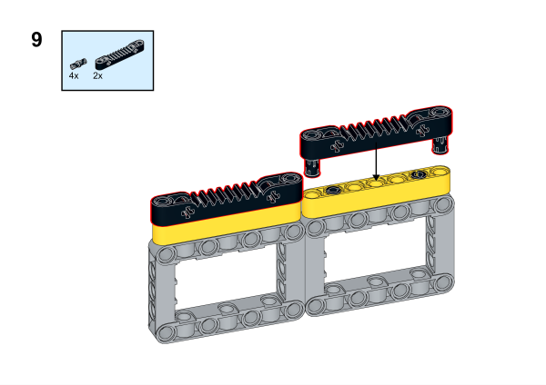

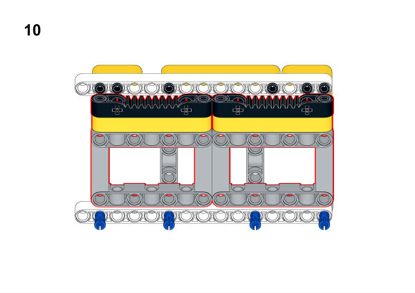

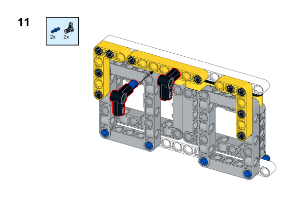

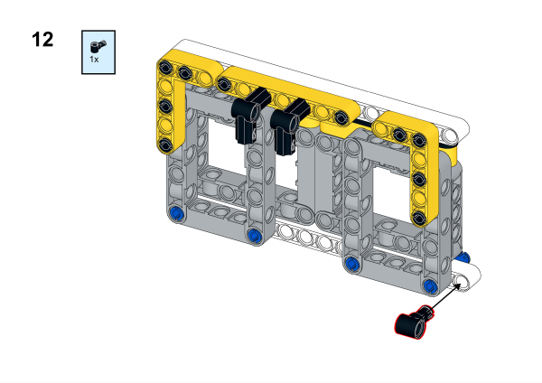

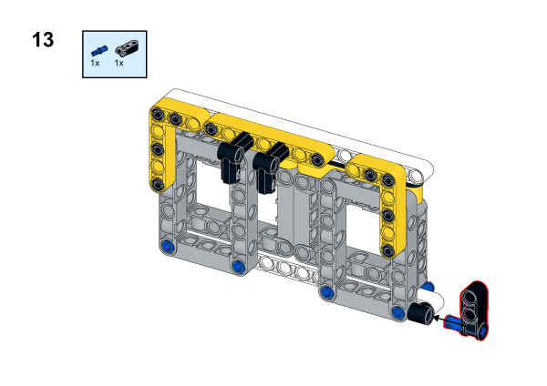

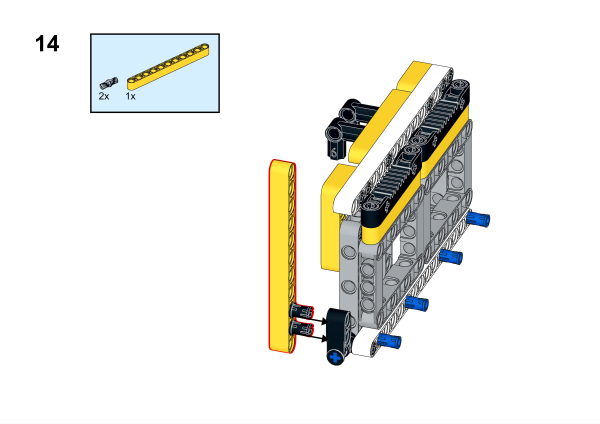

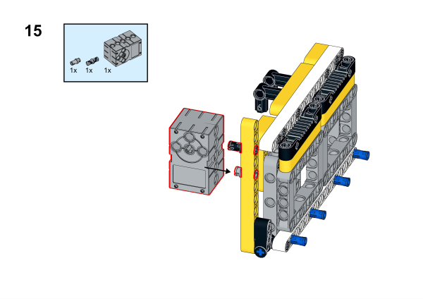

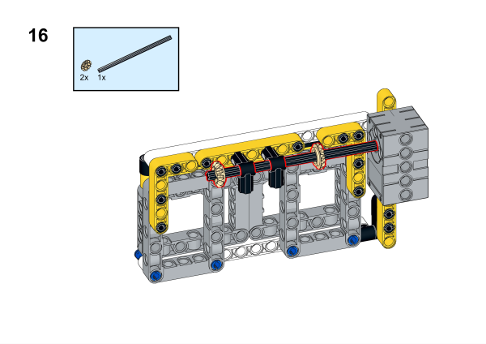

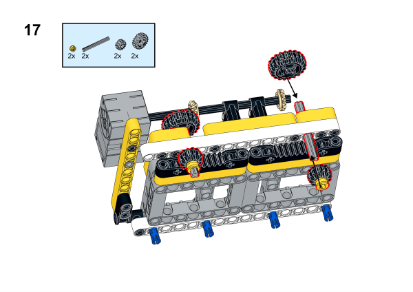

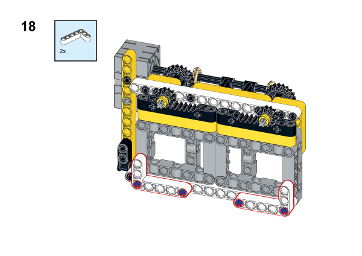

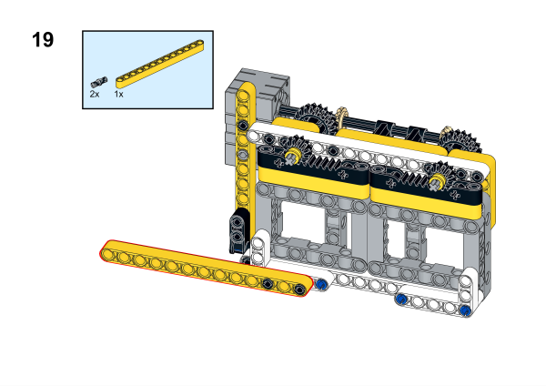

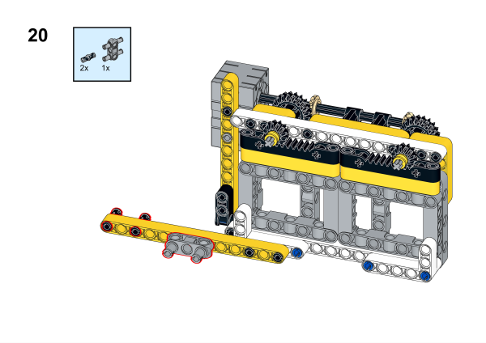

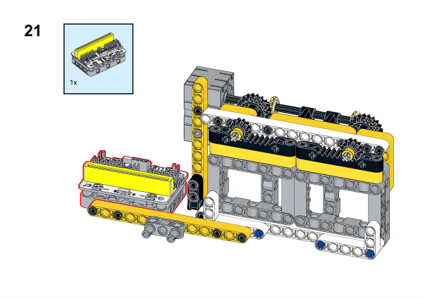

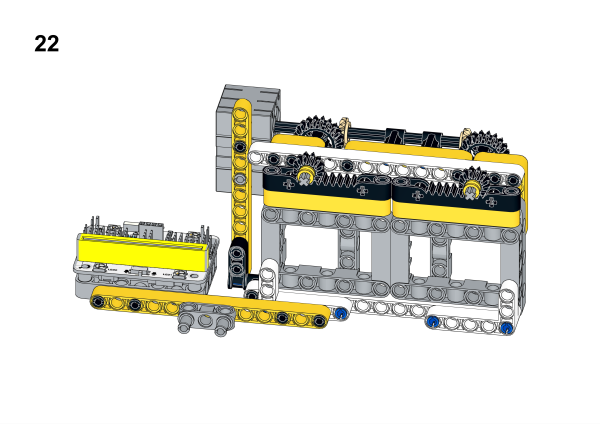

## Software Platform
---
[MakeCode](https://makecode.microbit.org/)

## Coding
---
### Add extensions
Click "Advanced" in the MakeCode to see more choices.
 

Search with Wukong in the dialogue box to download it. 

 Search with https://github.com/elecfreaks/pxt-sonarbit in the dialogue box to add the sonar:bit extension. 

### Program
 
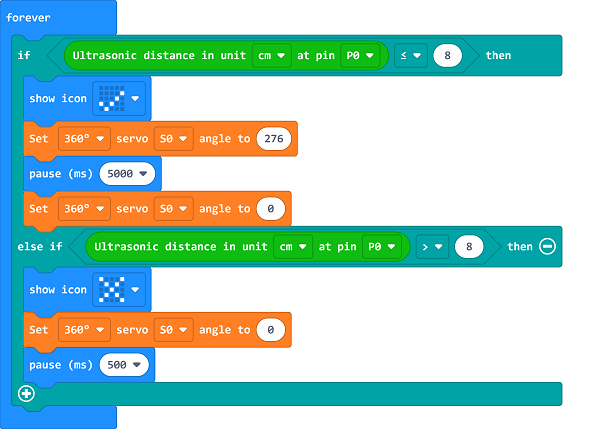

Link:[https://makecode.microbit.org/_eUPf4XEudVKY](https://makecode.microbit.org/_eUPf4XEudVKY)

