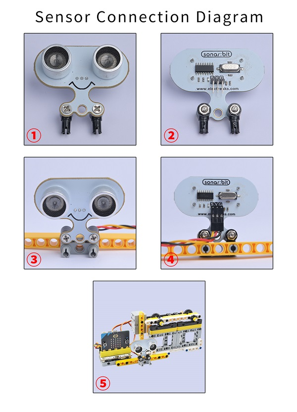
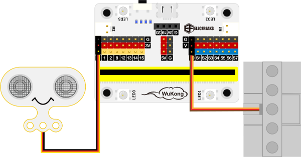

# Case 09: Automatic Doors

## Purpose
---
To make an automatic door. 
 

## Link: 
---
[micro:bit Wonder Building Kit](https://www.elecfreaks.com/micro-bit-wonder-building-kit-without-micro-bit-board.html)

## Materials Required
---

Video link:
[https://youtu.be/JimDF7ArSjQ](https://youtu.be/JimDF7ArSjQ)

## Bricks build-up
---

## Installation Mthods of Hardwares

Install the sonar:bit with the bricks. 

## Hardware Connection

Connect a [sonar:bit](https://www.elecfreaks.com/sonar-bit-for-micro-bit-ultrasonic-sensor-distance-measuring-3v-5v.html) to P1 and the [servo](https://www.elecfreaks.com/geekservo-2kg-360-degrees-compatible-with-lego.html) to S0 port on [Wukong breakout board](https://www.elecfreaks.com/wukong-board-with-lego-holder-for-micro-bit.html). 

## Software Platform
---
[MakeCode](https://makecode.microbit.org/)

## Coding
---
### Add extensions
Click "Advanced" in the MakeCode to see more choices.
 

Search with Wukong in the dialogue box to download it. 

 Search with https://github.com/elecfreaks/pxt-sonarbit in the dialogue box to add the sonar:bit extension. 

### Program
 

Link:[https://makecode.microbit.org/_eUPf4XEudVKY](https://makecode.microbit.org/_eUPf4XEudVKY)

### Result

When the ultrasonic sensor detects someone passing by, it will display √ on the micro:bit and control the servo to open the door and close it automatically after 5 seconds, if the ultrasonic sensor does not detect anyone, it will keep displaying × on the micro:bit and the door is closed.
