# Case 10: Boating 

## Purpose
---
To make a boating car. 
 
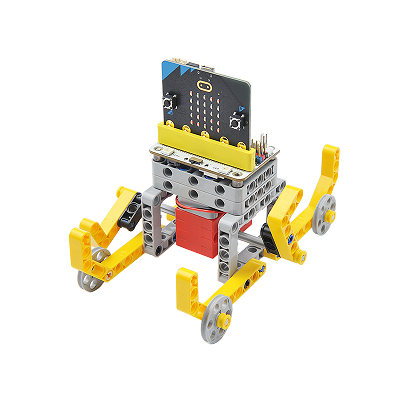

## Link: 
---
[micro:bit Wonder Building Kit](https://www.elecfreaks.com/micro-bit-wonder-building-kit-without-micro-bit-board.html)

## Materials Required
---
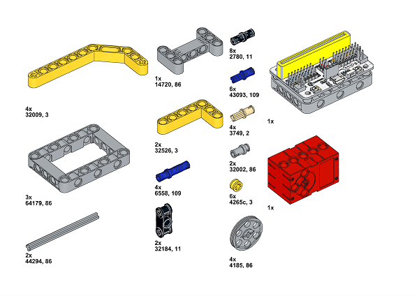

Video link:
[https://youtu.be/mT2DdwNPeks](https://youtu.be/mT2DdwNPeks)

## Bricks build-up
---

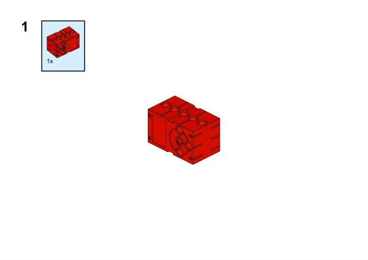

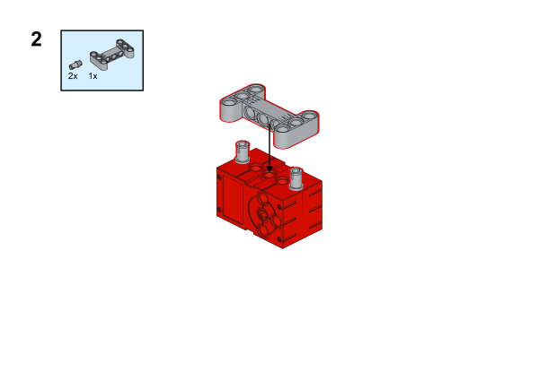

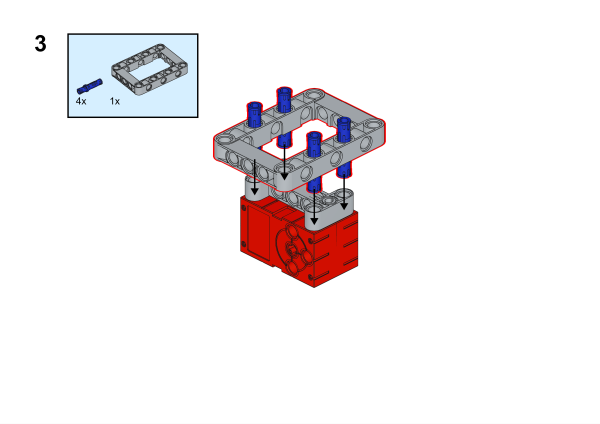

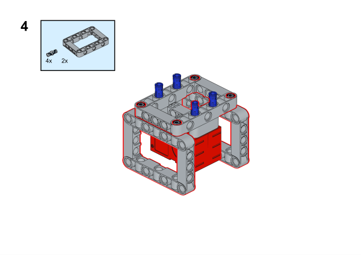

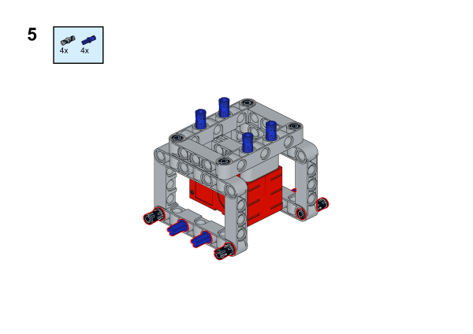

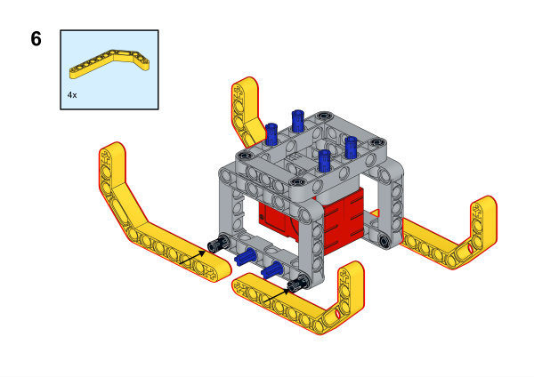

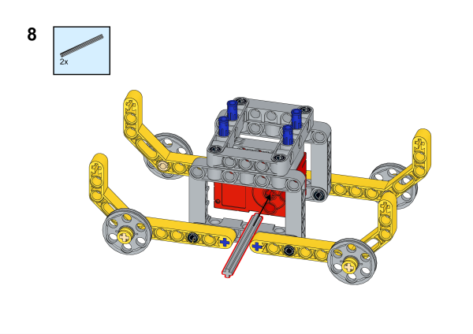

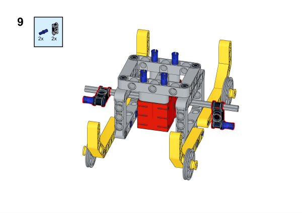

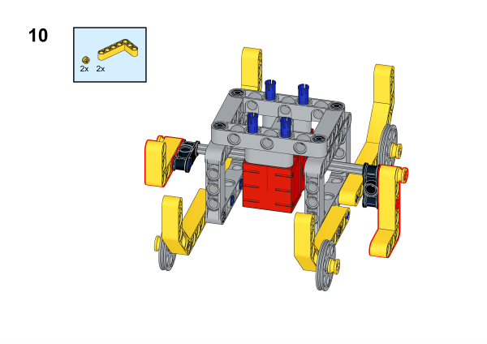

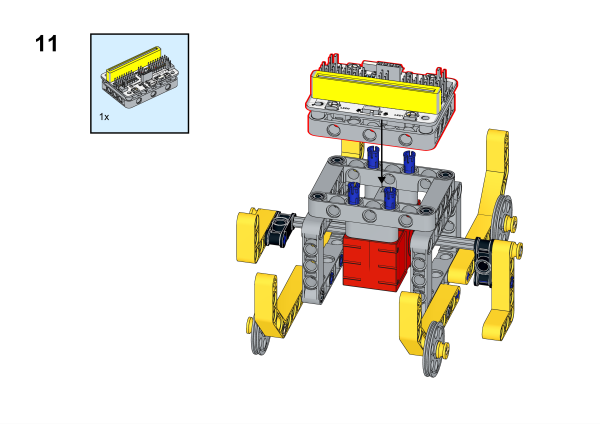

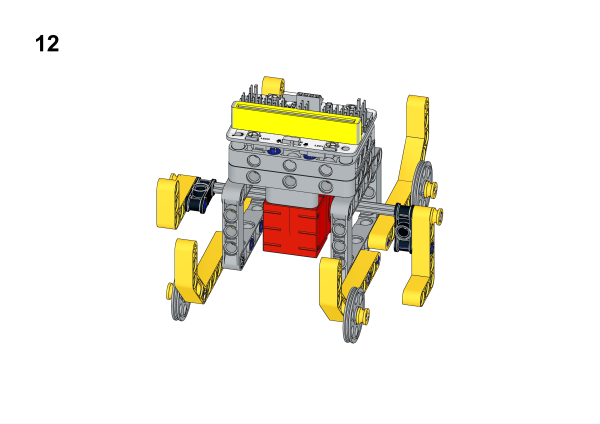

## Hardware Connection

Connect a [motor](https://www.elecfreaks.com/geekservo-motor-2kg-compatible-with-lego.html) to M1 port on [Wukong breakout board](https://www.elecfreaks.com/wukong-board-with-lego-holder-for-micro-bit.html).

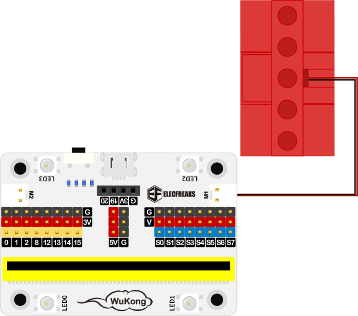

## Software Platform
---
[MakeCode](https://makecode.microbit.org/)

## Coding
---
### Add extensions
Click "Advanced" in the MakeCode to see more choices.
 

Search with Wukong in the dialogue box to download it. 

### Program
 
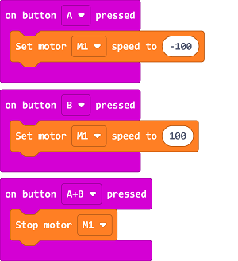

Link:[https://makecode.microbit.org/_4wuFkYirTVqd](https://makecode.microbit.org/_4wuFkYirTVqd)

### Result

When button A is pressed the rower moves forward, when button B is pressed the rower moves backward, when button A+B is pressed the rower stops moving.
