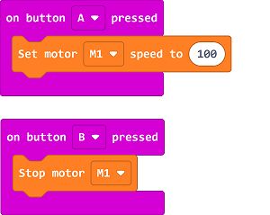

# Case 11: The Tiny Sky Wheel
## Purpose
To make a tiny sky wheel.
 

## Link: 

[micro:bit Wonder Building Kit](https://www.elecfreaks.com/micro-bit-wonder-building-kit-without-micro-bit-board.html)

## Materials Required

Video link:
[https://youtu.be/dbboivj1E64](https://youtu.be/dbboivj1E64)

## Software Platform

[MakeCode](https://makecode.microbit.org/)

## Coding
### Add extensions
Click "Advanced" in the MakeCode to see more choices.
 

Search with Wukong in the dialogue box to download it. 

### Program
 

Link:[https://makecode.microbit.org/_iFDPfDex5CqA](hhttps://makecode.microbit.org/_iFDPfDex5CqA)

